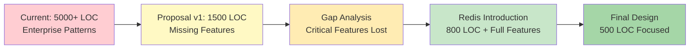
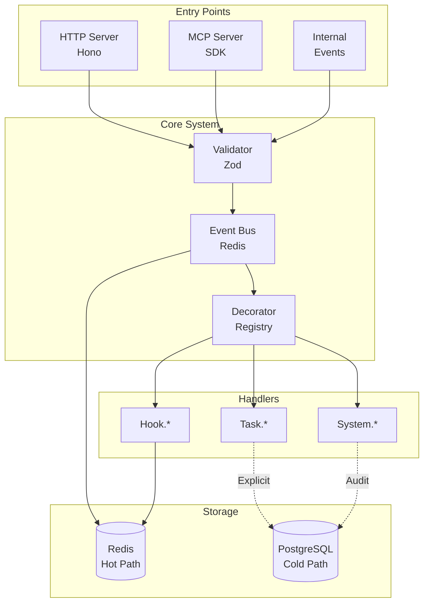
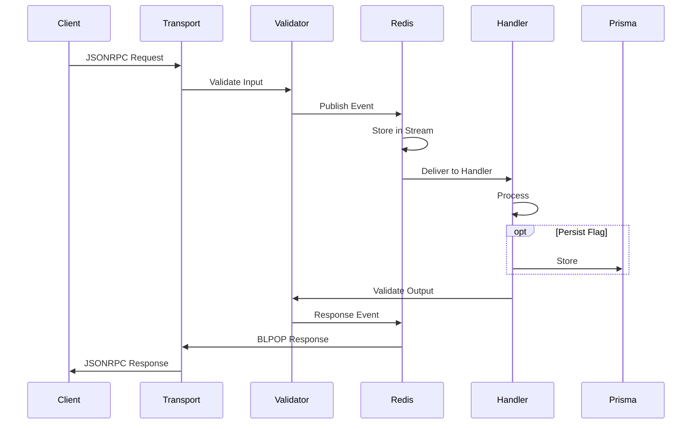
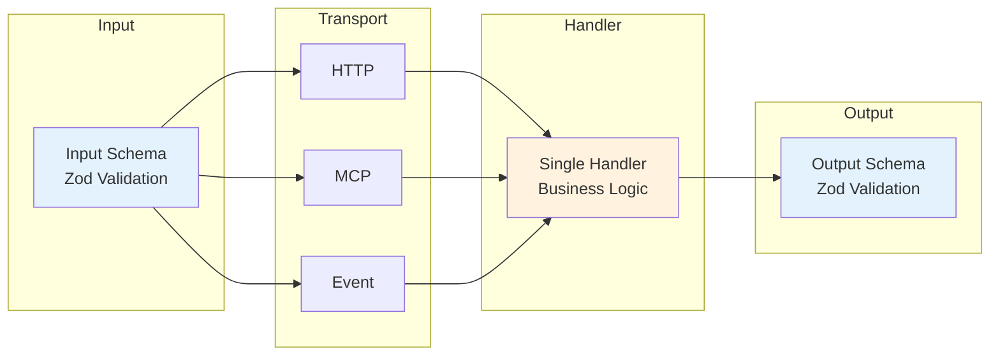
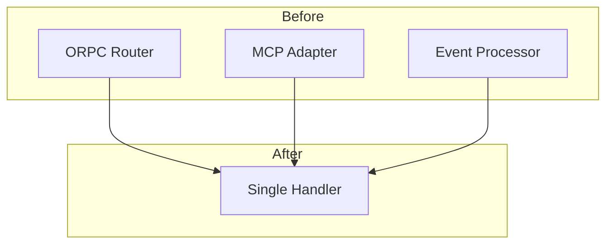

# ClaudeBench Architecture v2.0: Redis-First Event-Driven System

## Evolution Timeline & Refinement History

### Iteration Journey



| Round | Kicked Out | Solidified | Failed/Passed | Outcome |
|-------|------------|------------|---------------|---------|
| **R1** | Factories, Managers, 8+ layers | Need for simplification | ❌ Lost orchestration | Too simple |
| **R2** | Simplicity-only focus | Multi-instance, hooks, tasks required | ❌ Would recreate complexity | Gap identified |
| **R3** | Custom primitives | Redis as infrastructure | ✅ Features + simplicity | Breakthrough |
| **R4** | Auto-sync, versioning, backwards compat | Decorator pattern, explicit persistence | ✅ Final design | Optimized |

### Document Section Origins

| Section | From Round | Key Decision |
|---------|------------|--------------|
| Redis Infrastructure | R3 | Use Redis primitives directly |
| Decorator Pattern | R4 | Single source of truth |
| No Auto-Sync | R4 | Explicit persistence only |
| Flat Events | R4 | task.create, no nesting |
| JSONRPC Protocol | R4 | Unified across transports |
| Forward-Only | R4 | No versioning complexity |

---

## Feature Evolution Matrix

| Capability | Current (R0) | Simplified (R1) | + Redis (R3) | Final (R4) | Reduction |
|------------|--------------|-----------------|--------------|------------|-----------|
| **Core Infrastructure** |
| Event Bus | 400 LOC Map-based | 150 LOC EventEmitter | 30 LOC Redis pub/sub | 30 LOC | -93% |
| Type System | 1700 LOC interfaces | 100 LOC runtime | 50 LOC Zod | 50 LOC | -97% |
| Task Queue | 500 LOC TaskManager | ❌ None | Redis Sorted Sets | 20 LOC | -96% |
| Instance Registry | 300 LOC complex | ❌ None | Redis Hash+TTL | 15 LOC | -95% |
| **Patterns & Abstractions** |
| Factories | 1000+ LOC | ❌ Removed | ❌ Not needed | ❌ Gone | -100% |
| Adapters | 800+ LOC | Some remain | ❌ Not needed | ❌ Gone | -100% |
| Processors | 400 LOC | Simplified | Event handlers | Decorators | -90% |
| **Features** |
| Request-Response | Complex correlation | ❌ Missing | Redis BLPOP | 10 LOC | -95% |
| Hook Blocking | Full validation | ❌ Missing | Event-based | Decorator | -80% |
| State Management | Complex checkpoints | JSON only | Redis+Prisma | Explicit | -88% |
| Circuit Breakers | State machines | ❌ Missing | Redis counters | INCR+TTL | -96% |
| MCP Tools | Adapter pattern | Direct SDK | Direct SDK | Auto-gen | -70% |
| **Total** | **5000+ LOC** | **1500 LOC** | **800 LOC** | **500 LOC** | **-90%** |

---

## Core Architecture

### System Topology



### Event Flow



### Data Flow Consistency



---

## Constitutional Guidelines

### Naming Conventions

| Type | Pattern | Example | Counter-Example |
|------|---------|---------|-----------------|
| **Events** | domain.action | task.create | ~~task_create~~ |
| **Handlers** | [Domain][Action]Handler | TaskCreateHandler | ~~TaskManager~~ |
| **Schemas** | [Domain][Action][Input\|Output] | TaskCreateInput | ~~ITaskInput~~ |
| **Redis Keys** | cb:{type}:{id} | cb:task:123 | ~~cb.task.123~~ |
| **MCP Tools** | dots → double underscore | task__create | ~~task.create~~ |
| **HTTP Routes** | /{domain}/{action} | /task/create | ~~/api/v1/tasks~~ |

### Project Structure

```
/src
  /core (150 LOC)         # Minimal infrastructure
    bus.ts                # Redis pub/sub wrapper
    registry.ts           # Handler discovery
    server.ts             # HTTP + MCP setup
  
  /handlers (300 LOC)     # Business logic
    /task
      task.create.handler.ts
      task.update.handler.ts
    /hook
      hook.pre_tool.handler.ts
    /system
      system.health.handler.ts
  
  /schemas (50 LOC)       # Validation
    task.schema.ts
    hook.schema.ts
    common.schema.ts
```

### Code Principles

| Principle | YES | NO |
|-----------|-----|-----|
| **Persistence** | Explicit in handler | Auto Redis→Prisma sync |
| **Evolution** | Replace events | Version events |
| **Hierarchy** | Flat (task.create) | Nested (task.create.validate) |
| **Abstractions** | Direct Redis calls | Wrapper layers |
| **Patterns** | Decorator-driven | Factory patterns |
| **Types** | Zod runtime validation | Complex interfaces |

---

## JSONRPC Protocol

### Request Types

| Type | Has ID | Expects Response | Use Case |
|------|--------|------------------|----------|
| Request | ✅ | ✅ | Synchronous operations |
| Notification | ❌ | ❌ | Fire-and-forget events |

### Protocol Structure

```typescript
// Request (expects response)
{
  jsonrpc: "2.0",
  method: "task.create",    // Event type
  params: {...},            // Input schema
  id: "req-123",           // ID presence = needs response
  metadata: {...}          // Optional tracing
}

// Response
{
  jsonrpc: "2.0",
  result: {...},           // Success (Output schema)
  error: {                 // OR error
    code: -32600,
    message: "Invalid",
    data: {...}
  },
  id: "req-123"           // Matches request
}
```

### Error Codes

| Code | Meaning | When Used |
|------|---------|-----------|
| -32700 | Parse error | Invalid JSON |
| -32600 | Invalid request | Missing required fields |
| -32601 | Method not found | Unknown event type |
| -32602 | Invalid params | Schema validation failed |
| -32603 | Internal error | Handler exception |
| -32000 to -32099 | Custom errors | Application-specific |

---

## Component Patterns

### Decorator Pattern (Core Innovation)

```typescript
@EventHandler({
  event: 'task.create',
  inputSchema: TaskCreateInput,
  outputSchema: TaskCreateOutput,
  persist: true,
  roles: ['worker']
})
class TaskCreateHandler {
  async handle(input, context) {
    const task = { id: `t-${Date.now()}`, ...input };
    await this.redis.hset(`cb:task:${task.id}`, task);
    if (this.persist) await this.prisma.task.create({ data: task });
    return task;
  }
}
```

This single decorator generates:
- HTTP: `POST /task/create`
- MCP: `task__create` tool  
- Event: `task.create` subscription

### Handler Interface

```typescript
interface IEventHandler<I, O> {
  handle(input: I, context: EventContext): Promise<O>;
}

interface EventContext {
  emit(event: string, data: any): Promise<void>;
  metadata: EventMetadata;
  redis: Redis;
  prisma: PrismaClient;
}
```

### Testing Pattern

```typescript
describe('TaskCreateHandler', () => {
  it('creates task', async () => {
    const handler = new TaskCreateHandler(redis, prisma);
    const result = await handler.handle(
      { text: 'Test' },
      mockContext
    );
    expect(result.id).toBeDefined();
    expect(result.status).toBe('pending');
  });
});
```

---

## Feature Map

### Event Catalog

| Event | Input Schema | Output Schema | Storage | Purpose |
|-------|--------------|---------------|---------|---------|
| **Task Domain** |
| task.create | `{text: string, priority?: number}` | `{id, text, priority, status}` | Prisma | Create task |
| task.update | `{id: string, updates: Partial}` | `{...task}` | Prisma | Update task |
| task.assign | `{taskId, instanceId}` | `{...task}` | Prisma | Assign task |
| task.complete | `{id, result?}` | `{...task}` | Prisma | Complete task |
| **Hook Domain** |
| hook.pre_tool | `{tool, params}` | `{allow, reason?}` | Redis | Validate tool |
| hook.post_tool | `{tool, result}` | `{processed}` | Redis | Process result |
| hook.user_prompt | `{prompt, context}` | `{modified?}` | Redis | Intercept prompt |
| hook.todo_write | `{todos}` | `{processed}` | Redis | Process todos |
| **System Domain** |
| system.health | `{}` | `{status, services}` | Redis | Health check |
| system.register | `{id, roles[]}` | `{registered}` | Both | Instance join |
| system.heartbeat | `{instanceId}` | `{alive}` | Redis | Keep alive |
| system.metrics | `{}` | `{metrics}` | Redis | Get metrics |
| **MCP Domain** |
| mcp.tool.execute | `{tool, params}` | `{result}` | Redis | Execute tool |
| mcp.tool.list | `{}` | `{tools[]}` | Redis | List tools |
| mcp.session.start | `{sessionId}` | `{connected}` | Redis | Start session |

### Data Model

| Entity | Redis Structure | Prisma Table | TTL | Purpose |
|--------|----------------|--------------|-----|---------|
| Event | Stream: cb:stream:{type} | - | 24h | Event history |
| Task | Hash: cb:task:{id} | tasks | - | Task data |
| Instance | Hash: cb:instance:{id} | instances | 30s | Instance info |
| Queue | SortedSet: cb:queue:tasks | - | - | Task queue |
| Health | Key: cb:health:{id} | - | 30s | Health status |
| Response | List: cb:response:{id} | - | 30s | RPC responses |
| Rate | Key: cb:rate:{id}:{window} | - | 60s | Rate limiting |
| Circuit | Key: cb:circuit:{type} | - | 60s | Circuit breaker |

### Handler Responsibilities

| Handler | Reads From | Writes To | Emits | Returns |
|---------|-----------|-----------|-------|---------|
| TaskCreateHandler | - | Redis, Prisma | task.created | Task |
| TaskAssignHandler | Redis | Redis, Prisma | task.assigned | Task |
| HookPreToolHandler | Redis | Redis | hook.validated | Allow/Block |
| SystemHealthHandler | Redis | - | - | Status |
| SystemRegisterHandler | - | Redis, Prisma | instance.joined | Success |

---

## Implementation Guide

### Week 1: Core Setup


**Tasks:**
- Install and configure Redis
- Implement core event bus (30 LOC)
- Create handler registry (50 LOC)
- Build decorator system (40 LOC)
- Add Zod validation (30 LOC)

### Week 2: Handler Migration

**Priority Order:**
1. System handlers (health, register)
2. Task handlers (create, update)
3. Hook handlers (pre_tool, post_tool)
4. MCP handlers (tool execution)

**Pattern:**
```typescript
// Old processor
class TaskProcessor implements IProcessor {
  // 200+ lines
}

// New handler
@EventHandler({ event: 'task.create', ... })
class TaskCreateHandler {
  // 20 lines
}
```

### Week 3: Transport Unification



### Week 4: Cleanup & Optimization

**Delete:**
- All factory classes (-1000 LOC)
- All adapter packages (-800 LOC)
- Complex type definitions (-1500 LOC)
- Unused abstractions (-700 LOC)

**Optimize:**
- Redis connection pooling
- Handler lazy loading
- Schema caching

### Rollback Strategy

```yaml
Feature Flags:
  NEW_SYSTEM: false      # Start disabled
  DUAL_MODE: true        # Run both systems
  
Traffic Split:
  - Week 1: 0% (dark launch)
  - Week 2: 10% (canary)
  - Week 3: 50% (A/B test)
  - Week 4: 100% (full rollout)
  
Monitoring:
  - Error rates
  - Response times
  - Memory usage
  - Event throughput
  
Rollback Triggers:
  - Error rate > 1%
  - P95 latency > 100ms
  - Memory > 100MB
```

---

## Performance Targets

| Metric | Current | Target | Method |
|--------|---------|--------|--------|
| **Latency** |
| Event publish | 50-100ms | <1ms | Redis pub/sub |
| Handler execution | 100ms | <10ms | Remove layers |
| HTTP response | 200ms | <30ms | Direct handlers |
| MCP tool call | 300ms | <50ms | No adapters |
| **Throughput** |
| Events/sec | 100 | 10,000 | Redis streams |
| HTTP RPS | 100 | 5,000 | Hono + Bun |
| Concurrent handlers | 10 | 1,000 | Async processing |
| **Resources** |
| Memory usage | 100MB | 30MB | Less objects |
| Startup time | 5s | <500ms | No scanning |
| CPU usage | 20% | 5% | Efficient loops |

---

## Success Metrics

### Code Quality

| Metric | Before | After | Target Met |
|--------|--------|-------|------------|
| Total LOC | 5000+ | 500 | ✅ |
| Files | 50+ | 15 | ✅ |
| Dependencies | 50+ | 5 | ✅ |
| Abstraction layers | 8-10 | 2-3 | ✅ |
| Type definitions | 1700 | 50 | ✅ |

### Developer Experience

| Metric | Before | After |
|--------|--------|-------|
| Onboarding time | Days | Hours |
| Add new event | 1 hour | 5 minutes |
| Debug issue | Complex traces | Direct path |
| Test writing | Mock hell | Simple stubs |
| Deploy changes | Risky | Confident |

### Operational Excellence

| Aspect | Improvement |
|--------|------------|
| Monitoring | Built-in OpenTelemetry hooks |
| Scaling | Horizontal via Redis cluster |
| Recovery | Automatic via Redis persistence |
| Updates | Rolling via feature flags |

---

## Architecture Decisions Record (ADR)

### ADR-001: Redis as Primary Infrastructure
**Status:** Accepted  
**Context:** Need distributed system primitives  
**Decision:** Use Redis for all real-time operations  
**Consequences:** Single dependency, proven patterns  

### ADR-002: Decorator Pattern for Handlers
**Status:** Accepted  
**Context:** Multiple transports need same logic  
**Decision:** Single decorator generates all interfaces  
**Consequences:** DRY principle, automatic consistency  

### ADR-003: No Automatic Persistence
**Status:** Accepted  
**Context:** Not all events need persistence  
**Decision:** Handlers explicitly choose to persist  
**Consequences:** Better performance, clear data flow  

### ADR-004: Forward-Only Evolution
**Status:** Accepted  
**Context:** Versioning adds complexity  
**Decision:** Replace events instead of versioning  
**Consequences:** Simpler migrations, no legacy burden  

### ADR-005: Flat Event Hierarchy
**Status:** Accepted  
**Context:** Nested events create complexity  
**Decision:** Single-level events only  
**Consequences:** Easier to understand, route, and handle  

---

MCP Docs: MCP_SDK.md or browse online for the official repo of typescript mcp sdk
