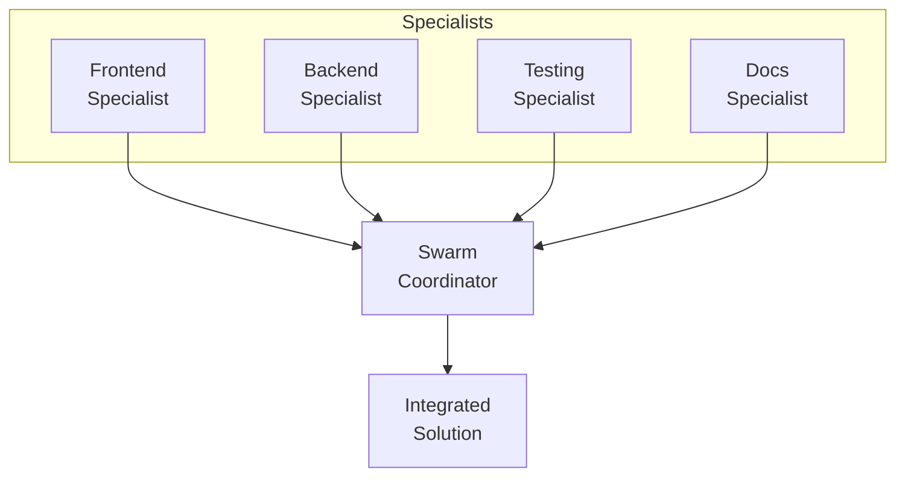
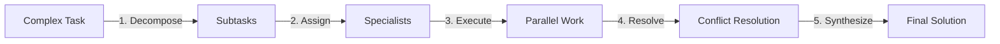
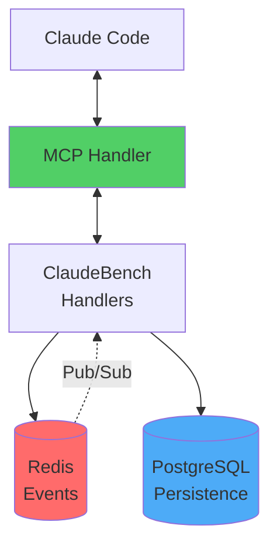
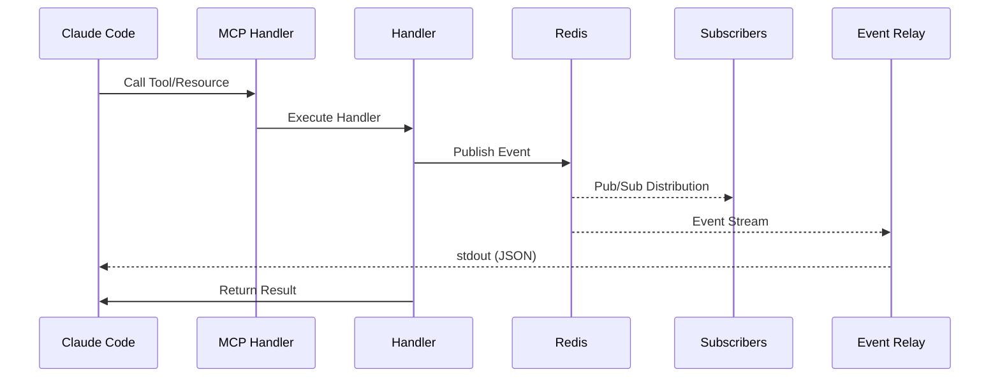

# 🚀 Welcome to ClaudeBench

## What is ClaudeBench?
ClaudeBench is an event-driven orchestration system that enables AI agents to collaborate through a Redis-first architecture with MCP (Model Context Protocol) integration.

## 🎯 Quick Start

> **Important:** Always create and claim tasks before working! This ensures visibility and proper tracking of all work in the system.

### 1. Event Relay
The event relay monitors all ClaudeBench events in real-time:
```bash
bun relay  # Running as {{ instanceId }}
```
Current Status: **{{ instanceCount }}** active instances, **{{ eventCount }}** total events

### 2. MCP Integration
You have access to:

#### 📋 Resources (Static Data)
- **Task List** (`swarm://tasks`) - View all tasks in the system
- **Pending Tasks** (`swarm://tasks/pending`) - Tasks ready to be claimed
- **Swarm Conflicts** (`swarm://conflicts`) - Active conflicts requiring resolution
- **Decompositions List** (`swarm://decompositions`) - All task decompositions

#### 📚 Documentation Resources
- **API Documentation** (`docs://api`) - Complete API reference for all handlers
- **Architecture Docs** (`docs://architecture`) - System design and patterns
- **Guides** (`docs://guides`) - Step-by-step tutorials and best practices
- **What's New** (`docs://whats-new`) - Latest features and updates

#### 🔄 Resource Templates (Dynamic Data)
- `swarm://decomposition/{taskId}` - Detailed task decomposition
- `swarm://context/{subtaskId}` - Execution context for subtasks
- `swarm://progress/{taskId}` - Real-time progress tracking

#### 🛠️ Tools (Actions)
All ClaudeBench handlers are exposed as MCP tools:
- **task.create** - Create new tasks
- **task.claim** - Claim tasks for processing
- **task.complete** - Mark tasks as completed
- **swarm.decompose** - Break down complex tasks
- **swarm.resolve** - Resolve conflicts between specialists
- **system.register** - Register new instances
- **docs.list** - Browse all available documentation
- **docs.get** - Retrieve specific documentation pages

### 3. Task Management

#### Creating Tasks
```javascript
// Use task.create tool
{
  "text": "Your task description",
  "priority": 50,  // 0-100, higher = more important
  "metadata": {}    // Optional custom data
}
```
**Current Queue**: {{ pendingTasks }} pending, {{ inProgressTasks }} in progress

#### Task Attachments
Tasks support rich attachments for context and results:
```javascript
// Attach data to tasks (key-value store)
task.create_attachment({
  "taskId": "t-123",
  "key": "git-commit-abc123",  // Unique key
  "type": "json",              // json, markdown, text, url, binary
  "value": { /* data */ }       // Attachment content
})
```

**Common Attachment Types**:
- 📝 **Context** (`context_*`) - Generated AI execution context
- 🔧 **Git Commits** (`git-commit-*`) - Auto-attached commit metadata
- 📊 **Results** (`result`) - Task completion details
- 🔗 **References** (`ref_*`) - Links to related resources
- 📄 **Documentation** (`doc_*`) - Generated docs or specs

#### Claiming Tasks
Workers claim tasks from the queue:
```javascript
// Use task.claim tool
{
  "workerId": "{{ instanceId }}",
  "maxTasks": 1
}
```

### 4. Swarm Coordination

The swarm system enables parallel task execution through specialist collaboration:



**Workflow**:



### 5. System Architecture



### 6. Event Flow

Events follow a predictable pattern:



**Active Event Streams**:

- `{{ stream.name }}`: {{ stream.count }} events


### 7. Current System Status

| Metric | Value |
|--------|-------|
| **Active Instances** | {{ instanceCount }} |
| **Total Tasks** | {{ totalTasks }} |
| **Pending Tasks** | {{ pendingTasks }} |
| **In Progress** | {{ inProgressTasks }} |
| **Completed Today** | {{ completedToday }} |
| **Success Rate** | {{ successRate }}% |
| **Avg Response Time** | {{ avgResponseTime }}ms |
| **Total Events** | {{ eventCount }} |

### 8. TodoWrite Integration

ClaudeBench integrates with Claude Code's TodoWrite tool:
- Tasks are automatically tracked as todos
- Progress updates trigger `hook.todo_write` events
- Completion rates are monitored in real-time

**Current Todo Stats**:
- Completion Rate: {{ todoCompletionRate }}%
- Active Todos: {{ activeTodos }}

### 9. Monitoring Commands

Essential monitoring tools:
```bash
# System health
mcp__claudebench__system__health

# Detailed metrics
mcp__claudebench__system__metrics

# Instance states
mcp__claudebench__system__get_state

# Redis keys inspection
mcp__claudebench__system__redis__keys
```

### 10. Documentation Access

#### 📖 Docusaurus Documentation Site
ClaudeBench includes comprehensive documentation available at:
- **Local**: `http://localhost:3002` (run `bun docs:dev`)
- **Categories**: API Reference, Architecture, Guides, What's New
- **Total Pages**: 69+ documentation pages

#### 🔍 MCP Documentation Tools
Access documentation directly through MCP:
```javascript
// List all available documentation
mcp__claudebench__docs__list({ category: "guides" })

// Get specific documentation page
mcp__claudebench__docs__get({ id: "api/task/create" })
```

#### 📂 Documentation Categories
- **API** ({{ '{{' }} docsApiCount {{ '}}' }} pages) - Handler references, schemas, examples
- **Architecture** ({{ '{{' }} docsArchCount {{ '}}' }} pages) - System design, patterns, Lua scripts
- **Guides** ({{ '{{' }} docsGuidesCount {{ '}}' }} pages) - Tutorials, best practices, workflows
- **General** ({{ '{{' }} docsGeneralCount {{ '}}' }} pages) - Overview, contributing, changelog

### 11. Best Practices

#### For Task Processing
✅ **ALWAYS declare tasks** - Create tasks for all work to maintain visibility
✅ **ALWAYS claim before working** - Assign tasks to yourself before starting
✅ Register your instance before claiming tasks
✅ Use appropriate worker roles (frontend, backend, testing, docs)
✅ Complete tasks with detailed result attachments
✅ Reassign tasks you can't handle (don't leave them hanging)
✅ Monitor your instance health regularly

#### Task Lifecycle Pattern
```javascript
// 1. Create task (declare work)
const task = await task.create({ 
  text: "Implement feature X",
  priority: 80 
});

// 2. Claim task (assign to worker)
await task.assign({ 
  taskId: task.id, 
  instanceId: "worker-1" 
});

// 3. Work on task and add attachments
await task.create_attachment({
  taskId: task.id,
  key: "implementation-notes",
  type: "markdown",
  content: "## Progress\n- Completed step 1\n- Working on step 2"
});

// 4. Complete with results + final attachment
await task.complete({ 
  taskId: task.id,
  result: { status: "success", details: "..." }
});

// 5. View all attachments
const attachments = await task.list_attachments({ 
  taskId: task.id 
});
```

#### For System Design
✅ Use events for loose coupling between components
✅ Persist selectively to PostgreSQL (explicit `persist: true`)
✅ Implement circuit breakers for resilience
✅ Follow `domain.action` event naming convention

#### For Performance
✅ Batch Redis operations when possible
✅ Use Lua scripts for atomic operations
✅ Monitor rate limits and adjust as needed
✅ Clean up completed tasks periodically

## 🎉 Ready to Start!

### Quick Actions:
1. **View pending tasks**: Access `swarm://tasks/pending` resource
2. **Create a task**: Use `task.create` tool with your task description
3. **Monitor events**: Check the relay output in your terminal
4. **Explore resources**: Browse available MCP resources in the sidebar

### Useful Resources:
- **Documentation Site**: Run `bun docs:dev` to browse at `http://localhost:3002`
- **CLAUDE.md**: `/CLAUDE.md` - AI assistant instructions and codebase patterns
- **MCP SDK Reference**: `/docs/MCP_SDK.md` - Complete MCP TypeScript SDK documentation
- **Redis Lua Scripts**: `/apps/server/src/core/lua-scripts.ts` - Atomic operations
- **Event Handlers**: `/apps/server/src/handlers/` - All domain handlers
- **API Contracts**: `/specs/001-claudebench/contracts/` - OpenRPC specifications
- **Web Dashboard**: `http://localhost:3001` - Visual task management interface

---
*ClaudeBench v2.0 - Redis-First Event-Driven Architecture*
*Instance: {{ instanceId }} | Session: {{ sessionId }} | Timestamp: {{ timestamp }}*