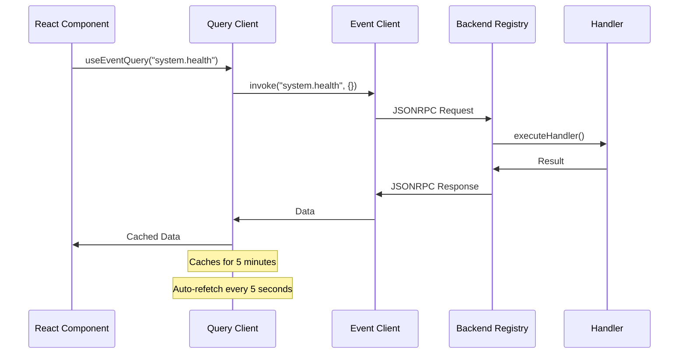

# ClaudeBench Frontend Services Documentation

## Overview

The ClaudeBench frontend uses a **handler-first architecture** where the backend handlers are the single source of truth. The frontend services are thin transport layers that facilitate communication without duplicating business logic.

## Architecture Principles

1. **No Business Logic Duplication**: The frontend doesn't hardcode handler methods
2. **Dynamic Discovery**: Clients discover available methods at runtime
3. **Passthrough Pattern**: Event client is just a JSONRPC transport
4. **Separation of Concerns**: Query management is separate from event transport

## Core Services

### 1. Event Client (`/apps/web/src/services/event-client.ts`)

The event client provides JSONRPC 2.0 communication with the backend.

#### Key Features

- **Generic Invocation**: Single `invoke()` method for any handler
- **Dynamic Discovery**: `discoverMethods()` queries available handlers
- **Automatic Retries**: Exponential backoff with configurable retry count
- **Batch Support**: Send multiple requests in a single call
- **SSE Subscriptions**: Real-time event streaming support

#### Usage

```typescript
import { getEventClient } from '@/services/event-client';

const client = getEventClient();

// Discover available methods
const { methods } = await client.discoverMethods();
// Returns: [{ name: "task.create", inputSchema: {...}, outputSchema: {...} }, ...]

// Invoke any handler dynamically
const result = await client.invoke("task.create", {
  text: "New task",
  priority: 50
});

// Batch requests
const results = await client.batch([
  { method: "system.health", params: {} },
  { method: "system.metrics", params: {} }
]);

// Subscribe to events
const eventSource = client.subscribeToEvents(
  ["task.created", "task.completed"],
  (event) => console.log("Event received:", event)
);
```

#### Design Rationale

The event client **does not** have methods like `createTask()` or `updateTask()`. Instead:
- Handlers define their own schemas via `@EventHandler` decorator
- Registry auto-discovers all handlers at runtime
- Client uses `invoke()` to call any method dynamically
- This prevents schema duplication and ensures handlers are the source of truth

### 2. Query Client (`/apps/web/src/services/query-client.ts`)

Manages server state with TanStack Query, separate from event transport.

#### Configuration

```typescript
const queryClient = new QueryClient({
  defaultOptions: {
    queries: {
      staleTime: 1000 * 60 * 5,     // Data fresh for 5 minutes
      gcTime: 1000 * 60 * 10,        // Cache for 10 minutes
      retry: 3,                      // Retry failed requests
      refetchOnWindowFocus: false,   // Don't refetch on focus
      placeholderData: (prev) => prev // Show previous data while loading
    }
  }
});
```

#### Query Keys Factory

Hierarchical key structure prevents collisions and enables targeted invalidation:

```typescript
queryKeys = {
  all: ["claudebench"],
  system: {
    all: ["claudebench", "system"],
    health: () => ["claudebench", "system", "health"],
    metrics: () => ["claudebench", "system", "metrics"]
  },
  tasks: {
    all: ["claudebench", "tasks"],
    list: (filters) => ["claudebench", "tasks", "list", filters],
    detail: (id) => ["claudebench", "tasks", "detail", id]
  }
}
```

#### Cache Management

```typescript
// Invalidate all system-related queries
invalidateRelatedQueries(queryClient, "system");

// Invalidate specific query
queryClient.invalidateQueries({ queryKey: queryKeys.tasks.list() });
```

### 3. React Query Hooks

Generic hooks for any event method without hardcoding:

#### Query Hook (GET-like operations)
```typescript
export function useEventQuery<T>(
  method: string,
  params?: any,
  options?: { refetchInterval?: number; enabled?: boolean }
)

// Usage
const { data, isLoading } = useEventQuery("system.health", {}, {
  refetchInterval: 5000
});
```

#### Mutation Hook (POST-like operations)
```typescript
export function useEventMutation<TParams, TResult>(
  method: string,
  options?: { 
    onSuccess?: (data: TResult) => void;
    invalidateQueries?: string[][]
  }
)

// Usage
const createTask = useEventMutation("task.create", {
  invalidateQueries: [["tasks"], ["system.get_state"]]
});

createTask.mutate({ text: "New task", priority: 50 });
```

#### Convenience Hooks

Pre-configured hooks for common operations:

```typescript
// System queries with auto-refresh
export const useSystemHealth = () => 
  useEventQuery("system.health", {}, { refetchInterval: 5000 });

export const useSystemMetrics = () => 
  useEventQuery("system.metrics", {}, { refetchInterval: 3000 });

// Task mutations with cache invalidation
export const useCreateTask = () => 
  useEventMutation("task.create", { 
    invalidateQueries: [["tasks"], ["system.get_state"]] 
  });
```

## Discovery Mechanism

### Backend: system.discover Handler

The `system.discover` handler exposes all registered handlers:

```typescript
@EventHandler({
  event: "system.discover",
  inputSchema: z.object({
    domain: z.string().optional() // Filter by domain
  }),
  outputSchema: z.object({
    methods: z.array(z.object({
      name: z.string(),
      description: z.string().optional(),
      inputSchema: z.any(),
      outputSchema: z.any(),
      metadata: z.object({
        persist: z.boolean().optional(),
        rateLimit: z.number().optional(),
        roles: z.array(z.string()).optional()
      })
    }))
  })
})
```

### Frontend: Dynamic Method Discovery

```typescript
// Discover all methods
const { methods } = await client.discoverMethods();

// Discover only task domain methods
const { methods } = await client.discoverMethods("task");

// Use discovered schema for validation
const taskCreateMethod = methods.find(m => m.name === "task.create");
console.log(taskCreateMethod.inputSchema);
// { type: "object", properties: { text: {...}, priority: {...} } }
```

## Data Flow



## Integration with Router

The router provides context to all routes:

```typescript
// router.tsx
export const router = createRouter({
  context: {
    queryClient,    // TanStack Query client
    apiUrl          // Backend URL
  }
});

// In components
function MyComponent() {
  const { queryClient, apiUrl } = useRouteContext();
}
```

## Error Handling

### JSONRPC Error Codes

```typescript
export const JsonRpcErrorCodes = {
  PARSE_ERROR: -32700,
  INVALID_REQUEST: -32600,
  METHOD_NOT_FOUND: -32601,
  INVALID_PARAMS: -32602,
  INTERNAL_ERROR: -32603,
  // Custom errors
  RATE_LIMIT_EXCEEDED: -32000,
  CIRCUIT_BREAKER_OPEN: -32001,
  UNAUTHORIZED: -32002,
  HOOK_BLOCKED: -32003
}
```

### Client Error Handling

```typescript
try {
  await client.invoke("task.create", params);
} catch (error) {
  if (error instanceof JsonRpcError) {
    switch (error.code) {
      case JsonRpcErrorCodes.RATE_LIMIT_EXCEEDED:
        // Handle rate limiting
        break;
      case JsonRpcErrorCodes.INVALID_PARAMS:
        // Handle validation error
        break;
    }
  }
}
```

## Best Practices

1. **Use Generic Hooks**: Prefer `useEventQuery` and `useEventMutation` over hardcoded methods
2. **Discover at Startup**: Cache discovered methods for the session
3. **Invalidate Wisely**: Use query key factory for targeted cache invalidation
4. **Handle Errors**: Check JSONRPC error codes for appropriate user feedback
5. **Leverage TypeScript**: Use discovered schemas for type safety

## Migration Guide

### From Hardcoded Methods to Dynamic Invocation

**Before** (hardcoded):
```typescript
// ❌ Old approach - duplicates handler logic
async createTask(params: { text: string; priority: number }) {
  return this.request("task.create", params);
}

const result = await client.createTask({ text: "Task", priority: 50 });
```

**After** (dynamic):
```typescript
// ✅ New approach - handlers are source of truth
const result = await client.invoke("task.create", { 
  text: "Task", 
  priority: 50 
});
```

### From Custom Hooks to Generic Hooks

**Before** (custom):
```typescript
// ❌ Old approach - one hook per method
export function useCreateTask() {
  const client = getEventClient();
  return useMutation({
    mutationFn: (params) => client.createTask(params)
  });
}
```

**After** (generic):
```typescript
// ✅ New approach - one hook for all mutations
const createTask = useEventMutation("task.create", {
  invalidateQueries: [["tasks"]]
});
```

## Testing

### Mocking Event Client

```typescript
const mockClient = {
  invoke: jest.fn(),
  discoverMethods: jest.fn().mockResolvedValue({
    methods: [
      { name: "task.create", inputSchema: {}, outputSchema: {} }
    ]
  })
};

jest.mock('@/services/event-client', () => ({
  getEventClient: () => mockClient
}));
```

### Testing React Query Hooks

```typescript
const wrapper = ({ children }) => (
  <QueryClientProvider client={queryClient}>
    {children}
  </QueryClientProvider>
);

const { result } = renderHook(() => useSystemHealth(), { wrapper });
await waitFor(() => expect(result.current.isSuccess).toBe(true));
```

## Performance Considerations

1. **Query Deduplication**: Multiple components requesting the same data share a single request
2. **Stale-While-Revalidate**: Shows cached data immediately while fetching fresh data
3. **Batch Requests**: Use `client.batch()` for multiple simultaneous requests
4. **Selective Invalidation**: Use query keys to invalidate only affected data
5. **SSE for Real-Time**: Use event subscriptions instead of polling for live data

## Future Enhancements

1. **Schema Validation**: Use discovered schemas for client-side validation
2. **Type Generation**: Generate TypeScript types from discovered schemas
3. **Offline Support**: Queue mutations when offline
4. **Optimistic Updates**: Update UI before server confirmation
5. **WebSocket Transport**: Replace SSE with bidirectional WebSocket