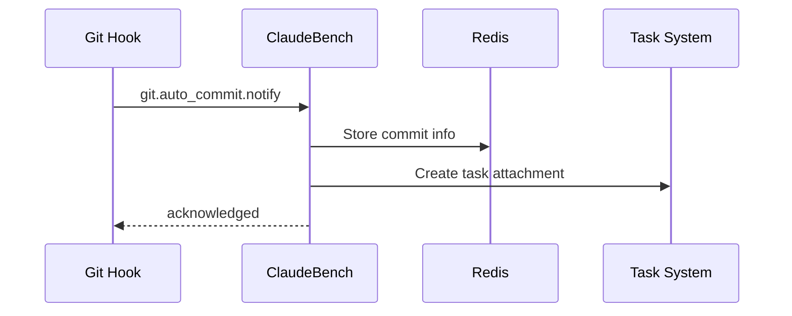
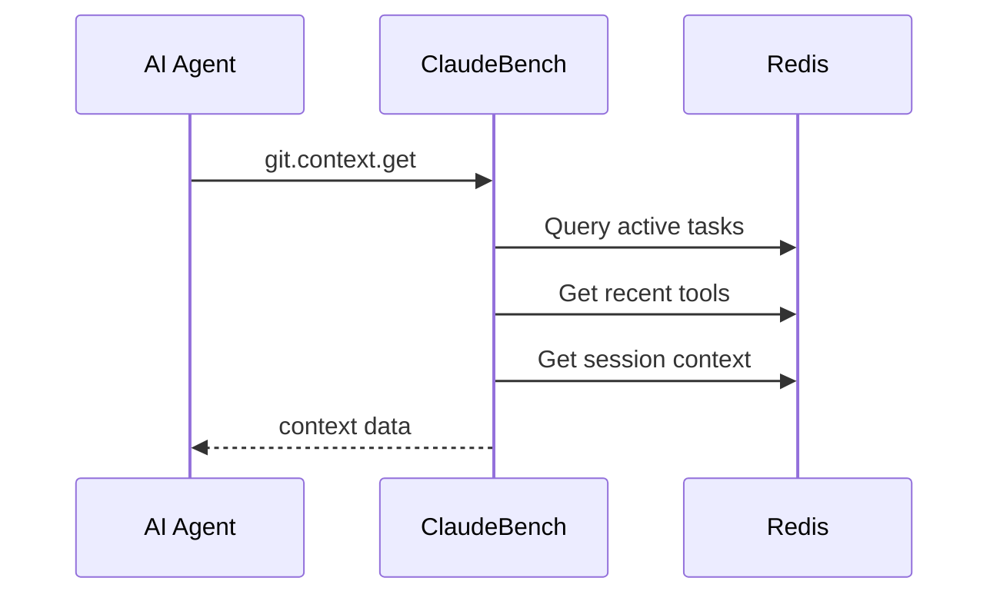

# Git Integration API

ClaudeBench provides Git integration handlers that track code changes, link commits to tasks, and provide context for automated commit messages.

## Overview

The Git integration enables ClaudeBench to:
- **Track code evolution** - Monitor changes made by AI agents through git hooks
- **Link commits to tasks** - Automatically associate commits with active tasks
- **Generate context** - Provide task and tool context for commit message generation
- **Create audit trails** - Store commit history with task attachments

## Available Handlers

### Core Handlers

| Handler | Description | Purpose |
|---------|-------------|---------|
| [`git.auto_commit.notify`](./auto_commit_notify.md) | Notify about auto-commits | Tracks commits from git hooks |
| [`git.context.get`](./context_get.md) | Get commit context | Provides task context for commits |

## Integration Architecture

### Git Hook Flow



### Context Retrieval Flow



## Redis Keys

Git handlers use the following Redis key patterns:

| Pattern | Type | Description | TTL |
|---------|------|-------------|-----|
| `cb:git:commit:{hash}` | Hash | Commit metadata | 7 days |
| `cb:session:commits:{sessionId}` | List | Session commit history | 7 days |
| `cb:session:tools:{sessionId}` | List | Recent tool usage | Session |
| `cb:session:context:{sessionId}` | Hash | Session context data | Session |
| `cb:metrics:git:commits` | Hash | Git commit metrics | Persistent |

## Task Attachments

Git commits are automatically attached to related tasks:

```json
{
  "taskId": "t-123",
  "key": "git-commit-abc123d",
  "type": "json",
  "value": {
    "commitHash": "abc123def456",
    "branch": "main",
    "files": ["src/feature.ts"],
    "diff": "+ added code\n- removed code",
    "stats": {
      "additions": 10,
      "deletions": 5,
      "filesChanged": 1
    },
    "toolUsed": "Edit",
    "timestamp": 1234567890,
    "commitMessage": {
      "task": "Implement feature X",
      "files": ["src/feature.ts"]
    }
  }
}
```

## Usage with Git Hooks

### Setting up Auto-commit Hook

Create `.git/hooks/post-commit`:

```bash
#!/bin/bash
# Auto-notify ClaudeBench about commits

COMMIT_HASH=$(git rev-parse HEAD)
BRANCH=$(git branch --show-current)
FILES=$(git diff-tree --no-commit-id --name-only -r HEAD)
DIFF=$(git diff HEAD~1 HEAD)

curl -X POST http://localhost:3000/rpc \
  -H "Content-Type: application/json" \
  -d '{
    "jsonrpc": "2.0",
    "method": "git.auto_commit.notify",
    "params": {
      "instanceId": "'$INSTANCE_ID'",
      "sessionId": "'$SESSION_ID'",
      "commitHash": "'$COMMIT_HASH'",
      "branch": "'$BRANCH'",
      "files": ["'$FILES'"],
      "diff": "'$DIFF'",
      "taskContext": {
        "taskIds": ["'$TASK_ID'"],
        "toolUsed": "Edit",
        "timestamp": '$(date +%s)'
      },
      "commitMessage": "{\"task\":\"Auto-commit\",\"files\":[\"'$FILES'\"]}"
    },
    "id": "hook-001"
  }'
```

### Getting Context for Commits

Before making a commit, retrieve context:

```typescript
const context = await mcp__claudebench__git__context__get({
  instanceId: "worker-1",
  sessionId: "session-123",
  limit: 5
});

// Use context to generate commit message
const commitMessage = generateCommitMessage(context.tasks, context.recentTools);
```

## Event Flow

Git handlers participate in the event system:

1. **git.auto_commit.notify** → emits `git.auto_commit.created`
2. State processors observe events and update session state
3. Task attachments link commits to work items
4. Metrics track tool usage and file changes

## Best Practices

1. **Always include task context** - Link commits to active tasks for traceability
2. **Limit diff size** - Large diffs are truncated to 10KB in attachments
3. **Use structured commit messages** - Parse JSON for better integration
4. **Monitor metrics** - Track commit patterns through `cb:metrics:git:commits`
5. **Set appropriate TTLs** - Git data expires after 7 days by default

## Related Documentation

- [Task System](../task/) - Understanding task management
- [System API](../system/) - System operations and state management
- [Architecture Overview](../../architecture/) - Event-driven architecture