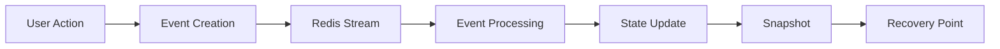

# Session Management

The Session API provides comprehensive state management and event sourcing capabilities for ClaudeBench. It enables tracking, storing, and reconstructing session states through an event-driven architecture that captures every interaction, tool usage, and task operation.

## Overview

ClaudeBench uses an event sourcing pattern where every significant action is recorded as an immutable event in Redis streams. These events form an append-only log that can be used to:

- Reconstruct session state at any point in time
- Create recovery snapshots for resilience
- Rehydrate context after interruptions
- Track user interactions and tool usage patterns
- Enable session replay and debugging

## Architecture

### Event Sourcing Pattern



### Session Lifecycle

1. **Event Collection**: All interactions generate events stored in Redis streams
2. **State Processing**: Events are processed to build current session state
3. **Snapshot Creation**: Periodic snapshots capture full state for recovery
4. **Rehydration**: Sessions can be restored from snapshots + new events
5. **Compaction**: Old events can be compacted while preserving state

## Key Concepts

### Events

Events are immutable records of actions that occurred during a session:

- **Hook Events**: Tool usage, user prompts, todo updates
- **Task Events**: Task creation, completion, failure
- **System Events**: Notifications, compaction, stops

Each event contains:
- `eventId`: Unique identifier
- `eventType`: Categorical type (e.g., `hook.pre_tool`)
- `timestamp`: Unix timestamp of occurrence
- `data`: Event-specific payload
- `labels`: Optional categorization tags

### Snapshots

Snapshots are point-in-time captures of complete session state:

- **Purpose**: Fast recovery without replaying all events
- **Triggers**: Manual, pre-compaction, checkpoints, error recovery
- **Contents**: Full context including tasks, tools, prompts, todos
- **Storage**: Both Redis (fast access) and PostgreSQL (durability)

### Condensed State

A optimized view of session state that provides:

- Recent task history
- Tools used with counts
- Last user prompt
- Active todos
- Event statistics

## Available Handlers

| Handler | Description | Use Case |
|---------|-------------|----------|
| [`session.state.get`](./state_get) | Retrieve session events and state | View history, get condensed state |
| [`session.rehydrate`](./rehydrate) | Restore session for work continuation | Resume after restart, recover from error |
| [`session.snapshot.create`](./snapshot_create) | Create recovery snapshot | Before compaction, periodic checkpoint |

## Event Types

The session system tracks these event types:

### Hook Events
- `hook.pre_tool` - Before tool execution
- `hook.post_tool` - After tool execution
- `hook.user_prompt` - User input captured
- `hook.todo_write` - Todo list updated
- `hook.agent_stop` - Agent stopped
- `hook.notification` - System notification
- `hook.pre_compact` - Before compaction

### Task Events
- `task.created` - Task was created
- `task.completed` - Task completed successfully
- `task.failed` - Task failed

### Swarm Events
- `swarm.decomposed` - Task decomposed into subtasks
- `swarm.synthesized` - Subtasks synthesized into solution

## Performance Considerations

### Event Volume

Sessions can accumulate thousands of events over time:

- Use `condensed: true` for quick state summaries
- Apply `limit` parameter to control retrieval size
- Filter by `eventTypes` to focus on specific events
- Use time ranges with `fromTimestamp` and `toTimestamp`

### Snapshot Strategy

Balance between recovery speed and storage:

- Create snapshots before major operations (compaction)
- Periodic checkpoints for long-running sessions
- Manual snapshots before risky operations
- Automatic cleanup of old snapshots

### Redis Keys

Session data is organized in Redis with these key patterns:

```
cb:stream:session:{sessionId}     # Event stream
cb:session:state:{sessionId}      # Current state
cb:snapshot:{sessionId}:{snapId}  # Snapshot data
cb:metrics:session:*              # Session metrics
```

## Common Workflows

### Resume Interrupted Work

```typescript
// 1. Get session state to understand context
const state = await mcp__claudebench__session__state__get({
  sessionId: "session-123",
  condensed: true
});

// 2. Rehydrate session for the worker
const rehydrated = await mcp__claudebench__session__rehydrate({
  sessionId: "session-123",
  instanceId: "worker-1"
});

// 3. Continue with restored context
console.log("Last prompt:", rehydrated.context.lastPrompt);
console.log("Active todos:", rehydrated.context.activeTodos);
```

### Create Recovery Point

```typescript
// 1. Create snapshot before risky operation
const snapshot = await mcp__claudebench__session__snapshot__create({
  sessionId: "session-123",
  instanceId: "worker-1",
  reason: "checkpoint",
  metadata: {
    operation: "database_migration",
    risk_level: "high"
  }
});

// 2. Perform operation...

// 3. If something goes wrong, restore from snapshot
await mcp__claudebench__session__rehydrate({
  sessionId: "session-123",
  snapshotId: snapshot.snapshotId,
  instanceId: "worker-1"
});
```

### Analyze Session Activity

```typescript
// Get full event history with statistics
const history = await mcp__claudebench__session__state__get({
  sessionId: "session-123",
  limit: 500
});

console.log("Total events:", history.summary.totalEvents);
console.log("Event breakdown:", history.summary.eventCounts);
console.log("Time span:", 
  new Date(history.summary.firstEvent),
  "to",
  new Date(history.summary.lastEvent)
);
```

## Best Practices

1. **Regular Snapshots**: Create snapshots at logical checkpoints
2. **Condensed Retrieval**: Use condensed mode for quick state checks
3. **Event Filtering**: Filter events by type when analyzing specific behavior
4. **Metadata Usage**: Add descriptive metadata to snapshots for context
5. **Cleanup Strategy**: Implement retention policies for old events/snapshots

## Related Documentation

- [Task Management](../task/index) - Task creation and lifecycle
- [System Operations](../system/index) - Health checks and metrics
- [Swarm Intelligence](../swarm/index) - Complex task decomposition