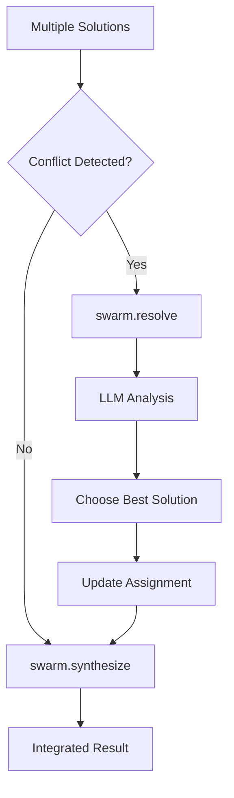
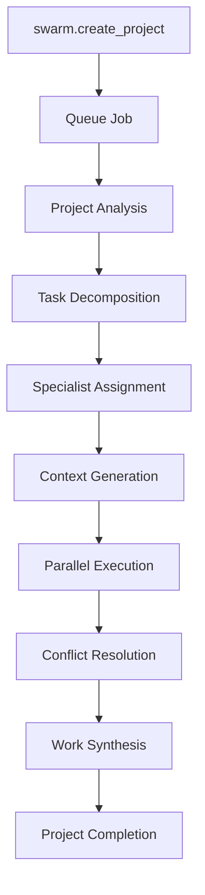

# Swarm Intelligence API

ClaudeBench's swarm intelligence system enables distributed task execution across multiple specialist agents using Large Language Model intelligence for coordination, conflict resolution, and work synthesis.

## Overview

The swarm system transforms complex tasks into manageable subtasks that can be executed in parallel by different specialists. It leverages LLM intelligence for intelligent decomposition, context generation, conflict resolution, and work integration.

## Core Concepts

### Specialist Types

The system supports five specialist types:

- **Frontend**: React, TypeScript, CSS, UI/UX components
- **Backend**: APIs, databases, server logic, authentication  
- **Testing**: Unit tests, integration tests, E2E testing
- **Documentation**: Technical writing, API docs, user guides
- **General**: Cross-cutting concerns, configuration, DevOps

### LLM Intelligence Features

- **Task Decomposition**: Breaking complex tasks into specialist-focused subtasks
- **Context Generation**: Providing specialist-specific guidance and constraints
- **Conflict Resolution**: Resolving disagreements between specialist solutions
- **Work Synthesis**: Integrating completed work into cohesive solutions
- **Capability Matching**: Assigning tasks based on specialist expertise

### Event-Driven Architecture

All swarm operations use ClaudeBench's event-driven architecture with Redis pub/sub for real-time coordination and PostgreSQL for persistence.

## Handler Reference

### [swarm.decompose](./decompose)
**Decompose complex tasks into subtasks using LLM intelligence**

- Breaks down complex tasks into manageable subtasks
- Assigns specialist types to each subtask  
- Establishes dependency relationships
- Creates execution strategies (parallel/sequential/mixed)
- **LLM Timeout**: 300 seconds
- **Rate Limit**: 10 decompositions/minute

### [swarm.context](./context)  
**Generate specialized context for subtask execution**

- Analyzes codebase and requirements
- Provides specialist-specific guidance
- Identifies mandatory readings and constraints
- Generates focused prompts for specialists
- **LLM Timeout**: 300 seconds
- **Rate Limit**: 50 contexts/minute

### [swarm.assign](./assign)
**Assign subtasks to best available specialists**

- Matches subtasks to specialist capabilities
- Implements load balancing across specialists
- Handles queuing when specialists unavailable
- Uses atomic Redis operations for consistency
- **Timeout**: 5 seconds (fast assignment)
- **Rate Limit**: 50 assignments/minute

### [swarm.resolve](./resolve)
**Resolve conflicts between specialist solutions**

- Analyzes conflicting approaches using LLM
- Considers project context and constraints
- Provides justified resolution decisions
- Supports hybrid and modified solutions
- **LLM Timeout**: 300 seconds
- **Rate Limit**: 20 resolutions/minute

### [swarm.synthesize](./synthesize)
**Synthesize completed subtasks into integrated solution**

- Integrates work from multiple specialists
- Identifies potential integration issues
- Generates unified implementation steps
- Creates merged code when possible
- **LLM Timeout**: 300 seconds
- **Rate Limit**: 10 syntheses/minute

### [swarm.create_project](./create_project)
**Create new projects using swarm intelligence**

- Queue-based asynchronous project creation
- Automatic complexity assessment
- Full project lifecycle management
- Priority-based processing
- **Timeout**: 5 seconds (queuing)
- **Rate Limit**: 5 projects/minute

## Workflow Examples

### Simple Feature Development

```mermaid
graph TD
    A[Task: "Add dark mode toggle"] --> B[swarm.decompose]
    B --> C[Frontend Subtask]
    B --> D[Backend Subtask]  
    B --> E[Testing Subtask]
    
    C --> F[swarm.assign Frontend]
    D --> G[swarm.assign Backend]
    E --> H[swarm.assign Testing]
    
    F --> I[swarm.context Frontend]
    G --> J[swarm.context Backend]
    H --> K[swarm.context Testing]
    
    I --> L[Frontend Work]
    J --> M[Backend Work]
    K --> N[Testing Work]
    
    L --> O[swarm.synthesize]
    M --> O
    N --> O
    
    O --> P[Integrated Solution]
```

### Conflict Resolution Workflow



### Project Creation Workflow



## Event Flows

### Core Events

| Event | Purpose | Triggers |
|-------|---------|----------|
| `swarm.decomposed` | Task broken down | Triggers subtask assignment |
| `swarm.assigned` | Subtask assigned | Triggers context generation |
| `swarm.context.generated` | Context created | Specialist can begin work |
| `swarm.resolved` | Conflict resolved | May trigger synthesis |
| `swarm.synthesized` | Work integrated | Task completion or fixes needed |
| `swarm.task_completed` | Task finished | Project milestone reached |

### Event Chain Example

```json
{
  "type": "swarm.decomposed",
  "payload": {
    "taskId": "t-123",
    "subtaskCount": 3,
    "strategy": "mixed"
  }
}
↓
{
  "type": "swarm.assigned", 
  "payload": {
    "subtaskId": "st-1",
    "specialistId": "frontend-42",
    "score": 87
  }
}
↓
{
  "type": "swarm.context.generated",
  "payload": {
    "subtaskId": "st-1",
    "specialist": "frontend",
    "contextSize": 2048
  }
}
```

## Performance Characteristics

### LLM Operation Timeouts

| Handler | Typical Time | Maximum Timeout |
|---------|-------------|-----------------|
| decompose | 15-30s | 300s |
| context | 5-15s | 300s |
| resolve | 20-60s | 300s |
| synthesize | 30-120s | 300s |
| assign | &lt;1s | 5s |
| create_project | &lt;1s | 5s (queuing) |

### Rate Limits

| Handler | Rate Limit | Reason |
|---------|------------|---------|
| decompose | 10/min | Complex LLM analysis |
| context | 50/min | Moderate LLM usage |
| assign | 50/min | Fast Redis operations |
| resolve | 20/min | Complex LLM decision making |
| synthesize | 10/min | Complex LLM integration |
| create_project | 5/min | Resource-intensive orchestration |

## Prerequisites

### System Requirements

- **Redis**: For event coordination and caching
- **PostgreSQL**: For data persistence and audit trails  
- **MCP Sampling Service**: For LLM intelligence
- **Bull Queue**: For asynchronous job processing

### Specialist Registration

Specialists must be registered with capabilities:

```typescript
await systemRegister({
  id: "specialist-frontend-1",
  roles: ["frontend"],
  capabilities: ["react", "typescript", "css", "accessibility"]
});
```

### Session Management

Most LLM operations require valid session context:

```typescript
// Session ID from MCP context
const sessionId = ctx.metadata?.sessionId || ctx.metadata?.clientId;
```

## Best Practices

### Task Decomposition

- **Clear Requirements**: Provide detailed task descriptions
- **Appropriate Scope**: Tasks should be 30-120 minutes of work
- **Dependency Mapping**: Clearly define task relationships
- **Constraint Specification**: Include technical and business constraints

### Specialist Assignment

- **Capability Matching**: Ensure required skills are specified
- **Load Balancing**: Monitor specialist utilization
- **Queue Management**: Handle peak demand gracefully
- **Fallback Strategies**: Plan for specialist unavailability

### Conflict Resolution

- **Context Provision**: Include project requirements and constraints
- **Multiple Solutions**: Encourage diverse approaches
- **Clear Criteria**: Define decision-making factors
- **Documentation**: Record resolution reasoning

### Work Integration

- **Incremental Synthesis**: Integrate work as it completes
- **Issue Tracking**: Monitor and resolve integration problems
- **Quality Assurance**: Validate integrated solutions
- **Rollback Planning**: Prepare for integration failures

## Monitoring & Debugging

### Event Monitoring

```bash
# Monitor swarm events
bun relay | grep "swarm\."
```

### Queue Status

```bash
# Check queue depth
redis-cli ZCARD cb:queue:frontend
redis-cli ZCARD cb:queue:backend
```

### Specialist Health

```bash
# Check registered specialists
redis-cli SMEMBERS cb:specialists:frontend
redis-cli HGETALL cb:specialist:frontend-1
```

### Performance Metrics

```bash
# LLM operation timing
redis-cli HGETALL cb:metrics:llm:decompose
redis-cli HGETALL cb:metrics:llm:synthesis
```

## Common Issues

### LLM Timeouts
- **Cause**: Complex tasks exceeding 300-second limit
- **Solution**: Break down tasks further or increase timeout
- **Prevention**: Use incremental decomposition

### Specialist Overload
- **Cause**: Too many tasks assigned to limited specialists
- **Solution**: Register more specialists or adjust load balancing
- **Prevention**: Monitor utilization metrics

### Integration Conflicts
- **Cause**: Incompatible solutions from different specialists
- **Solution**: Use conflict resolution or manual intervention
- **Prevention**: Better context generation and constraints

### Queue Bottlenecks
- **Cause**: Insufficient specialists for task demand
- **Solution**: Scale specialist capacity or prioritize tasks
- **Prevention**: Capacity planning and demand forecasting

## Related Documentation

- [Task Management API](../task/index) - Core task operations
- [System API](../system/index) - Health and registration
- [Event Architecture](../../architecture/events) - Event system design
- [Redis Operations](../../architecture/redis) - Redis usage patterns