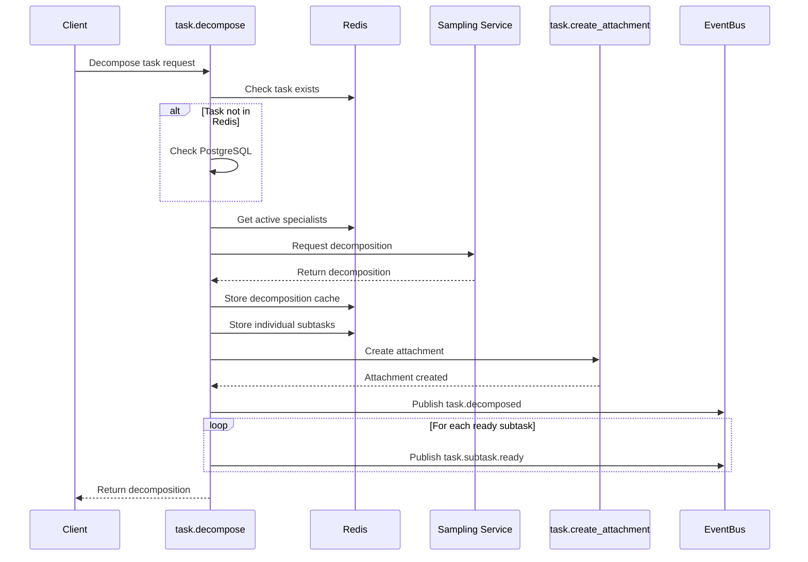

# task.decompose

Decompose complex tasks into manageable subtasks using LLM intelligence for distributed execution across specialist agents.

## Overview

The `task.decompose` handler breaks down complex tasks into smaller, focused subtasks that can be executed by different specialists. This handler replaces the previous `swarm.decompose` handler with improved domain alignment, attachment-based storage, and session-aware workflow tracking.

### Key Improvements from swarm.decompose

| Aspect | Old (swarm.decompose) | New (task.decompose) |
|--------|----------------------|---------------------|
| **Domain Alignment** | Swarm domain | Task domain - better conceptual fit |
| **Storage** | Separate PostgreSQL tables | Attachment-based storage |
| **Session Awareness** | Basic session support | Full session-aware workflow tracking |
| **Redis Integration** | Limited | Full Redis caching with 7-day expiration |
| **Event Publishing** | Single event | Multiple events: `task.decomposed` and `task.subtask.ready` |
| **Subtask Tracking** | Database only | Redis for quick access and queuing |

## Request

### Method
`task.decompose`

### Parameters

| Parameter | Type | Required | Description |
|-----------|------|----------|-------------|
| `taskId` | string | ✓ | The ID of the task to decompose |
| `task` | string | ✓ | Task description (1-1000 characters) |
| `priority` | number | ✗ | Priority level 0-100 (default: 50) |
| `constraints` | string[] | ✗ | Additional constraints for decomposition |
| `sessionId` | string | ✗ | Session ID for workflow tracking |
| `metadata` | object | ✗ | Additional metadata for the decomposition |

### Example Request

```json
{
  "jsonrpc": "2.0",
  "method": "task.decompose",
  "params": {
    "taskId": "t-123456",
    "task": "Add dark mode toggle to settings page",
    "priority": 75,
    "constraints": [
      "Use React hooks",
      "Follow atomic design pattern",
      "Ensure mobile responsiveness"
    ],
    "sessionId": "session-abc123"
  },
  "id": 1
}
```

## Response

### Success Response

```json
{
  "jsonrpc": "2.0",
  "result": {
    "taskId": "t-123456",
    "subtaskCount": 4,
    "decomposition": {
      "subtasks": [
        {
          "id": "st-1234567890-1",
          "description": "Create DarkModeToggle React component",
          "specialist": "frontend",
          "dependencies": [],
          "complexity": 30,
          "context": {
            "files": ["components/Settings.tsx"],
            "patterns": ["React hooks", "Context API"],
            "constraints": ["Mobile responsive", "Accessible"]
          },
          "estimatedMinutes": 45,
          "rationale": "Core UI component for theme switching"
        },
        {
          "id": "st-1234567890-2",
          "description": "Implement theme persistence API",
          "specialist": "backend",
          "dependencies": [],
          "complexity": 25,
          "context": {
            "files": ["api/preferences.ts"],
            "patterns": ["REST API", "localStorage"],
            "constraints": ["Secure storage", "Fast retrieval"]
          },
          "estimatedMinutes": 30,
          "rationale": "Backend support for saving user preferences"
        },
        {
          "id": "st-1234567890-3",
          "description": "Apply dark theme styles across components",
          "specialist": "frontend",
          "dependencies": ["st-1234567890-1"],
          "complexity": 40,
          "context": {
            "files": ["styles/theme.css", "components/**/*.tsx"],
            "patterns": ["CSS variables", "Theme context"],
            "constraints": ["Consistent styling", "Performance"]
          },
          "estimatedMinutes": 60,
          "rationale": "Comprehensive theme application"
        },
        {
          "id": "st-1234567890-4",
          "description": "Write E2E tests for dark mode functionality",
          "specialist": "testing",
          "dependencies": ["st-1234567890-1", "st-1234567890-2", "st-1234567890-3"],
          "complexity": 20,
          "context": {
            "files": ["tests/e2e/darkmode.test.ts"],
            "patterns": ["Playwright", "Visual regression"],
            "constraints": ["Cross-browser testing"]
          },
          "estimatedMinutes": 30,
          "rationale": "Ensure feature works end-to-end"
        }
      ],
      "executionStrategy": "mixed",
      "totalComplexity": 115,
      "reasoning": "Task decomposed into frontend component creation, backend persistence, style application, and testing. Frontend and backend work can proceed in parallel, followed by style application, then testing.",
      "architecturalConsiderations": [
        "Theme context should be at app root level",
        "Use CSS variables for dynamic theming",
        "Consider system preference detection",
        "Ensure smooth transitions between themes"
      ]
    },
    "attachmentKey": "decomposition_1734567890123"
  },
  "id": 1
}
```

### Error Response

```json
{
  "jsonrpc": "2.0",
  "error": {
    "code": -32602,
    "message": "Task t-999999 not found"
  },
  "id": 1
}
```

## Storage Architecture

### Attachment-Based Storage

The decomposition is stored as a task attachment with the following structure:

```typescript
{
  taskId: string;
  taskText: string;
  strategy: "parallel" | "sequential" | "mixed";
  totalComplexity: number;
  reasoning: string;
  subtaskCount: number;
  subtasks: Array<{
    id: string;
    description: string;
    specialist: string;
    complexity: number;
    estimatedMinutes: number;
    dependencies: string[];
    context: object;
    rationale: string;
    status: "pending";
  }>;
  architecturalConsiderations?: string[];
  decomposedAt: string;  // ISO datetime
  decomposedBy: string;  // Instance ID
  sessionId: string;
  metadata?: object;
}
```

**Attachment Key Pattern**: `decomposition_{timestamp}`

### Redis Caching

Decomposition data is cached in Redis for quick access:

- **Key**: `cb:decomposition:{taskId}`
- **Expiration**: 7 days (604800 seconds)
- **Fields**:
  - `taskId`: Task identifier
  - `taskText`: Original task description
  - `strategy`: Execution strategy
  - `totalComplexity`: Sum of all subtask complexities
  - `subtaskCount`: Number of subtasks
  - `timestamp`: Creation timestamp
  - `sessionId`: Associated session

### Subtask Storage

Individual subtasks are stored in Redis for tracking:

- **Key**: `cb:subtask:{subtaskId}`
- **Fields**:
  - `id`: Subtask identifier
  - `parentTaskId`: Parent task ID
  - `description`: Subtask description
  - `specialist`: Assigned specialist type
  - `complexity`: Complexity score (1-100)
  - `estimatedMinutes`: Time estimate
  - `dependencies`: JSON array of dependency IDs
  - `status`: Current status (initially "pending")
  - `createdAt`: Creation timestamp

## Event Flow

### Published Events

#### 1. task.decomposed

Published after successful decomposition:

```json
{
  "type": "task.decomposed",
  "payload": {
    "taskId": "t-123456",
    "subtaskCount": 4,
    "strategy": "mixed",
    "totalComplexity": 115,
    "attachmentKey": "decomposition_1734567890123"
  },
  "metadata": {
    "decomposedBy": "worker-1",
    "sessionId": "session-abc123",
    "timestamp": 1734567890123
  }
}
```

#### 2. task.subtask.ready

Published for each subtask without dependencies:

```json
{
  "type": "task.subtask.ready",
  "payload": {
    "subtaskId": "st-1234567890-1",
    "parentTaskId": "t-123456",
    "specialist": "frontend",
    "description": "Create DarkModeToggle React component",
    "requiredCapabilities": ["React hooks", "Context API"]
  },
  "metadata": {
    "priority": 75,
    "sessionId": "session-abc123"
  }
}
```

## Execution Flow Diagram



## Specialist Queue Management

Subtasks without dependencies are automatically added to specialist queues:

- **Queue Key**: `cb:queue:specialist:{specialistType}`
- **Score**: `timestamp + complexity` (for priority ordering)
- **Member**: Subtask ID

This enables specialists to claim work from their respective queues.

## LLM Integration

### Sampling Service

The handler uses the MCP sampling service for intelligent decomposition:

```typescript
const decomposition = await samplingService.requestDecomposition(
  sessionId,
  input.task,
  {
    specialists,      // Available specialist types
    priority,         // Task priority
    constraints       // Additional constraints
  }
);
```

### Session Management

Session ID priority order:
1. Explicit `sessionId` from input
2. `sessionId` from context metadata
3. `clientId` from context metadata
4. `instanceId` as fallback

## Error Handling

### Common Errors

| Error | Code | Description |
|-------|------|-------------|
| Task not found | -32602 | The specified task ID doesn't exist |
| No session ID | -32603 | No session ID available for sampling |
| Sampling timeout | -32001 | LLM sampling exceeded 300 seconds |
| Storage failure | -32000 | Failed to store decomposition attachment |

### Circuit Breaker

The handler includes circuit breaker protection:
- **Threshold**: 3 failures
- **Timeout**: 60 seconds
- **Fallback**: Returns empty decomposition with "Service temporarily unavailable" message

## Best Practices

### When to Use task.decompose

✅ **Use when:**
- Task description is complex and multi-faceted
- Work can be parallelized across specialists
- Task requires multiple skill sets
- Estimated time > 2 hours

❌ **Avoid when:**
- Task is simple and straightforward
- Single specialist can complete entire task
- Task is already well-defined with clear steps
- Decomposition would add unnecessary overhead

### Optimization Tips

1. **Provide Clear Constraints**: More specific constraints lead to better decomposition
2. **Include Context**: Add relevant metadata for better specialist assignment
3. **Session Continuity**: Use consistent session IDs for related decompositions
4. **Monitor Complexity**: High total complexity (>200) may indicate over-decomposition

## Migration from swarm.decompose

### Key Differences

1. **Event Name**: `swarm.decompose` → `task.decompose`
2. **Storage**: Database tables → Task attachments
3. **Caching**: Limited → Full Redis caching with expiration
4. **Events**: Single event → Multiple granular events

### Migration Steps

```javascript
// Old way (swarm.decompose)
await client.call('swarm.decompose', {
  taskId: 't-123',
  task: 'Build feature',
  priority: 50
});

// New way (task.decompose)
await client.call('task.decompose', {
  taskId: 't-123',
  task: 'Build feature',
  priority: 50,
  sessionId: 'session-123'  // Now recommended
});
```

### Attachment Retrieval

Decompositions can be retrieved via the attachment system:

```javascript
// Get decomposition attachment
const attachment = await client.call('task.get_attachment', {
  taskId: 't-123',
  key: 'decomposition_1734567890123'
});

// List all decompositions for a task
const attachments = await client.call('task.list_attachments', {
  taskId: 't-123',
  type: 'json'
});

const decompositions = attachments.attachments.filter(
  a => a.key.startsWith('decomposition_')
);
```

## Related Handlers

- [`task.create`](./create.md) - Create the parent task before decomposition
- [`task.create_attachment`](./create_attachment.md) - Stores decomposition data
- [`task.context`](./context.md) - Generate execution context for subtasks
- [`swarm.assign`](../swarm/assign.md) - Assign subtasks to specialists
- [`swarm.synthesize`](../swarm/synthesize.md) - Combine subtask results

## Performance Considerations

- **LLM Timeout**: 300 seconds (5 minutes) for complex decompositions
- **Rate Limit**: 10 decompositions per minute
- **Redis Cache**: 7-day expiration to balance memory usage
- **Attachment Size**: Large decompositions may impact attachment storage

## Examples

### Feature Development

```json
{
  "taskId": "t-feature-123",
  "task": "Implement user authentication with OAuth2",
  "priority": 90,
  "constraints": [
    "Support Google and GitHub providers",
    "Include refresh token handling",
    "Add rate limiting",
    "Ensure GDPR compliance"
  ]
}
```

### Bug Fix

```json
{
  "taskId": "t-bug-456",
  "task": "Fix memory leak in real-time chat component",
  "priority": 95,
  "constraints": [
    "Maintain backward compatibility",
    "Add performance monitoring",
    "Include regression tests"
  ]
}
```

### Documentation

```json
{
  "taskId": "t-docs-789",
  "task": "Create comprehensive API documentation",
  "priority": 60,
  "constraints": [
    "Include code examples",
    "Add OpenAPI specification",
    "Create migration guide",
    "Include troubleshooting section"
  ]
}
```