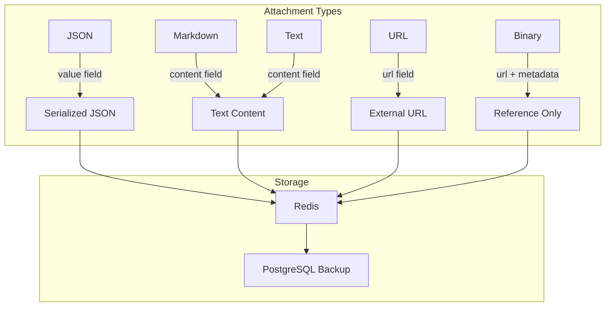
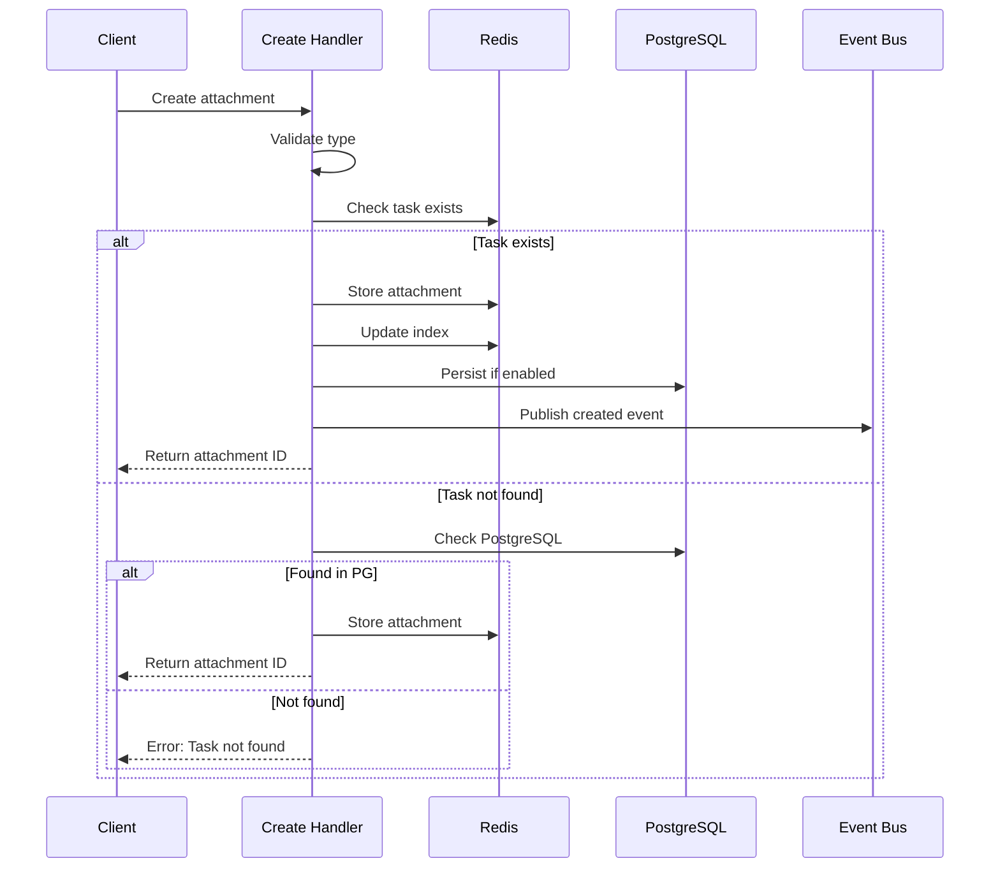
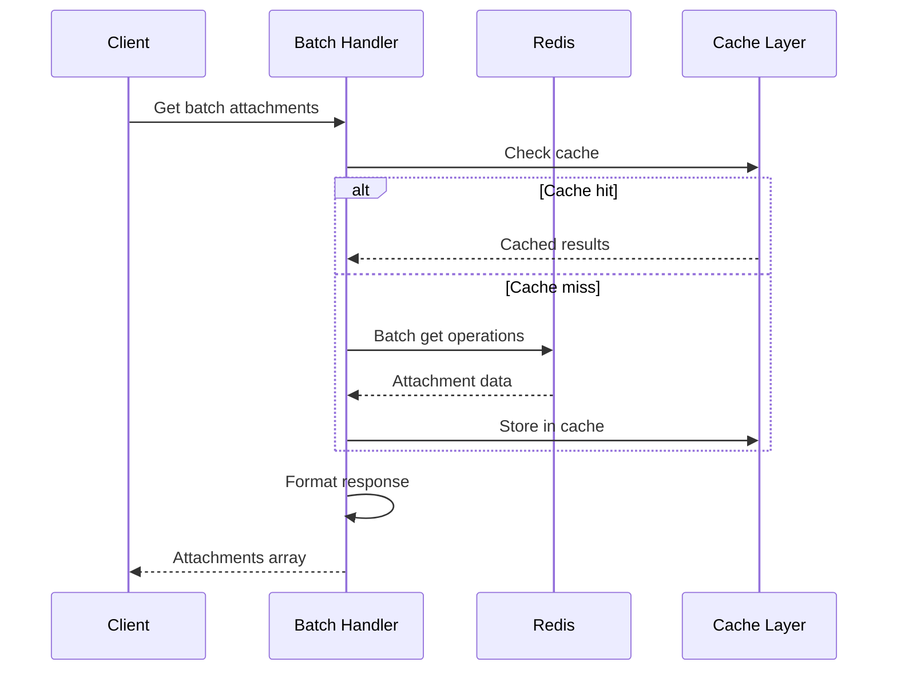

# Task Attachments Architecture

## Overview

The Task Attachments system provides a flexible key-value store per task, allowing any type of structured or unstructured data to be associated with tasks. This architecture evolved from a simple metadata field to a full-featured attachment system supporting multiple data types, batch operations, and seamless integration with other ClaudeBench subsystems.

## Design Principles

### 1. **Type Safety**
Each attachment has an explicit type (json, markdown, text, url, binary) with corresponding validation rules, ensuring data integrity and enabling type-specific processing.

### 2. **Key Uniqueness**
Attachments are uniquely identified by task ID and key combination. Updates to existing keys overwrite previous values, maintaining consistency.

### 3. **Storage Flexibility**
Small attachments stored directly in Redis/PostgreSQL, while large or binary attachments store references to external storage.

### 4. **Query Efficiency**
Indexed by task and type, attachments support efficient listing, filtering, and batch retrieval operations.

### 5. **Integration First**
Designed to seamlessly integrate with git commits, swarm results, and analysis outputs.

## Components

### Attachment Creation Handler

Creates or updates attachments for tasks:

```typescript
// task.create_attachment.handler.ts
@EventHandler({
    event: "task.create_attachment",
    inputSchema: taskCreateAttachmentInput,
    outputSchema: taskCreateAttachmentOutput,
    persist: true, // Store in PostgreSQL
})
export class TaskCreateAttachmentHandler {
    async handle(input: TaskCreateAttachmentInput, ctx: EventContext) {
        // 1. Validate type-specific requirements
        // 2. Generate attachment ID
        // 3. Store in Redis (immediate access)
        // 4. Persist to PostgreSQL (durability)
        // 5. Update attachment index
        // 6. Publish creation event
    }
}
```

### Attachment Retrieval Handlers

Multiple handlers for different access patterns:

```typescript
// Single attachment retrieval
@EventHandler({ event: "task.get_attachment" })
export class TaskGetAttachmentHandler {
    // Retrieve specific attachment by key
}

// List attachments with filtering
@EventHandler({ event: "task.list_attachments" })
export class TaskListAttachmentsHandler {
    // List all attachments for a task
}

// Batch retrieval for efficiency
@EventHandler({ event: "task.get_attachments_batch" })
export class TaskGetAttachmentsBatchHandler {
    // Retrieve multiple attachments in one call
}
```

## Data Model

### Attachment Types

```typescript
enum AttachmentType {
    "json",      // Structured data (analysis, configs)
    "markdown",  // Documentation, notes
    "text",      // Plain text, logs
    "url",       // External references
    "binary"     // File references (not content)
}
```

### Attachment Schema

```typescript
interface TaskAttachment {
    id: string;              // Unique attachment ID
    taskId: string;          // Parent task ID
    key: string;             // Unique key per task
    type: AttachmentType;    // Data type
    
    // Content (only one will be set based on type)
    value?: any;             // For JSON type
    content?: string;        // For text/markdown
    url?: string;            // For URL type
    
    // Metadata
    size?: number;           // Content size in bytes
    mimeType?: string;       // MIME type for binary
    createdBy?: string;      // Instance that created it
    createdAt: string;       // ISO timestamp
    updatedAt: string;       // Last modified
}
```

### Storage Strategy

Different attachment types use different storage fields:



## Data Flow

### Attachment Creation Flow



### Batch Retrieval Flow



## Redis Keys & Patterns

| Key Pattern | Type | Purpose | TTL |
|-------------|------|---------|-----|
| `cb:task:{taskId}:attachment:{key}` | hash | Attachment data | Task lifetime |
| `cb:task:{taskId}:attachments` | zset | Attachment index (score=timestamp) | Task lifetime |
| `cb:metrics:attachments` | hash | Global metrics | None |
| `cb:metrics:attachments:type` | hash | Per-type counters | None |

### Index Structure

Attachments are indexed using sorted sets for efficient queries:

```redis
# Attachment index for task
ZADD cb:task:t-123:attachments <timestamp> "analysis"
ZADD cb:task:t-123:attachments <timestamp> "git-commit-abc"
ZADD cb:task:t-123:attachments <timestamp> "implementation_notes"

# Query recent attachments
ZREVRANGE cb:task:t-123:attachments 0 10 WITHSCORES
```

## Integration Points

### Git Integration

Git commits automatically create attachments:

```typescript
// Git commit creates attachment
{
    taskId: "t-123",
    key: "git-commit-abc123d",
    type: "json",
    value: {
        commitHash: "abc123def",
        branch: "feature/auth",
        files: ["src/auth.ts"],
        diff: "+ added auth logic",
        stats: { additions: 45, deletions: 12 }
    }
}
```

### Swarm Intelligence

Swarm results attached to parent tasks:

```typescript
// Swarm decomposition results
{
    taskId: "t-parent",
    key: "swarm-decomposition",
    type: "json",
    value: {
        subtasks: [
            { id: "t-sub-1", specialist: "frontend" },
            { id: "t-sub-2", specialist: "backend" }
        ],
        strategy: "parallel",
        estimatedTime: "2h"
    }
}

// Synthesis results
{
    taskId: "t-parent",
    key: "swarm-synthesis",
    type: "markdown",
    content: "## Integrated Solution\n..."
}
```

### Analysis Tools

External analysis tools store results as attachments:

```typescript
// Code complexity analysis
{
    taskId: "t-456",
    key: "complexity-analysis",
    type: "json",
    value: {
        cyclomaticComplexity: 12,
        linesOfCode: 450,
        testCoverage: 0.75,
        dependencies: ["react", "redux"]
    }
}
```

## Performance Considerations

### Storage Optimization

- **Size Limits**: 10KB limit for inline storage, larger data uses references
- **Compression**: JSON attachments compressed when > 1KB
- **Lazy Loading**: Attachments loaded on-demand, not with task
- **Batch Operations**: Multi-get operations reduce round trips

### Caching Strategy

```typescript
interface AttachmentCache {
    L1: {
        type: "Memory",
        ttl: 60,  // 1 minute
        maxSize: 100
    },
    L2: {
        type: "Redis",
        ttl: 3600, // 1 hour
        pattern: "cb:cache:attachment:*"
    }
}
```

### Query Optimization

Efficient patterns for common queries:

```typescript
// Get all git commits for a task
const commits = await listAttachments({
    taskId: "t-123",
    type: "json"
}).filter(a => a.key.startsWith("git-commit-"));

// Get latest analysis
const analysis = await getAttachment({
    taskId: "t-123",
    key: "latest-analysis"
});

// Batch get multiple attachments
const batch = await getBatch([
    { taskId: "t-1", key: "analysis" },
    { taskId: "t-2", key: "synthesis" }
]);
```

## Security Considerations

- **Access Control**: Attachments inherit task permissions
- **Content Validation**: Type-specific validation prevents injection
- **Size Limits**: Prevents storage exhaustion attacks
- **Sanitization**: Markdown/HTML content sanitized before storage
- **URL Validation**: External URLs verified before storage

## Examples

### Creating Analysis Attachment

```typescript
// Attach complexity analysis to task
const attachment = await handler.handle({
    taskId: "t-789",
    key: "complexity",
    type: "json",
    value: {
        complexity: "high",
        estimatedHours: 8,
        risks: ["dependency conflicts", "API changes"],
        recommendations: ["Add integration tests", "Document APIs"]
    }
});

// Returns
{
    id: "ta-1234567890-abc",
    taskId: "t-789",
    key: "complexity",
    type: "json",
    createdAt: "2024-01-15T10:30:00Z"
}
```

### Attaching External Documentation

```typescript
// Link to external documentation
await handler.handle({
    taskId: "t-789",
    key: "api-docs",
    type: "url",
    url: "https://docs.api.com/v2/authentication"
});
```

### Storing Implementation Notes

```typescript
// Add markdown documentation
await handler.handle({
    taskId: "t-789",
    key: "implementation",
    type: "markdown",
    content: `## Implementation Details

### Architecture Decision
We chose Redux for state management because:
1. Complex state interactions
2. Time-travel debugging needed
3. Existing team expertise

### Performance Notes
- Implement virtual scrolling for lists > 100 items
- Use React.memo for expensive components
`
});
```

### Batch Retrieval

```typescript
// Get multiple attachments efficiently
const attachments = await handler.handle({
    requests: [
        { taskId: "t-1", key: "analysis" },
        { taskId: "t-1", key: "git-commit-latest" },
        { taskId: "t-2", key: "synthesis" },
        { taskId: "t-3", key: "test-results" }
    ]
});

// Returns array with found attachments
// Missing attachments return null
```

## Migration from Metadata

The attachment system evolved from a simple metadata field:

```typescript
// Before: Unstructured metadata
task.metadata = {
    anything: "goes",
    no: "validation"
};

// After: Typed attachments
attachment = {
    key: "analysis",
    type: "json",
    value: { validated: "content" }
};
```

Benefits of migration:
- **Type Safety**: Each attachment type has validation
- **Querying**: Can filter by type and key
- **Size Management**: Large data doesn't bloat task records
- **Versioning**: Attachments can be updated independently
- **Integration**: Purpose-built for system integrations

## Troubleshooting

### Common Issues

1. **Attachment Not Found**
   - **Check**: Task exists in Redis or PostgreSQL
   - **Verify**: Key spelling and case sensitivity
   - **Debug**: List all attachments for task

2. **Type Validation Failed**
   - **JSON**: Ensure `value` field is provided
   - **Markdown/Text**: Ensure `content` field is provided
   - **URL**: Ensure valid URL format

3. **Size Limit Exceeded**
   - **Solution**: Store reference instead of content
   - **Alternative**: Compress data before storage
   - **Consider**: External storage for large files

## Future Enhancements

- [ ] **Attachment Versioning**: Track changes over time
- [ ] **Full-Text Search**: Search within attachment content
- [ ] **Automatic Summarization**: AI-generated summaries of attachments
- [ ] **Attachment Templates**: Predefined structures for common types
- [ ] **Cross-Task Linking**: Reference attachments from other tasks
- [ ] **Expiration Policies**: Auto-cleanup of old attachments
- [ ] **Encryption**: Client-side encryption for sensitive data

## References

- [Task System Documentation](/api/tasks)
- [Git Integration](./git-integration)
- [Session State Management](./session-state)
- [Redis Architecture](./redis)