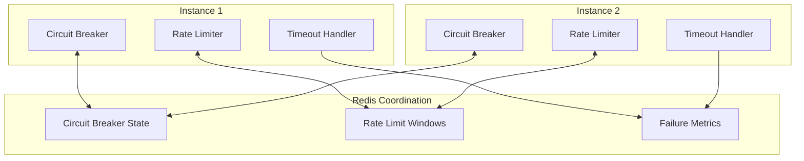
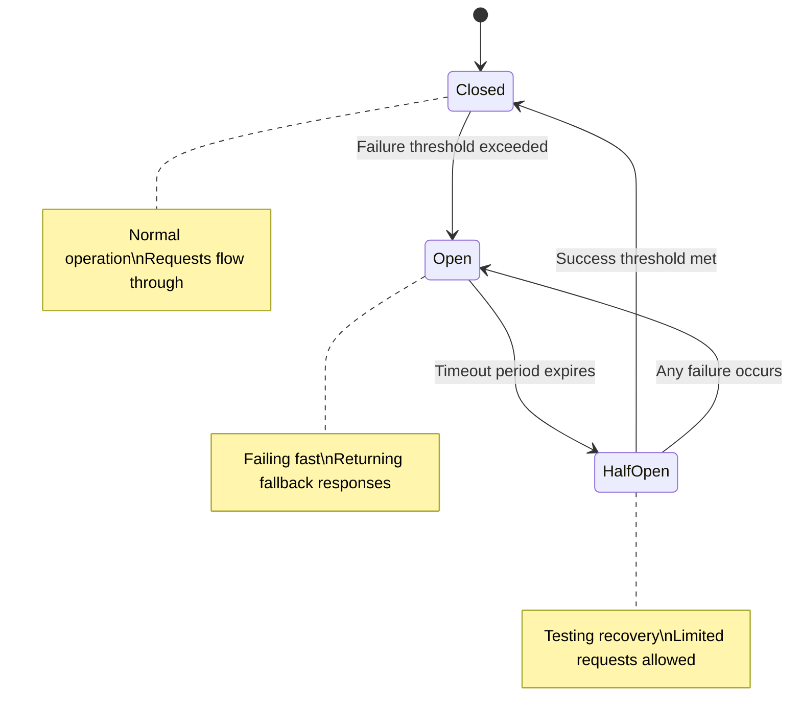
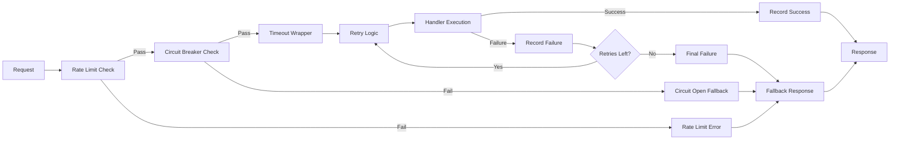

# Circuit Breaker and Resilience Patterns

ClaudeBench implements comprehensive resilience patterns to ensure system stability under failure conditions. The circuit breaker pattern, combined with rate limiting, timeouts, and graceful degradation, provides robust protection against cascading failures.

## Overview

### Resilience Philosophy

ClaudeBench's resilience strategy follows the principle of "fail fast, recover gracefully":

- **Circuit Breakers**: Prevent cascading failures by stopping requests to failing services
- **Rate Limiting**: Protect against resource exhaustion and abuse
- **Timeouts**: Ensure bounded response times and prevent resource leaks
- **Graceful Degradation**: Provide fallback responses when services are unavailable
- **Bulkhead Isolation**: Isolate failures to prevent system-wide impact

### Distributed Coordination

All resilience patterns coordinate across multiple instances using Redis:



## Circuit Breaker Implementation

### Circuit Breaker States



### State Management

**Redis Keys for Circuit Breaker State**:
```
cb:circuit:{event}:state     # Circuit breaker state and metrics
cb:circuit:{event}:failures  # Recent failure timestamps
cb:circuit:{event}:successes # Recent success timestamps (half-open)
```

**State Structure**:
```typescript
interface CircuitBreakerState {
  status: 'closed' | 'open' | 'half-open';
  failureCount: number;
  lastFailureTime: number;
  lastSuccessTime: number;
  nextAttemptTime: number;
  consecutiveSuccesses: number;
}
```

### Decorator Implementation

```typescript
interface CircuitBreakerConfig {
  threshold: number;          // Failures before opening
  timeout: number;           // Time before trying half-open (ms)
  successThreshold: number;  // Successes needed to close (default: 3)
  slidingWindow: number;     // Window for failure counting (ms)
  fallback?: () => any;      // Fallback response function
  backoffMultiplier?: number; // Exponential backoff multiplier (default: 1.5)
}

@CircuitBreaker({
  threshold: 10,
  timeout: 30000,
  successThreshold: 3,
  slidingWindow: 60000,
  fallback: () => ({ status: 'unavailable', cached: true })
})
export class ProtectedHandler {
  async handle(input: any, context: EventContext) {
    // Protected operation
    return await this.performOperation(input);
  }
}

// Note: Circuit breaker timeout is capped at 5 minutes (300000ms) to prevent
// overflow from exponential backoff calculations
```

### Circuit Breaker Logic

```typescript
export class CircuitBreakerManager {
  async checkCircuit(eventType: string): Promise<CircuitBreakerDecision> {
    const stateKey = `cb:circuit:${eventType}:state`;
    const state = await this.getCircuitState(stateKey);
    
    switch (state.status) {
      case 'closed':
        return { allow: true, reason: 'circuit_closed' };
        
      case 'open':
        if (Date.now() >= state.nextAttemptTime) {
          // Transition to half-open
          await this.setCircuitState(stateKey, {
            ...state,
            status: 'half-open',
            consecutiveSuccesses: 0
          });
          return { allow: true, reason: 'half_open_trial' };
        }
        return { 
          allow: false, 
          reason: 'circuit_open',
          retryAfter: state.nextAttemptTime - Date.now()
        };
        
      case 'half-open':
        return { allow: true, reason: 'half_open_testing' };
        
      default:
        return { allow: true, reason: 'unknown_state' };
    }
  }
  
  async recordSuccess(eventType: string): Promise<void> {
    const stateKey = `cb:circuit:${eventType}:state`;
    const state = await this.getCircuitState(stateKey);
    
    if (state.status === 'half-open') {
      const newSuccesses = state.consecutiveSuccesses + 1;
      
      if (newSuccesses >= this.config.successThreshold) {
        // Circuit can close
        await this.setCircuitState(stateKey, {
          status: 'closed',
          failureCount: 0,
          lastSuccessTime: Date.now(),
          consecutiveSuccesses: 0,
          nextAttemptTime: 0
        });
      } else {
        // Still testing
        await this.setCircuitState(stateKey, {
          ...state,
          consecutiveSuccesses: newSuccesses,
          lastSuccessTime: Date.now()
        });
      }
    }
  }
  
  async recordFailure(eventType: string): Promise<void> {
    const stateKey = `cb:circuit:${eventType}:state`;
    const failuresKey = `cb:circuit:${eventType}:failures`;
    
    // Record failure timestamp
    await this.redis.lpush(failuresKey, Date.now());
    await this.redis.expire(failuresKey, this.config.slidingWindow / 1000);
    
    // Count recent failures
    const cutoff = Date.now() - this.config.slidingWindow;
    await this.redis.lrem(failuresKey, 0, cutoff); // Remove old failures
    const recentFailures = await this.redis.llen(failuresKey);
    
    if (recentFailures >= this.config.threshold) {
      // Open the circuit
      await this.setCircuitState(stateKey, {
        status: 'open',
        failureCount: recentFailures,
        lastFailureTime: Date.now(),
        nextAttemptTime: Date.now() + this.config.timeout,
        consecutiveSuccesses: 0
      });
    }
  }
}
```

## Rate Limiting

### Sliding Window Rate Limiting

ClaudeBench implements distributed rate limiting using Redis sorted sets for sliding window tracking:

```typescript
interface RateLimitConfig {
  limit: number;           // Max requests per window
  windowMs: number;        // Window duration in milliseconds
  keyGenerator?: (ctx: EventContext) => string;
  skipSuccessfulRequests?: boolean;
  skipFailedRequests?: boolean;
}

@RateLimited({
  limit: 100,
  windowMs: 60000,
  keyGenerator: (ctx) => `${ctx.eventType}:${ctx.instanceId}`
})
export class RateLimitedHandler {
  async handle(input: any, context: EventContext) {
    // Rate limited operation
  }
}
```

### Rate Limit Implementation

```typescript
export class RateLimitManager {
  async checkRateLimit(
    key: string, 
    limit: number, 
    windowMs: number
  ): Promise<RateLimitResult> {
    const rateLimitKey = `cb:ratelimit:${key}`;
    const now = Date.now();
    const windowStart = now - windowMs;
    
    // Use Redis pipeline for atomic operations
    const pipeline = this.redis.pipeline();
    
    // Remove expired entries
    pipeline.zremrangebyscore(rateLimitKey, '-inf', windowStart);
    
    // Count current requests in window
    pipeline.zcard(rateLimitKey);
    
    // Add current request
    pipeline.zadd(rateLimitKey, now, `${now}-${Math.random()}`);
    
    // Set expiration
    pipeline.expire(rateLimitKey, Math.ceil(windowMs / 1000));
    
    const results = await pipeline.exec();
    const currentCount = results[1][1] as number;
    
    if (currentCount >= limit) {
      // Remove the request we just added since it's over limit
      await this.redis.zremrangebyrank(rateLimitKey, -1, -1);
      
      return {
        allowed: false,
        limit,
        remaining: 0,
        resetTime: windowStart + windowMs
      };
    }
    
    return {
      allowed: true,
      limit,
      remaining: Math.max(0, limit - currentCount - 1),
      resetTime: windowStart + windowMs
    };
  }
}
```

### Rate Limiting Strategies

**Per-Instance Rate Limiting**:
```typescript
keyGenerator: (ctx) => `instance:${ctx.instanceId}`
```

**Per-Event-Type Rate Limiting**:
```typescript
keyGenerator: (ctx) => `event:${ctx.eventType}`
```

**Global Rate Limiting**:
```typescript
keyGenerator: (ctx) => 'global'
```

**User-Based Rate Limiting**:
```typescript
keyGenerator: (ctx) => `user:${ctx.metadata.userId}`
```

## Timeout Management

### Request Timeouts

```typescript
interface TimeoutConfig {
  timeout: number;           // Timeout in milliseconds
  onTimeout?: () => any;     // Timeout fallback
}

@Timeout({
  timeout: 5000,
  onTimeout: () => ({ error: 'Request timed out', code: 'TIMEOUT' })
})
export class TimeSensitiveHandler {
  async handle(input: any, context: EventContext) {
    // Time-sensitive operation
  }
}
```

### Implementation

```typescript
export class TimeoutManager {
  async executeWithTimeout<T>(
    operation: () => Promise<T>,
    timeoutMs: number,
    fallback?: () => T
  ): Promise<T> {
    const timeoutPromise = new Promise<never>((_, reject) => {
      setTimeout(() => {
        reject(new TimeoutError(`Operation timed out after ${timeoutMs}ms`));
      }, timeoutMs);
    });
    
    try {
      return await Promise.race([operation(), timeoutPromise]);
    } catch (error) {
      if (error instanceof TimeoutError && fallback) {
        return fallback();
      }
      throw error;
    }
  }
}
```

## Comprehensive Resilience Decorator

### @Resilient Decorator

The `@Resilient` decorator combines all resilience patterns:

```typescript
interface ResilientConfig {
  circuitBreaker?: CircuitBreakerConfig;
  rateLimit?: RateLimitConfig;
  timeout?: TimeoutConfig;
  retries?: RetryConfig;
  bulkhead?: BulkheadConfig;
}

@Resilient({
  circuitBreaker: {
    threshold: 10,
    timeout: 30000,
    fallback: () => ({ status: 'degraded' })
  },
  rateLimit: {
    limit: 100,
    windowMs: 60000
  },
  timeout: {
    timeout: 5000
  },
  retries: {
    attempts: 3,
    backoff: 'exponential'
  }
})
export class FullyProtectedHandler {
  async handle(input: any, context: EventContext) {
    // Fully protected operation
  }
}
```

### Execution Pipeline



## Fallback Strategies

### Static Fallbacks

```typescript
// Simple static response
fallback: () => ({ 
  status: 'unavailable', 
  message: 'Service temporarily unavailable',
  timestamp: Date.now()
})
```

### Cache-Based Fallbacks

```typescript
// Return cached data when available
fallback: async () => {
  const cached = await redis.get(`cb:cache:${eventType}:last_known_good`);
  return cached ? JSON.parse(cached) : { status: 'no_data' };
}
```

### Degraded Functionality

```typescript
// Provide limited functionality
fallback: () => ({
  status: 'degraded',
  features: ['read_only', 'cached_data'],
  message: 'Operating in degraded mode'
})
```

### Upstream Service Fallbacks

```typescript
// Try alternative service
fallback: async () => {
  try {
    return await alternativeService.handle(input);
  } catch {
    return { status: 'all_services_unavailable' };
  }
}
```

## Monitoring and Observability

### Circuit Breaker Metrics

```typescript
interface CircuitBreakerMetrics {
  eventType: string;
  state: 'closed' | 'open' | 'half-open';
  failureRate: number;
  requestCount: number;
  failureCount: number;
  lastStateChange: number;
  timeInCurrentState: number;
  fallbacksTriggered: number;
}
```

### Rate Limiting Metrics

```typescript
interface RateLimitMetrics {
  eventType: string;
  requestsAllowed: number;
  requestsBlocked: number;
  currentWindowUsage: number;
  windowResetTime: number;
  averageRequestRate: number;
}
```

### Aggregated Resilience Metrics

```typescript
interface ResilienceMetrics {
  circuitBreakers: {
    total: number;
    open: number;
    halfOpen: number;
    closed: number;
  };
  rateLimiting: {
    requestsPerSecond: number;
    blockedRequestsPerSecond: number;
    blockRate: number;
  };
  timeouts: {
    timeoutRate: number;
    averageResponseTime: number;
    p95ResponseTime: number;
  };
  fallbacks: {
    triggeredPerSecond: number;
    successRate: number;
  };
}
```

### Alerting Thresholds

```yaml
alerts:
  circuit_breaker:
    - name: "Circuit Breaker Open"
      condition: "circuit_breaker.state == 'open'"
      severity: "warning"
      duration: "1m"
      
    - name: "Multiple Circuit Breakers Open"
      condition: "circuit_breakers.open > 3"
      severity: "critical"
      duration: "30s"
      
  rate_limiting:
    - name: "High Block Rate"
      condition: "rate_limit.block_rate > 0.1"
      severity: "warning" 
      duration: "5m"
      
  timeouts:
    - name: "High Timeout Rate"
      condition: "timeout.rate > 0.05"
      severity: "warning"
      duration: "2m"
      
    - name: "Response Time Degradation"
      condition: "response_time.p95 > 1000"
      severity: "warning"
      duration: "3m"
```

## Testing Resilience Patterns

### Circuit Breaker Testing

```typescript
describe('Circuit Breaker', () => {
  it('opens after threshold failures', async () => {
    const handler = new ProtectedHandler();
    
    // Trigger failures to open circuit
    for (let i = 0; i < 10; i++) {
      try {
        await handler.handle({ shouldFail: true }, context);
      } catch (error) {
        // Expected failures
      }
    }
    
    // Verify circuit is open
    const state = await circuitBreaker.getState('test.operation');
    expect(state.status).toBe('open');
    
    // Verify fallback is used
    const result = await handler.handle({}, context);
    expect(result.status).toBe('unavailable');
  });
  
  it('transitions to half-open after timeout', async () => {
    // Set up open circuit
    await circuitBreaker.setState('test.operation', {
      status: 'open',
      nextAttemptTime: Date.now() - 1000 // Past timeout
    });
    
    // First request should transition to half-open
    const decision = await circuitBreaker.checkCircuit('test.operation');
    expect(decision.allow).toBe(true);
    expect(decision.reason).toBe('half_open_trial');
  });
});
```

### Rate Limiting Testing

```typescript
describe('Rate Limiting', () => {
  it('blocks requests exceeding limit', async () => {
    const handler = new RateLimitedHandler();
    
    // Send requests up to limit
    for (let i = 0; i < 100; i++) {
      const result = await handler.handle({}, context);
      expect(result).toBeDefined();
    }
    
    // Next request should be rate limited
    await expect(handler.handle({}, context))
      .rejects.toThrow('Rate limit exceeded');
  });
  
  it('resets after window expires', async () => {
    // Fill rate limit
    // ... wait for window to expire
    // Verify requests allowed again
  });
});
```

### Integration Testing

```typescript
describe('Resilience Integration', () => {
  it('handles cascading failures gracefully', async () => {
    // Simulate various failure conditions
    // Verify system continues operating
    // Check fallback responses are appropriate
  });
  
  it('recovers automatically when services restore', async () => {
    // Trigger failures and circuit opening
    // Restore service
    // Verify automatic recovery
  });
});
```

## Best Practices

### Configuration Guidelines

1. **Circuit Breaker Thresholds**: Set based on acceptable error rates (typically 5-10%)
2. **Rate Limits**: Configure based on actual capacity testing
3. **Timeouts**: Set slightly above P95 response times
4. **Fallback Quality**: Ensure fallbacks provide meaningful responses

### Operational Considerations

1. **Monitoring**: Track all resilience metrics and set appropriate alerts
2. **Capacity Planning**: Account for fallback resource usage
3. **Testing**: Regularly test failure scenarios and recovery procedures
4. **Documentation**: Document fallback behaviors for operational teams

### Performance Impact

1. **Overhead**: Resilience patterns add 5-15ms per request
2. **Memory**: Redis coordination requires modest memory overhead
3. **Network**: Additional Redis calls for state coordination
4. **CPU**: Pattern evaluation is computationally lightweight

This resilience architecture ensures ClaudeBench remains stable and responsive even under adverse conditions, with graceful degradation and automatic recovery capabilities.