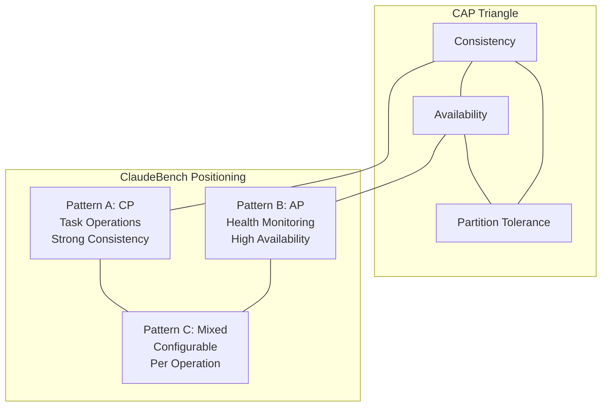
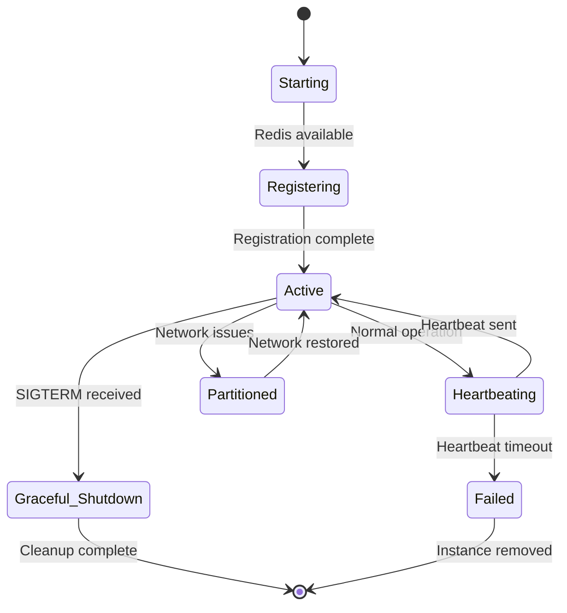
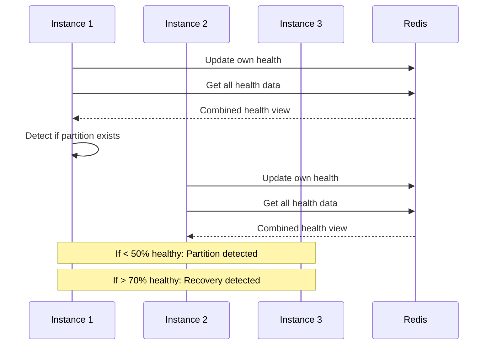
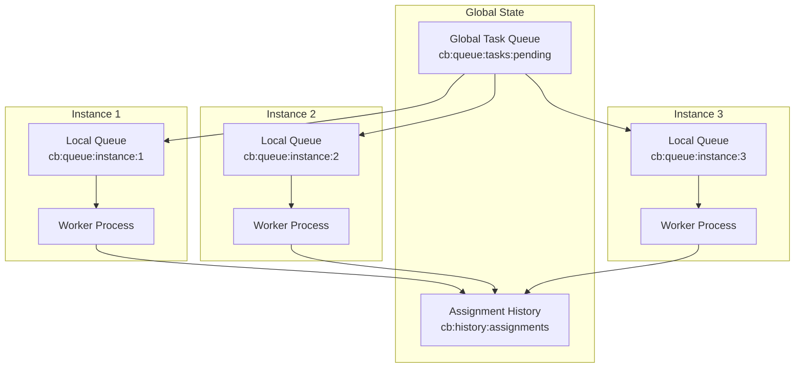

# Distributed Systems Architecture

ClaudeBench implements sophisticated distributed systems patterns to enable multi-instance coordination, fault tolerance, and horizontal scaling. The architecture demonstrates a pragmatic approach to distributed computing with clear trade-offs between consistency, availability, and partition tolerance.

## Overview

### Distributed System Characteristics

ClaudeBench operates as a distributed system with the following properties:

- **Multi-Instance Deployment**: Multiple ClaudeBench instances coordinate work
- **Shared State**: Redis serves as distributed state store
- **Consensus Mechanisms**: Quorum voting for critical decisions
- **Failure Detection**: Gossip-based health monitoring
- **Partition Tolerance**: Automatic partition detection and recovery
- **Load Distribution**: Dynamic task assignment with load balancing

### CAP Theorem Positioning



## Instance Management

### Instance Lifecycle



### Instance Registration

```typescript
interface InstanceMetadata {
  id: string;
  hostname: string;
  roles: string[];
  capabilities: string[];
  capacity: number;
  version: string;
  startTime: number;
  lastHeartbeat: number;
}

@EventHandler({ event: 'system.register' })
export class SystemRegisterHandler {
  async handle(input: RegisterInput, ctx: EventContext) {
    const instanceKey = `cb:instance:${input.id}`;
    
    // Register instance with metadata
    await ctx.redis.hset(instanceKey, {
      id: input.id,
      hostname: input.hostname || 'unknown',
      roles: JSON.stringify(input.roles),
      capabilities: JSON.stringify(input.capabilities || []),
      capacity: input.capacity || 100,
      version: input.version || '2.0.0',
      startTime: Date.now(),
      lastHeartbeat: Date.now(),
      status: 'active'
    });
    
    // Set TTL for automatic cleanup
    await ctx.redis.expire(instanceKey, 60); // 1 minute TTL
    
    // Announce registration
    await ctx.publish({
      type: 'instance.registered',
      data: { instanceId: input.id, roles: input.roles }
    });
    
    return { registered: true, instanceId: input.id };
  }
}
```

### Heartbeat Management

```typescript
@EventHandler({ event: 'system.heartbeat' })
export class SystemHeartbeatHandler {
  async handle(input: HeartbeatInput, ctx: EventContext) {
    const instanceKey = `cb:instance:${input.instanceId}`;
    
    // Update heartbeat timestamp and extend TTL
    await ctx.redis.hset(instanceKey, 'lastHeartbeat', Date.now());
    await ctx.redis.expire(instanceKey, 60);
    
    // Update health status if provided
    if (input.health) {
      await ctx.redis.evalsha(
        'GOSSIP_HEALTH_UPDATE',
        3,
        'cb:gossip:health',
        'cb:partition:detected',
        'cb:partition:recovery',
        input.instanceId,
        JSON.stringify(input.health),
        Date.now().toString()
      );
    }
    
    return { 
      alive: true, 
      instanceId: input.instanceId,
      nextHeartbeat: Date.now() + 30000 // 30 seconds
    };
  }
}
```

## Leadership Election

### Single Leader Pattern

ClaudeBench uses a simple leader election mechanism for coordination-heavy operations:

```typescript
export class LeadershipManager {
  private leaderKey = 'cb:leader:current';
  private leaderTTL = 30; // 30 seconds
  
  async attemptLeadership(instanceId: string): Promise<LeadershipResult> {
    // Try to become leader
    const result = await this.redis.set(
      this.leaderKey,
      instanceId,
      'NX', // Only set if not exists
      'EX', // Set expiration
      this.leaderTTL
    );
    
    if (result === 'OK') {
      return {
        isLeader: true,
        leaderId: instanceId,
        leadershipExpires: Date.now() + (this.leaderTTL * 1000)
      };
    }
    
    // Get current leader
    const currentLeader = await this.redis.get(this.leaderKey);
    return {
      isLeader: false,
      leaderId: currentLeader,
      leadershipExpires: await this.getLeadershipExpiry()
    };
  }
  
  async renewLeadership(instanceId: string): Promise<boolean> {
    // Renew leadership if we're the current leader
    const script = `
      if redis.call('GET', KEYS[1]) == ARGV[1] then
        redis.call('EXPIRE', KEYS[1], ARGV[2])
        return 1
      else
        return 0
      end
    `;
    
    const result = await this.redis.eval(
      script,
      1,
      this.leaderKey,
      instanceId,
      this.leaderTTL.toString()
    );
    
    return result === 1;
  }
  
  async getCurrentLeader(): Promise<string | null> {
    return await this.redis.get(this.leaderKey);
  }
}
```

### Leadership Responsibilities

The leader instance handles:

- **Global metrics aggregation**: Collecting system-wide statistics
- **Orphaned task cleanup**: Reassigning tasks from failed instances
- **Capacity planning decisions**: Scaling recommendations
- **System-wide coordination**: Batch processing initiation

```typescript
export class LeaderTasks {
  async performLeaderDuties() {
    if (!await this.leadership.isCurrentLeader(this.instanceId)) {
      return; // Not the leader
    }
    
    // Aggregate global metrics
    await this.aggregateMetrics();
    
    // Clean up orphaned tasks
    await this.cleanupOrphanedTasks();
    
    // Check for scaling needs
    await this.evaluateScaling();
    
    // Renew leadership
    await this.leadership.renewLeadership(this.instanceId);
  }
  
  private async cleanupOrphanedTasks() {
    // Find tasks assigned to instances that no longer exist
    const activeInstances = await this.getActiveInstanceIds();
    const allQueueKeys = await this.redis.keys('cb:queue:instance:*');
    
    for (const queueKey of allQueueKeys) {
      const instanceId = queueKey.replace('cb:queue:instance:', '');
      
      if (!activeInstances.includes(instanceId)) {
        // Instance is gone, reassign its tasks
        const orphanedTasks = await this.redis.lrange(queueKey, 0, -1);
        
        for (const taskId of orphanedTasks) {
          await this.reassignTask(taskId);
        }
        
        // Clean up the orphaned queue
        await this.redis.del(queueKey);
      }
    }
  }
}
```

## Consensus and Quorum Voting

### Quorum-Based Decisions

For critical system decisions, ClaudeBench implements quorum voting:

```typescript
@EventHandler({ event: 'system.quorum.vote' })
export class SystemQuorumVoteHandler {
  async handle(input: QuorumVoteInput, ctx: EventContext) {
    const totalInstances = await this.getActiveInstanceCount();
    
    const [quorumReached, decision, voteCount] = await ctx.redis.evalsha(
      'QUORUM_VOTE',
      2,
      'cb:quorum:decision:latest',
      'cb:quorum:result',
      input.instanceId,
      input.vote,
      totalInstances.toString(),
      input.decisionId
    );
    
    if (quorumReached) {
      // Notify all instances of the decision
      await ctx.publish({
        type: 'quorum.decided',
        data: {
          decisionId: input.decisionId,
          decision,
          voteCount,
          participants: await this.getVoteParticipants(input.decisionId)
        }
      });
    }
    
    return {
      quorumReached: Boolean(quorumReached),
      decision,
      currentVotes: voteCount,
      requiredVotes: Math.floor(totalInstances / 2) + 1
    };
  }
}
```

### Decision Types

Common decisions made through quorum voting:

1. **Scaling Operations**: Scale up/down decisions
2. **Emergency Procedures**: System-wide emergency responses
3. **Configuration Changes**: Dynamic configuration updates
4. **Partition Recovery**: How to handle partition recovery

```typescript
interface QuorumDecision {
  type: 'scaling' | 'emergency' | 'config' | 'partition';
  proposal: any;
  requiredVotes: number;
  currentVotes: number;
  timeoutAt: number;
}
```

## Gossip Protocol for Health Monitoring

### Health Propagation

ClaudeBench uses a gossip protocol for health information propagation:



### Health Data Structure

```typescript
interface HealthStatus {
  instanceId: string;
  status: 'healthy' | 'degraded' | 'unhealthy';
  timestamp: number;
  metrics: {
    cpuUsage: number;
    memoryUsage: number;
    taskQueueDepth: number;
    responseTime: number;
  };
  services: {
    redis: 'connected' | 'disconnected';
    postgres: 'connected' | 'disconnected';
    network: 'good' | 'poor' | 'failed';
  };
}
```

### Partition Detection

```typescript
export class PartitionDetector {
  async updateHealth(instanceId: string, health: HealthStatus) {
    const [updated, partitionDetected] = await this.redis.evalsha(
      'GOSSIP_HEALTH_UPDATE',
      3,
      'cb:gossip:health',
      'cb:partition:detected', 
      'cb:partition:recovery',
      instanceId,
      JSON.stringify(health),
      Date.now().toString()
    );
    
    if (partitionDetected) {
      await this.handlePartitionDetected();
    } else if (await this.isRecoveryDetected()) {
      await this.handlePartitionRecovery();
    }
  }
  
  private async handlePartitionDetected() {
    // Enter degraded mode
    this.operatingMode = 'degraded';
    
    // Reduce external dependencies
    await this.pauseNonEssentialOperations();
    
    // Increase local caching
    await this.enableAggressiveCaching();
    
    // Notify monitoring systems
    await this.alertPartitionDetected();
  }
  
  private async handlePartitionRecovery() {
    // Resume normal operations
    this.operatingMode = 'normal';
    
    // Re-enable all operations
    await this.resumeAllOperations();
    
    // Sync state with other instances
    await this.performStateSynchronization();
    
    // Clear partition flags
    await this.redis.del('cb:partition:detected');
  }
}
```

## Task Distribution and Load Balancing

### Distributed Task Queue



### Load-Aware Assignment

The `ASSIGN_TASK_WITH_LOAD_BALANCING` Lua script implements sophisticated load balancing:

```typescript
export class TaskDistributor {
  async assignTask(taskId: string, priority: number): Promise<AssignmentResult> {
    const [assignedTo, queueDepth, success] = await this.redis.evalsha(
      'ASSIGN_TASK_WITH_LOAD_BALANCING',
      3,
      'cb:instance:*',
      'cb:queue:tasks:pending',
      'cb:history:assignments',
      taskId,
      priority.toString()
    );
    
    if (!success) {
      throw new Error('No instances available or all at capacity');
    }
    
    return {
      taskId,
      assignedTo,
      queueDepth,
      assignedAt: Date.now()
    };
  }
  
  async getLoadDistribution(): Promise<LoadDistribution> {
    const instances = await this.getActiveInstances();
    const distribution = new Map<string, number>();
    
    for (const instance of instances) {
      const queueDepth = await this.redis.llen(`cb:queue:instance:${instance.id}`);
      distribution.set(instance.id, queueDepth);
    }
    
    return {
      instances: distribution,
      total: Array.from(distribution.values()).reduce((a, b) => a + b, 0),
      average: Array.from(distribution.values()).reduce((a, b) => a + b, 0) / distribution.size,
      max: Math.max(...distribution.values()),
      min: Math.min(...distribution.values())
    };
  }
}
```

## State Synchronization

### Global State Management

```typescript
@EventHandler({ event: 'system.sync_state' })
export class SystemSyncStateHandler {
  async handle(input: SyncStateInput, ctx: EventContext) {
    const [success, newVersion] = await ctx.redis.evalsha(
      'SYNC_GLOBAL_STATE',
      1,
      'cb:state:global',
      JSON.stringify(input.stateUpdate)
    );
    
    if (success) {
      // Notify other instances of state change
      await ctx.publish({
        type: 'state.updated',
        data: {
          version: newVersion,
          update: input.stateUpdate,
          updatedBy: ctx.instanceId
        }
      });
    }
    
    return {
      synchronized: Boolean(success),
      version: newVersion,
      timestamp: Date.now()
    };
  }
}
```

### Conflict Resolution

For conflicting state updates, ClaudeBench uses timestamp-based resolution:

```typescript
export class ConflictResolver {
  async resolveConflict(
    local: StateUpdate,
    remote: StateUpdate
  ): Promise<StateUpdate> {
    // Last-writer-wins with timestamp
    if (remote.timestamp > local.timestamp) {
      return remote;
    }
    
    // If timestamps are equal, use instance ID ordering
    if (remote.timestamp === local.timestamp) {
      return remote.instanceId > local.instanceId ? remote : local;
    }
    
    return local;
  }
  
  async mergeStates(states: StateUpdate[]): Promise<StateUpdate> {
    // Sort by timestamp and apply changes in order
    const sortedStates = states.sort((a, b) => a.timestamp - b.timestamp);
    
    let merged = {};
    for (const state of sortedStates) {
      merged = { ...merged, ...state.data };
    }
    
    return {
      data: merged,
      timestamp: Date.now(),
      instanceId: 'merged',
      version: Math.max(...states.map(s => s.version)) + 1
    };
  }
}
```

## Batch Processing Coordination

### Distributed Batch Processing

```typescript
@EventHandler({ event: 'system.batch.process' })
export class SystemBatchProcessHandler {
  async handle(input: BatchProcessInput, ctx: EventContext) {
    // Try to acquire batch processing lock
    const [acquired, processor, progress] = await ctx.redis.evalsha(
      'COORDINATE_BATCH',
      3,
      'cb:batch:lock',
      'cb:batch:progress',
      'cb:batch:current',
      input.batchId,
      ctx.instanceId,
      input.items.length.toString()
    );
    
    if (!acquired) {
      return {
        processing: false,
        currentProcessor: processor,
        progress: progress
      };
    }
    
    try {
      // Process batch items
      const results = [];
      for (let i = 0; i < input.items.length; i++) {
        const result = await this.processItem(input.items[i]);
        results.push(result);
        
        // Update progress
        await this.updateBatchProgress(input.batchId, i + 1);
      }
      
      return {
        processing: true,
        completed: true,
        results,
        processedBy: ctx.instanceId
      };
    } finally {
      // Release lock
      await this.releaseBatchLock(input.batchId);
    }
  }
  
  private async updateBatchProgress(batchId: string, processed: number) {
    await this.redis.hset('cb:batch:progress', 'processed', processed);
  }
  
  private async releaseBatchLock(batchId: string) {
    await this.redis.del('cb:batch:lock');
    await this.redis.del('cb:batch:progress');
  }
}
```

## Failure Handling and Recovery

### Instance Failure Detection

```typescript
export class FailureDetector {
  async detectFailedInstances(): Promise<string[]> {
    const allInstances = await this.redis.keys('cb:instance:*');
    const failedInstances = [];
    
    for (const instanceKey of allInstances) {
      const ttl = await this.redis.ttl(instanceKey);
      
      if (ttl === -2) { // Key expired
        const instanceId = instanceKey.replace('cb:instance:', '');
        failedInstances.push(instanceId);
      }
    }
    
    return failedInstances;
  }
  
  async handleInstanceFailure(instanceId: string) {
    // Reassign tasks from failed instance
    await this.reassignTasksFromInstance(instanceId);
    
    // Update health status
    await this.markInstanceAsFailed(instanceId);
    
    // Notify other instances
    await this.notifyInstanceFailure(instanceId);
    
    // Clean up instance-specific data
    await this.cleanupInstanceData(instanceId);
  }
  
  private async reassignTasksFromInstance(instanceId: string) {
    const queueKey = `cb:queue:instance:${instanceId}`;
    const tasks = await this.redis.lrange(queueKey, 0, -1);
    
    // Move tasks back to global queue for reassignment
    for (const taskId of tasks) {
      const task = await this.redis.hgetall(`cb:task:${taskId}`);
      if (task.priority) {
        await this.redis.zadd('cb:queue:tasks:pending', task.priority, taskId);
      }
    }
    
    // Clean up the failed instance's queue
    await this.redis.del(queueKey);
  }
}
```

### Split-Brain Prevention

```typescript
export class SplitBrainPrevention {
  async checkClusterHealth(): Promise<ClusterHealth> {
    const totalInstances = await this.getConfiguredInstanceCount();
    const activeInstances = await this.getActiveInstanceCount();
    
    const majorityThreshold = Math.floor(totalInstances / 2) + 1;
    
    if (activeInstances < majorityThreshold) {
      // Not enough instances for safe operation
      await this.enterReadOnlyMode();
      
      return {
        status: 'split_brain_risk',
        activeInstances,
        requiredForMajority: majorityThreshold,
        mode: 'read_only'
      };
    }
    
    return {
      status: 'healthy',
      activeInstances,
      requiredForMajority: majorityThreshold,
      mode: 'normal'
    };
  }
  
  private async enterReadOnlyMode() {
    // Disable write operations
    await this.redis.set('cb:cluster:mode', 'read_only', 'EX', 300);
    
    // Notify all instances
    await this.eventBus.publish({
      type: 'cluster.mode_changed',
      data: { mode: 'read_only', reason: 'split_brain_prevention' }
    });
  }
}
```

## Performance and Scalability

### Horizontal Scaling Characteristics

| Component | Scaling Pattern | Bottleneck | Solution |
|-----------|----------------|------------|----------|
| Task Processing | Linear | None (stateless) | Add instances |
| Event Bus | Sub-linear | Redis pub/sub | Partition events |
| State Store | Limited | Single Redis | Redis cluster |
| Leadership | N/A | Single leader | Multiple domains |

### Scaling Metrics

```typescript
interface ScalingMetrics {
  throughputPerInstance: number;
  coordinationOverhead: number;
  stateConsistencyLatency: number;
  failureDetectionTime: number;
  recoveryTime: number;
}

// Typical performance characteristics
const typicalMetrics: ScalingMetrics = {
  throughputPerInstance: 1000, // ops/sec per instance
  coordinationOverhead: 0.15,  // 15% overhead for coordination
  stateConsistencyLatency: 50, // ms for state updates
  failureDetectionTime: 30,    // seconds to detect failure
  recoveryTime: 60            // seconds to recover from partition
};
```

## Best Practices

### Design Principles

1. **Eventual Consistency**: Accept eventual consistency for non-critical operations
2. **Idempotent Operations**: Design all operations to be safely retryable
3. **Graceful Degradation**: Provide fallback behavior during partitions
4. **Monitoring**: Comprehensive observability for distributed behavior
5. **Testing**: Regular chaos engineering and partition testing

### Operational Guidelines

1. **Instance Management**: Maintain odd number of instances for quorum
2. **Network Partitions**: Plan for and test partition scenarios
3. **State Synchronization**: Regular state consistency checks
4. **Capacity Planning**: Monitor coordination overhead as system scales
5. **Failure Recovery**: Automated procedures for common failure modes

This distributed systems architecture enables ClaudeBench to operate reliably across multiple instances while maintaining strong consistency where needed and accepting eventual consistency where appropriate, providing a robust foundation for scalable event-driven workloads.