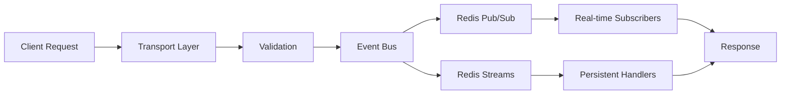
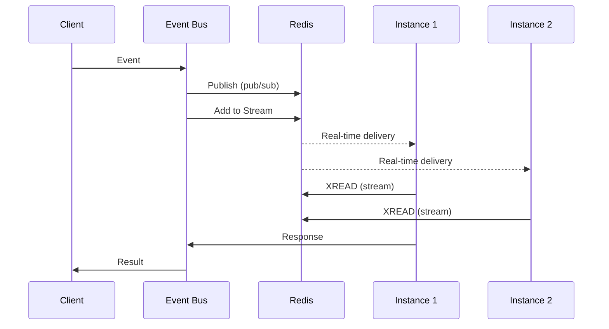

# Event Bus Architecture

ClaudeBench implements a sophisticated Redis-first event-driven architecture with dual-transport messaging for optimal performance and reliability.

## Overview

The event bus serves as the central nervous system of ClaudeBench, coordinating communication between handlers, instances, and external systems. It implements a hybrid pattern (Pattern C) that combines Redis pub/sub for real-time delivery with Redis streams for persistence and exactly-once guarantees.

## Core Principles

### 1. Dual Transport Strategy

**Redis Pub/Sub (Real-time)**
- Low latency event delivery (< 1ms)
- At-least-once delivery guarantee
- No persistence
- Used for: Instance coordination, real-time notifications

**Redis Streams (Persistent)**
- Event persistence and replay capability
- Exactly-once delivery via Lua scripts
- Ordered event processing
- Used for: Audit trail, event sourcing, recovery

### 2. Event Naming Convention

All events follow the `domain.action` pattern:

```typescript
// Examples
"task.create"      // Task domain, create action
"system.health"    // System domain, health action
"hook.pre_tool"    // Hook domain, pre_tool action
```

| Domain | Purpose | Actions |
|--------|---------|---------|
| `task` | Task management | create, update, assign, complete |
| `system` | System operations | register, health, heartbeat, metrics |
| `hook` | Hook processing | pre_tool, post_tool, user_prompt, todo_write |
| `test` | Testing scenarios | circuit |

### 3. JSONRPC 2.0 Protocol

All events use JSONRPC 2.0 for consistent message structure:

```typescript
// Request (expects response)
{
  jsonrpc: "2.0",
  method: "task.create",
  params: { text: "Example task" },
  id: "req-123",
  metadata: { instanceId: "worker-1" }
}

// Response
{
  jsonrpc: "2.0",
  result: { id: "t-456", status: "pending" },
  id: "req-123"
}

// Notification (fire-and-forget)
{
  jsonrpc: "2.0",
  method: "system.heartbeat",
  params: { instanceId: "worker-1" }
}
```

## Event Flow Architecture

### 1. Event Lifecycle



### 2. Multi-Instance Distribution



## Implementation Details

### Event Bus Core

```typescript
export class EventBus {
  async publish(event: Event, options: PublishOptions = {}) {
    const { realTime = true, persistent = true } = options;
    
    // Real-time delivery via pub/sub
    if (realTime) {
      await this.redis.publish(`cb:events:${event.type}`, event);
    }
    
    // Persistent delivery via streams
    if (persistent) {
      await this.redis.xadd(
        `cb:stream:${event.type}`,
        '*',
        'data', JSON.stringify(event)
      );
    }
    
    // Exactly-once delivery guarantee
    if (options.exactlyOnce) {
      const [isDuplicate] = await this.redis.evalsha(
        'EXACTLY_ONCE_DELIVERY',
        2,
        `cb:processed:events`,
        `cb:duplicates:prevented`,
        event.id
      );
      
      if (isDuplicate) {
        throw new Error(`Duplicate event: ${event.id}`);
      }
    }
  }
}
```

### Event Context

Every handler receives consistent context:

```typescript
interface EventContext {
  eventType: string;
  eventId: string;
  instanceId: string;
  
  // Resource access
  redis: RedisClients;
  prisma: PrismaClient;
  
  // Capabilities
  persist: boolean;
  publish: (event: Event) => Promise<void>;
  
  // Request metadata
  metadata: Record<string, any>;
}
```

## Redis Key Patterns

### Event Storage

```
cb:stream:{eventType}     # Event streams for persistence
cb:events:{eventType}     # Pub/sub channels for real-time
cb:processed:events       # Deduplication tracking
cb:duplicates:prevented   # Duplicate count metrics
cb:response:{requestId}   # Response correlation
```

### TTL Strategy

- **Event streams**: 24 hours (audit trail)
- **Processed events**: 24 hours (deduplication)
- **Response correlation**: 30 seconds (request timeout)
- **Duplicate counters**: 1 hour (metrics)

## Consistency Guarantees

### Exactly-Once Delivery

Using the `EXACTLY_ONCE_DELIVERY` Lua script:

```lua
-- Atomically check and mark event as processed
local processed = redis.call('SISMEMBER', KEYS[1], ARGV[1])
if processed == 1 then
    local count = redis.call('INCR', KEYS[2])
    redis.call('EXPIRE', KEYS[2], 3600)
    return {1, count}
else
    redis.call('SADD', KEYS[1], ARGV[1])
    redis.call('EXPIRE', KEYS[1], 86400)
    return {0, 0}
end
```

### Event Ordering

- **Within streams**: Guaranteed by Redis streams
- **Across streams**: Timestamp-based ordering
- **Cross-instance**: Vector clocks for causality

## Performance Characteristics

### Latency Metrics

| Transport | P50 | P95 | P99 | Use Case |
|-----------|-----|-----|-----|----------|
| Pub/Sub | < 1ms | 5ms | 10ms | Real-time notifications |
| Streams | 5ms | 15ms | 30ms | Persistent events |
| Dual | 5ms | 20ms | 40ms | Reliable delivery |

### Throughput Capacity

- **Pub/Sub**: 100,000+ events/second
- **Streams**: 50,000+ events/second  
- **Dual mode**: 30,000+ events/second
- **Exactly-once**: 10,000+ events/second

## Pattern Classification

The EventBus implements **Pattern C (Hybrid)**:

- **Central coordination**: Single event bus manages all routing
- **Distributed execution**: Multiple subscribers process events
- **Mixed consistency**: Real-time (eventual) + persistent (strong)
- **Orchestrated workflows**: Event correlation and response handling

## Error Handling and Resilience

### Circuit Breaker Integration

```typescript
@CircuitBreaker({
  threshold: 10,
  timeout: 30000,
  fallback: () => ({ delivered: false, cached: true })
})
async publishEvent(event: Event) {
  // Implementation with automatic fallback
}
```

### Failure Modes

| Failure Type | Detection | Recovery | Data Loss |
|-------------|-----------|----------|-----------|
| Redis pub/sub down | Immediate | Switch to streams only | None |
| Redis streams down | 5-10s | Buffer in memory | Possible |
| Network partition | Gossip protocol | Reconnect + replay | None |
| Handler failure | Circuit breaker | Fallback response | None |

## Evolution and Scaling

### Current State (Pattern C)

- Hybrid pub/sub + streams
- Central event bus coordination
- Mixed consistency models
- Good for current scale (< 100 instances)

### Transformation Options

#### To Pattern A (Centralized)
**Benefits**: Simplified consistency, easier debugging
**Trade-offs**: Single point of failure, reduced scalability
**Use case**: Simplified deployments, strong consistency requirements

#### To Pattern B (Distributed)
**Benefits**: Better fault tolerance, horizontal scaling
**Trade-offs**: Complex coordination, eventual consistency
**Use case**: High-scale deployments, partition tolerance

## Monitoring and Observability

### Key Metrics

```typescript
// Event bus metrics
{
  eventsPublished: 1000,
  eventsDelivered: 995,
  duplicatesPrevented: 5,
  averageLatency: 15,
  circuitBreakerTrips: 2
}
```

### Recommended Alerts

- Event delivery rate drops below 95%
- Average latency exceeds 100ms
- Duplicate rate exceeds 1%
- Circuit breaker open for > 1 minute

## Best Practices

### Event Design

1. **Keep events small**: < 1KB payload size
2. **Include metadata**: Timestamp, instance ID, correlation ID
3. **Use semantic versioning**: Forward-compatible schema changes
4. **Avoid nested events**: Flat `domain.action` hierarchy

### Handler Implementation

1. **Idempotent operations**: Handle duplicate delivery gracefully
2. **Fast processing**: < 100ms per event handler
3. **Error isolation**: Don't let one handler failure cascade
4. **Resource cleanup**: Use TTL for temporary state

### Performance Optimization

1. **Batch operations**: Group related events when possible
2. **Connection pooling**: Reuse Redis connections
3. **Compression**: Use compression for large payloads
4. **Caching**: Cache frequently accessed data with TTL

This event bus architecture provides the foundation for ClaudeBench's distributed, resilient, and scalable event-driven system while maintaining clear patterns for evolution as requirements change.