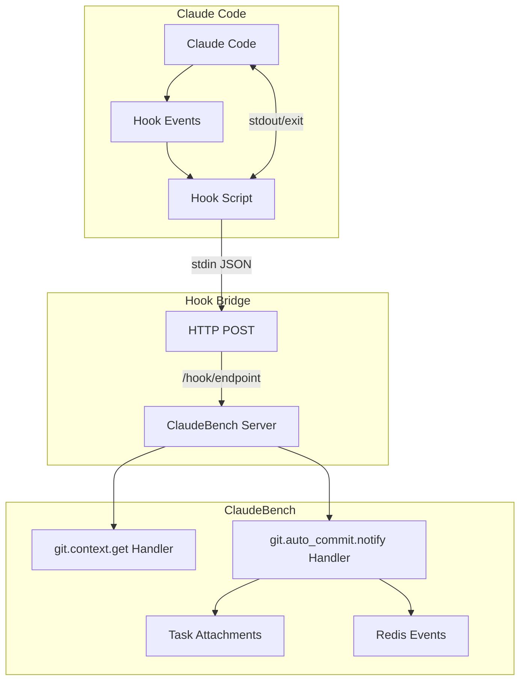
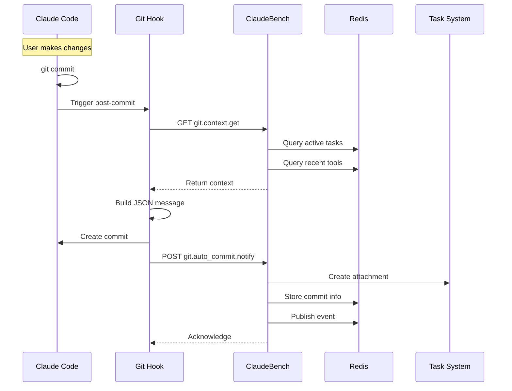

# Git Integration Architecture

## Overview

ClaudeBench's Git Integration provides deep visibility into code changes by automatically capturing commits with rich task context. This system bridges Claude Code's file operations with ClaudeBench's event-driven architecture, creating an audit trail that links code changes to specific tasks, tools, and sessions.

## Design Principles

### 1. **Context Preservation**
Every commit captures not just the "what" (files changed) but the "why" (task context) and "how" (tool used). This creates a searchable history where commits are linked to their originating tasks.

### 2. **Non-Intrusive Monitoring**
The integration operates through hook notifications rather than modifying Git operations directly. Commits proceed normally even if ClaudeBench is unavailable.

### 3. **Structured Commit Messages**
Commit messages contain structured JSON data that can be parsed programmatically, enabling advanced queries and analysis of development patterns.

### 4. **Task-Centric Attachment**
Git diffs and commit metadata are automatically attached to relevant tasks, creating a permanent record of how each task was implemented.

## Components

### Git Hook Transport Layer

The hook transport layer defines how Claude Code communicates with ClaudeBench through external scripts:



### Git Context Handler

Retrieves current task context for enriching commit messages:

```typescript
// git.context.get.handler.ts
@EventHandler({
    event: "git.context.get",
    inputSchema: gitContextGetInput,
    outputSchema: gitContextGetOutput,
})
export class GitContextGetHandler {
    async handle(input: GitContextGetInput, ctx: EventContext) {
        // Returns:
        // - Active tasks assigned to instance
        // - Recent tools used in session
        // - Current TODO items
        // - Last user prompt
    }
}
```

### Git Auto-Commit Notification Handler

Processes commit notifications and creates task attachments:

```typescript
// git.auto_commit.notify.handler.ts
@EventHandler({
    event: "git.auto_commit.notify",
    inputSchema: gitAutoCommitNotifyInput,
    persist: true, // Persist to PostgreSQL
})
export class GitAutoCommitNotifyHandler {
    async handle(input: GitAutoCommitNotifyInput, ctx: EventContext) {
        // 1. Publish event for state processor
        // 2. Create task attachments with diff
        // 3. Store commit info in Redis
        // 4. Update session commit list
        // 5. Update metrics
    }
}
```

## Data Flow

### Commit Flow Sequence



### Commit Message Structure

The structured commit message format captures rich context:

```json
{
    "task": "Implement dark mode toggle",
    "files": ["src/components/ThemeToggle.tsx"],
    "tool": "Edit",
    "taskIds": ["t-123", "t-124"],
    "sessionId": "session-abc",
    "timestamp": 1694462400000,
    "stats": {
        "additions": 45,
        "deletions": 12,
        "filesChanged": 1
    }
}
```

## Redis Keys & Patterns

| Key Pattern | Type | Purpose | TTL |
|-------------|------|---------|-----|
| `cb:git:commit:{hash}` | hash | Commit metadata cache | 7 days |
| `cb:session:commits:{sessionId}` | list | Session commit history | 7 days |
| `cb:session:tools:{sessionId}` | list | Recent tools used | 24 hours |
| `cb:session:context:{sessionId}` | hash | Session context data | Session lifetime |
| `cb:metrics:git:commits` | hash | Git operation metrics | None |
| `cb:task:{taskId}:attachment:{key}` | hash | Task attachment data | Task lifetime |
| `cb:task:{taskId}:attachments` | zset | Attachment index | Task lifetime |

## Event Flow

| Event | Source | Consumers | Purpose |
|-------|--------|-----------|---------|
| `git.auto_commit.created` | GitAutoCommitNotifyHandler | State Processor, Relay | Track commit in session state |
| `task.attachment_created` | GitAutoCommitNotifyHandler | Task System | Link diff to task |
| `hook.post_tool` | Hook Bridge | Session State | Track tool usage |

## Integration Points

### With Task System

Git commits automatically create task attachments:

1. **Primary Task Attachment**: Full diff and commit metadata attached to the first task
2. **Reference Attachments**: Lightweight references created for additional tasks
3. **Attachment Keys**: Use pattern `git-commit-{hash}` for easy identification

### With Session Management

Sessions track git operations for context:

1. **Commit List**: Last 100 commits per session
2. **Tool Tracking**: Recent tools used for context
3. **Active TODOs**: Current work items

### With Hook System

Hook transport enables bidirectional communication:

1. **Pre-Tool Hooks**: Can monitor file operations before execution
2. **Post-Tool Hooks**: Capture results for commit context
3. **User Prompt Hooks**: Track intent for commit messages

## Performance Considerations

- **Diff Truncation**: Large diffs are truncated to 10KB to prevent storage bloat
- **Batch Operations**: Multiple task attachments created in parallel
- **Cache Strategy**: 7-day TTL for commit data balances history with storage
- **Non-Blocking**: Commit operations proceed even if attachment creation fails
- **Metrics Tracking**: Atomic increment operations for performance metrics

## Security Considerations

- **Branch Protection**: System could extend to prevent commits to protected branches
- **Credential Filtering**: Sensitive data should be filtered from diffs
- **Access Control**: Task attachments inherit task permissions
- **Audit Trail**: All commits logged with instance and session context

## Configuration

### Environment Variables

```bash
# Hook configuration
CLAUDEBENCH_SERVER_URL=http://localhost:3000
CLAUDE_PROJECT_DIR=/path/to/project
CLAUDE_SESSION_ID=session-123

# Optional
CLAUDEBENCH_INSTANCE_ID=worker-1
CLAUDEBENCH_TIMEOUT=5000
```

### Hook Installation

Hooks integrate with Husky for automatic setup:

```bash
# .husky/_/post-commit
#!/usr/bin/env sh
. "$(dirname "$0")/h"

# Call ClaudeBench notification endpoint
# Implementation varies by environment
```

## Examples

### Auto-Commit with Task Context

When Claude Code edits a file while working on a task:

```typescript
// 1. Edit operation triggers post-tool hook
{
    tool: "Edit",
    params: { file_path: "/src/feature.ts", ... },
    result: { success: true }
}

// 2. Git commit includes context
{
    commitMessage: {
        task: "Implement authentication",
        files: ["src/feature.ts"],
        tool: "Edit",
        taskIds: ["t-123"]
    }
}

// 3. Creates task attachment
{
    taskId: "t-123",
    key: "git-commit-abc123d",
    type: "json",
    value: {
        commitHash: "abc123def...",
        diff: "+ added auth logic",
        branch: "feature/auth"
    }
}
```

### Querying Commit History

Finding all commits related to a specific task:

```typescript
// Via task attachments
const attachments = await handler.handle({
    taskId: "t-123",
    type: "json"
});

// Filter for git commits
const commits = attachments.filter(a => 
    a.key.startsWith("git-commit-")
);
```

## Troubleshooting

### Common Issues

1. **Missing Context**: Hook cannot retrieve task context
   - **Solution**: Ensure ClaudeBench server is running and accessible
   - **Fallback**: Commit proceeds with minimal context

2. **Large Diffs**: Attachment creation fails for huge diffs
   - **Solution**: Diffs automatically truncated to 10KB
   - **Alternative**: Store reference to full diff location

3. **Session Mismatch**: Commits not linked to correct session
   - **Solution**: Verify CLAUDE_SESSION_ID environment variable
   - **Debug**: Check Redis key `cb:session:commits:{sessionId}`

## Future Enhancements

- [ ] **Smart Diff Analysis**: AI-powered understanding of code changes
- [ ] **Commit Message Generation**: Auto-generate detailed messages from task context
- [ ] **Branch Strategy Enforcement**: Validate branch naming conventions
- [ ] **Conflict Detection**: Warn about potential merge conflicts early
- [ ] **Regression Tracking**: Link commits to test failures
- [ ] **Code Review Integration**: Auto-create review requests with context

## References

- [Hook Transport Contract](/contracts/hook-transport)
- [Task Attachment System](./attachments)
- [Session State Management](./session-state)
- [Event Bus Architecture](./event-bus)