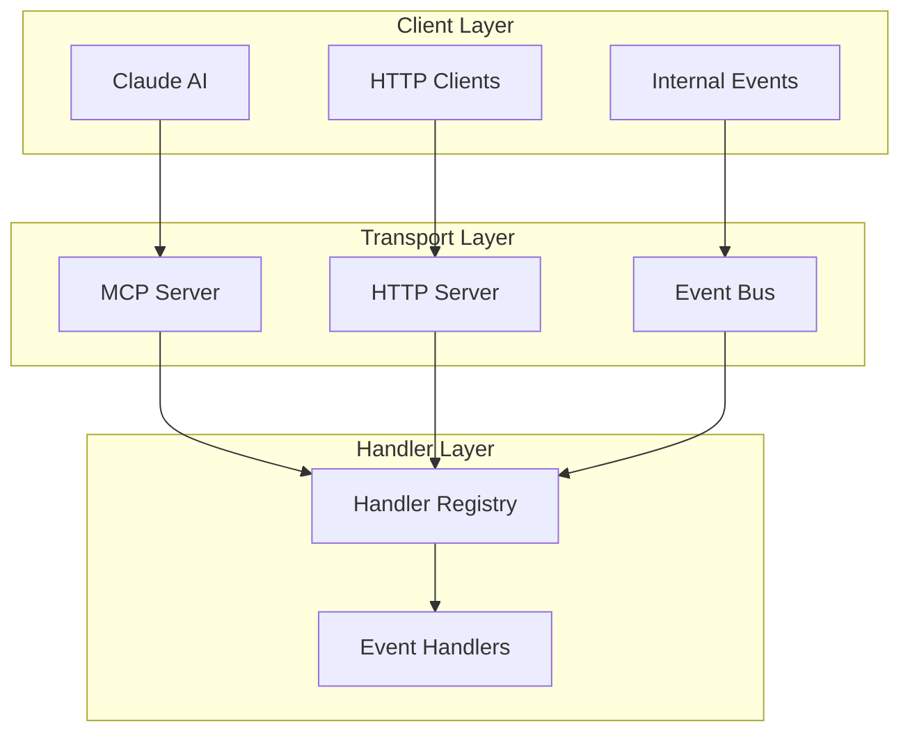
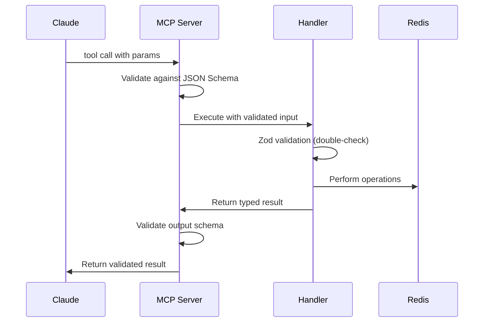

# Model Context Protocol (MCP) Integration

ClaudeBench seamlessly integrates with the Model Context Protocol (MCP) to provide Claude and other AI models with direct access to its event-driven architecture. The integration automatically generates MCP tools from ClaudeBench handlers, enabling natural language interaction with the system.

## Overview

### MCP in ClaudeBench Architecture

The MCP integration serves as one of three transport mechanisms alongside HTTP and direct event publishing:



### Automatic Tool Generation

Every ClaudeBench handler automatically becomes an MCP tool:

```typescript
// Handler definition
@EventHandler({
  event: 'task.create',
  inputSchema: TaskCreateInput,
  outputSchema: TaskCreateOutput
})
export class TaskCreateHandler {
  async handle(input: TaskCreateInput, ctx: EventContext) {
    // Implementation
  }
}

// Automatically generates MCP tool:
// Name: "task__create"
// Description: "Create a new task"
// Input Schema: TaskCreateInput (Zod → JSON Schema)
// Implementation: Direct handler execution
```

## Tool Naming Convention

### Event to Tool Name Mapping

ClaudeBench events use `domain.action` format, which translates to MCP tool names using double underscores:

| Event Name | MCP Tool Name | Purpose |
|------------|---------------|---------|
| `task.create` | `task__create` | Create new tasks |
| `task.update` | `task__update` | Update existing tasks |
| `task.assign` | `task__assign` | Assign tasks to instances |
| `task.complete` | `task__complete` | Mark tasks as completed |
| `system.health` | `system__health` | Check system health |
| `system.register` | `system__register` | Register new instances |
| `hook.pre_tool` | `hook__pre_tool` | Validate tool execution |
| `hook.todo_write` | `hook__todo_write` | Process todo updates |

### Tool Categories

**Task Management Tools**
- `task__create` - Create new tasks with priority and metadata
- `task__update` - Update task properties and status
- `task__assign` - Assign tasks to specific instances
- `task__complete` - Mark tasks as completed with results

**System Management Tools**
- `system__health` - Get comprehensive system health status
- `system__register` - Register new instances with roles
- `system__heartbeat` - Send instance heartbeat signals
- `system__metrics` - Retrieve system performance metrics
- `system__get_state` - Get current system state

**Hook Processing Tools**
- `hook__pre_tool` - Validate and potentially block tool execution
- `hook__post_tool` - Process tool execution results
- `hook__user_prompt` - Intercept and modify user prompts
- `hook__todo_write` - Process todo list updates

**Testing Tools**
- `test__circuit` - Test circuit breaker functionality

## Schema Translation

### Zod to JSON Schema Conversion

ClaudeBench uses Zod for runtime validation, which automatically converts to JSON Schema for MCP:

```typescript
// Zod schema definition
const TaskCreateInput = z.object({
  text: z.string().min(1).max(500).describe("Task description"),
  priority: z.number().int().min(0).max(100).optional().default(50).describe("Task priority (0-100)"),
  metadata: z.record(z.any()).optional().describe("Additional task metadata")
});

// Automatically becomes MCP JSON Schema:
{
  "type": "object",
  "properties": {
    "text": {
      "type": "string",
      "minLength": 1,
      "maxLength": 500,
      "description": "Task description"
    },
    "priority": {
      "type": "integer", 
      "minimum": 0,
      "maximum": 100,
      "default": 50,
      "description": "Task priority (0-100)"
    },
    "metadata": {
      "type": "object",
      "additionalProperties": true,
      "description": "Additional task metadata"
    }
  },
  "required": ["text"],
  "additionalProperties": false
}
```

### Schema Validation Flow



## MCP Server Implementation

### Server Configuration

```typescript
interface MCPServerConfig {
  name: string;
  version: string;
  tools: MCPTool[];
  resources?: MCPResource[];
  prompts?: MCPPrompt[];
}

const server = new MCPServer({
  name: "claudebench",
  version: "2.0.0",
  tools: await generateToolsFromHandlers(),
  resources: [
    {
      uri: "claudebench://welcome",
      name: "ClaudeBench Welcome",
      description: "System overview and capabilities"
    }
  ]
});
```

### Tool Registration Process

```typescript
export class MCPIntegration {
  async registerHandler(handlerClass: any) {
    const config = getEventHandlerConfig(handlerClass);
    
    const tool: MCPTool = {
      name: config.event.replace('.', '__'),
      description: this.generateDescription(config),
      inputSchema: zodToJsonSchema(config.inputSchema),
      outputSchema: zodToJsonSchema(config.outputSchema)
    };
    
    this.server.addTool(tool, async (params) => {
      const context = this.createEventContext();
      const handler = new handlerClass();
      return await handler.handle(params, context);
    });
  }
  
  private generateDescription(config: EventHandlerConfig): string {
    const [domain, action] = config.event.split('.');
    return `Execute ${action} operation in ${domain} domain`;
  }
}
```

### Context Bridge

```typescript
// Convert MCP request context to ClaudeBench EventContext
private createEventContext(mcpRequest: MCPRequest): EventContext {
  return {
    eventType: mcpRequest.tool.replace('__', '.'),
    eventId: `mcp-${Date.now()}`,
    instanceId: 'mcp-server',
    redis: this.redis,
    prisma: this.prisma,
    persist: true, // MCP calls typically want persistence
    publish: (event) => this.eventBus.publish(event),
    metadata: {
      transport: 'mcp',
      mcpRequestId: mcpRequest.id,
      timestamp: Date.now()
    }
  };
}
```

## Claude Integration Examples

### Task Management Workflows

**Creating Tasks via Natural Language**
```
Claude: I need to create a high-priority task for implementing user authentication.

System: I'll create that task for you.

[Uses task__create tool]
{
  "text": "Implement user authentication system",
  "priority": 85,
  "metadata": {
    "category": "feature",
    "estimated_hours": 8
  }
}

Result: Created task t-1234567 with priority 85
```

**System Health Monitoring**
```
Claude: Can you check the current system health?

[Uses system__health tool]
{}

Result: {
  "status": "healthy",
  "services": {
    "redis": "connected",
    "postgres": "connected", 
    "instances": 3
  },
  "metrics": {
    "tasks_pending": 15,
    "throughput": "120 events/min"
  }
}
```

### Advanced Workflows

**Multi-Step Task Processing**
```
Claude: Create a task for code review, assign it to the least loaded instance, and monitor its progress.

Step 1: [task__create] → t-789
Step 2: [task__assign] → assigned to instance-2  
Step 3: [system__metrics] → monitoring setup
```

**Hook-Based Validation**
```
Claude: Before executing any database migration tools, validate they're safe.

[Uses hook__pre_tool with validation logic]
{
  "tool": "db_migrate",
  "params": { "migration": "add_user_table" }
}

Result: { "allow": true, "reason": "Migration validated as safe" }
```

## Resource Endpoints

### System Information Resources

ClaudeBench exposes several MCP resources for system introspection:

```typescript
const resources: MCPResource[] = [
  {
    uri: "claudebench://welcome",
    name: "System Overview", 
    description: "Introduction to ClaudeBench capabilities",
    mimeType: "text/markdown"
  },
  {
    uri: "claudebench://health",
    name: "System Health",
    description: "Current system health and metrics",
    mimeType: "application/json"
  },
  {
    uri: "claudebench://tools",
    name: "Available Tools",
    description: "Complete list of available MCP tools",
    mimeType: "application/json"
  },
  {
    uri: "claudebench://events",
    name: "Recent Events",
    description: "Recent system events and activity",
    mimeType: "application/json"
  }
];
```

### Dynamic Resource Generation

```typescript
async getResource(uri: string): Promise<MCPResourceContent> {
  switch (uri) {
    case "claudebench://welcome":
      return {
        contents: [{
          type: "text",
          text: await this.generateWelcomeMessage()
        }]
      };
      
    case "claudebench://health":
      const health = await this.handlers.system.health.handle({}, context);
      return {
        contents: [{
          type: "text", 
          text: JSON.stringify(health, null, 2)
        }]
      };
      
    case "claudebench://tools":
      return {
        contents: [{
          type: "text",
          text: JSON.stringify(this.getAvailableTools(), null, 2)
        }]
      };
  }
}
```

## Error Handling and Resilience

### MCP Error Translation

```typescript
// Convert ClaudeBench errors to MCP errors
async handleMCPRequest(request: MCPRequest): Promise<MCPResponse> {
  try {
    const result = await this.executeHandler(request);
    return { result };
  } catch (error) {
    if (error instanceof ValidationError) {
      return {
        error: {
          code: -32602, // Invalid params
          message: "Input validation failed",
          data: error.details
        }
      };
    }
    
    if (error instanceof CircuitBreakerOpenError) {
      return {
        error: {
          code: -32000, // Custom application error
          message: "Service temporarily unavailable",
          data: { 
            retry_after: error.retryAfter,
            circuit_breaker: "open" 
          }
        }
      };
    }
    
    // Generic internal error
    return {
      error: {
        code: -32603,
        message: "Internal error",
        data: { type: error.constructor.name }
      }
    };
  }
}
```

### Resilience Integration

MCP tools inherit all ClaudeBench resilience patterns:

```typescript
@EventHandler({ event: 'task.create' })
@Resilient({
  rateLimit: { limit: 100, windowMs: 60000 },
  circuitBreaker: { threshold: 10, timeout: 30000 },
  timeout: 5000
})
export class TaskCreateHandler {
  // MCP calls automatically get:
  // - Rate limiting protection
  // - Circuit breaker fallbacks  
  // - Request timeout handling
}
```

## Performance Considerations

### MCP Transport Overhead

| Layer | Overhead | Mitigation |
|-------|----------|------------|
| JSON Serialization | 1-2ms | Efficient JSON library |
| Schema Validation | 2-5ms | Zod optimization |
| Network Transport | 5-20ms | Local MCP server |
| Handler Execution | 5-50ms | Handler optimization |
| **Total** | **13-77ms** | Acceptable for AI interaction |

### Optimization Strategies

**Connection Reuse**
```typescript
// Maintain persistent MCP connection
const mcpConnection = new MCPConnection({
  transport: "stdio", // or "websocket"
  keepAlive: true,
  timeout: 30000
});
```

**Result Caching**
```typescript
@Instrumented(300) // 5-minute cache
async handle(input: SystemHealthInput) {
  // Cached results for expensive operations
  return await this.getSystemHealth();
}
```

**Batch Operations**
```typescript
// Support batch tool calls where appropriate
@EventHandler({ event: 'task.batch_create' })
export class TaskBatchCreateHandler {
  async handle(input: { tasks: TaskCreateInput[] }) {
    // Process multiple tasks in single call
  }
}
```

## Security and Access Control

### MCP Authentication

```typescript
// Optional authentication for MCP access
interface MCPAuthConfig {
  required: boolean;
  methods: ['api_key', 'oauth', 'none'];
  roles?: string[];
}

const authConfig: MCPAuthConfig = {
  required: true,
  methods: ['api_key'],
  roles: ['ai_assistant', 'admin']
};
```

### Permission-Based Tool Access

```typescript
@EventHandler({ 
  event: 'system.register',
  roles: ['admin'] // Restrict sensitive operations
})
export class SystemRegisterHandler {
  async handle(input: RegisterInput, ctx: EventContext) {
    // Only admin-level MCP clients can register instances
  }
}
```

### Audit Logging

```typescript
// Automatic audit logging for MCP calls
async logMCPCall(request: MCPRequest, response: MCPResponse) {
  await this.audit.log({
    transport: 'mcp',
    tool: request.tool,
    input: request.params,
    output: response.result,
    timestamp: Date.now(),
    clientId: request.clientId
  });
}
```

## Monitoring and Observability

### MCP-Specific Metrics

```typescript
interface MCPMetrics {
  toolCalls: {
    total: number;
    byTool: Record<string, number>;
    errorRate: number;
  };
  performance: {
    averageLatency: number;
    p95Latency: number;
    timeouts: number;
  };
  clients: {
    active: number;
    totalSessions: number;
  };
}
```

### Claude Integration Health

```typescript
// Monitor Claude-specific patterns
const claudeMetrics = {
  workflowSuccess: 0.95,      // Multi-step workflow completion
  toolChaining: 2.3,          // Average tools per conversation
  errorRecovery: 0.98,        // Claude's error handling success
  contextRetention: 0.87      // Context maintenance across calls
};
```

## Best Practices

### Tool Design for AI

1. **Clear Descriptions**: Use descriptive tool and parameter names
2. **Helpful Defaults**: Provide sensible default values
3. **Rich Metadata**: Include comprehensive descriptions and examples
4. **Error Messages**: Provide actionable error information

### Schema Design

1. **Validation**: Use comprehensive Zod validation
2. **Documentation**: Include descriptions for all fields
3. **Constraints**: Set appropriate min/max values
4. **Optional Fields**: Make non-essential fields optional

### Performance

1. **Caching**: Cache expensive operations appropriately
2. **Batching**: Support batch operations where logical
3. **Timeouts**: Set reasonable timeout values
4. **Fallbacks**: Provide meaningful fallback responses

### Security

1. **Validation**: Never trust MCP input without validation
2. **Authorization**: Implement role-based access control
3. **Audit**: Log all MCP interactions for security
4. **Rate Limiting**: Protect against abuse

This MCP integration provides Claude and other AI models with powerful, type-safe access to ClaudeBench's event-driven architecture while maintaining all the reliability, security, and performance characteristics of the underlying system.