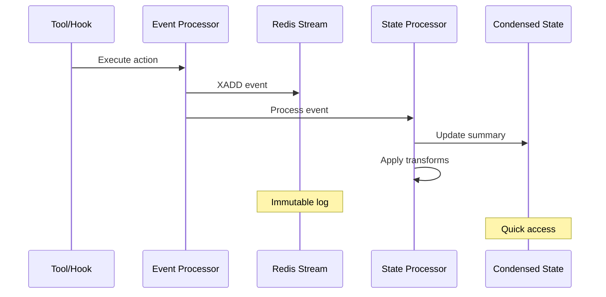
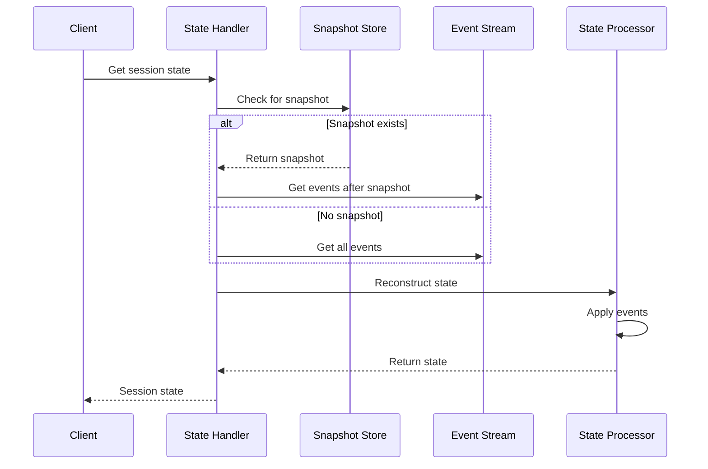
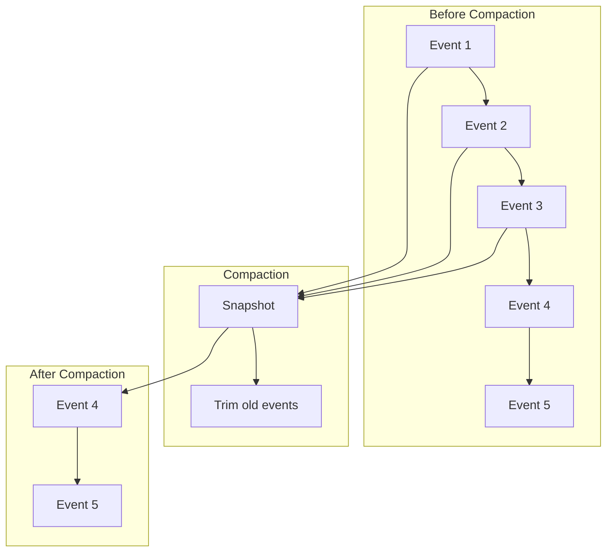

# Session State Architecture

## Overview

ClaudeBench implements an event sourcing pattern for session management, where every action is captured as an immutable event in a Redis stream. This architecture enables perfect session reconstruction, time-travel debugging, and resilient state recovery. Sessions can be snapshot, compacted, and rehydrated on-demand.

## Design Principles

### 1. **Event Sourcing**
All state changes are captured as events. The current state is derived from replaying events, ensuring consistency and auditability.

### 2. **Immutable Event Log**
Events are never modified or deleted, only appended. This creates an authoritative history of all session activities.

### 3. **Lazy State Reconstruction**
State is rebuilt on-demand from events rather than maintained continuously, reducing memory overhead and improving reliability.

### 4. **Snapshot Optimization**
Periodic snapshots capture state at points in time, allowing faster rehydration without replaying entire event streams.

### 5. **Condensed Views**
High-level summaries provide quick access to session context without processing full event streams.

## Components

### State Processor

The central component that manages session state evolution:

```typescript
// core/state-processor.ts
class StateProcessor {
    // Process incoming events
    async processEvent(event: SessionEvent): Promise<void> {
        // 1. Append to Redis stream
        // 2. Update condensed state
        // 3. Trigger dependent processes
    }
    
    // Rebuild state from events
    async rehydrate(sessionId: string): Promise<SessionState> {
        // 1. Load snapshot if available
        // 2. Replay events from snapshot
        // 3. Return reconstructed state
    }
}
```

### Session State Handler

Retrieves session state with flexible filtering:

```typescript
// session.state.get.handler.ts
@EventHandler({
    event: "session.state.get",
    inputSchema: sessionStateGetInput,
    outputSchema: sessionStateGetOutput,
})
export class SessionStateGetHandler {
    async handle(input: SessionStateGetInput, ctx: EventContext) {
        if (input.condensed) {
            // Return high-level summary
            return getCondensedState(sessionId);
        } else {
            // Return raw event stream
            return getEventStream(sessionId, filters);
        }
    }
}
```

### Snapshot Creation Handler

Creates point-in-time snapshots for recovery:

```typescript
// session.snapshot.create.handler.ts
@EventHandler({
    event: "session.snapshot.create",
    inputSchema: sessionSnapshotCreateInput,
    persist: true,
})
export class SessionSnapshotCreateHandler {
    async handle(input: SessionSnapshotCreateInput, ctx: EventContext) {
        // 1. Capture current state
        // 2. Serialize to snapshot format
        // 3. Store in Redis/PostgreSQL
        // 4. Return snapshot metadata
    }
}
```

## Data Flow

### Event Capture Flow



### State Reconstruction Flow



## Event Types & Structure

### Core Event Types

```typescript
enum SessionEventType {
    // Hook events
    "hook.pre_tool",       // Tool about to execute
    "hook.post_tool",      // Tool completed
    "hook.user_prompt",    // User submitted prompt
    "hook.todo_write",     // TODO list modified
    
    // Task events
    "task.created",        // New task created
    "task.completed",      // Task marked complete
    "task.failed",         // Task failed
    
    // Swarm events
    "swarm.decomposed",    // Task broken down
    "swarm.synthesized",   // Results combined
    
    // System events
    "hook.agent_stop",     // Agent stopped
    "hook.notification",   // System notification
    "hook.pre_compact"     // Before compaction
}
```

### Event Schema

```typescript
interface SessionEvent {
    eventId: string;           // Unique event identifier
    eventType: SessionEventType;
    timestamp: number;         // Unix timestamp
    sessionId: string;
    instanceId: string;
    data: {
        params: any;          // Input parameters
        result: any;          // Operation result
    };
    labels?: string[];        // Event categorization
    metadata?: Record<string, any>;
}
```

## Redis Keys & Patterns

| Key Pattern | Type | Purpose | TTL |
|-------------|------|---------|-----|
| `cb:stream:session:{sessionId}` | stream | Event stream for session | 30 days |
| `cb:session:state:{sessionId}` | hash | Current session state | Session lifetime |
| `cb:session:context:{sessionId}` | hash | Condensed context | Session lifetime |
| `cb:session:snapshot:{snapshotId}` | hash | State snapshot | 7 days |
| `cb:session:tasks:{sessionId}` | list | Active task IDs | Session lifetime |
| `cb:session:tools:{sessionId}` | list | Recent tools used | 24 hours |
| `cb:session:commits:{sessionId}` | list | Git commits | 7 days |
| `cb:metrics:session:{sessionId}` | hash | Session metrics | Session lifetime |

## State Management Strategies

### Condensed State

High-level session summary for quick access:

```typescript
interface CondensedState {
    tasks: Array<{
        id: string;
        text: string;
        status: string;
        result?: any;
    }>;
    tools: Array<{
        name: string;
        count: number;
        lastUsed: number;
    }>;
    prompts: Array<{
        prompt: string;
        timestamp: number;
    }>;
    todos: Array<{
        content: string;
        status: string;
    }>;
}
```

### Snapshot Strategy

Snapshots are created at strategic points:

1. **Pre-Compaction**: Before removing old events
2. **Checkpoint**: At regular intervals (hourly)
3. **Manual**: On-demand by user/system
4. **Error Recovery**: After system failures

```typescript
interface SessionSnapshot {
    snapshotId: string;
    sessionId: string;
    timestamp: number;
    eventCount: number;
    state: {
        // Complete state at snapshot time
        tasks: Task[];
        events: Event[];
        context: Context;
    };
}
```

### Rehydration Process

State reconstruction follows this algorithm:

```typescript
async function rehydrateSession(sessionId: string): SessionState {
    // 1. Find latest snapshot
    const snapshot = await getLatestSnapshot(sessionId);
    
    // 2. Initialize state
    let state = snapshot ? snapshot.state : emptyState();
    
    // 3. Get events after snapshot
    const events = await getEvents(sessionId, snapshot?.timestamp);
    
    // 4. Apply each event
    for (const event of events) {
        state = applyEvent(state, event);
    }
    
    // 5. Cache and return
    await cacheState(sessionId, state);
    return state;
}
```

## Performance Considerations

### Event Stream Optimization

- **Stream Trimming**: Old events removed after snapshot
- **Batch Reading**: Events fetched in chunks (100 default)
- **Lazy Loading**: State rebuilt only when accessed
- **Index Usage**: XRANGE with timestamps for efficient queries

### Caching Strategy

```typescript
// Three-tier caching
interface CacheStrategy {
    L1: "Memory",      // In-process cache (5 min TTL)
    L2: "Redis Hash",  // Condensed state (1 hour TTL)
    L3: "Redis Stream" // Full events (persistent)
}
```

### Compaction Process

Large event streams are compacted periodically:



## Integration Points

### With Task System

Session tracks all task operations:

```typescript
// Task events automatically captured
await ctx.publish({
    type: "task.created",
    payload: { taskId, text, priority },
    metadata: { sessionId, instanceId }
});
```

### With Git Integration

Commits linked to session context:

```typescript
// Session maintains commit history
const commits = await redis.lrange(
    `cb:session:commits:${sessionId}`,
    0, 99
);
```

### With Hook System

All hook events flow through session state:

```typescript
// Hook events become session events
{
    eventType: "hook.pre_tool",
    data: {
        tool: "Edit",
        params: { file_path: "..." }
    }
}
```

## Examples

### Getting Condensed Session State

```typescript
// Request condensed view
const state = await handler.handle({
    sessionId: "session-123",
    condensed: true
});

// Returns high-level summary
{
    tasks: [
        { id: "t-1", text: "Setup auth", status: "completed" }
    ],
    tools: [
        { name: "Edit", count: 15, lastUsed: 1694462400000 }
    ],
    prompts: [
        { prompt: "Add login page", timestamp: 1694462300000 }
    ]
}
```

### Creating Recovery Snapshot

```typescript
// Create checkpoint snapshot
const snapshot = await handler.handle({
    sessionId: "session-123",
    instanceId: "worker-1",
    reason: "checkpoint",
    includeEvents: true
});

// Returns snapshot metadata
{
    snapshotId: "snap-abc123",
    sessionId: "session-123",
    timestamp: 1694462400000,
    size: 4096,
    eventCount: 150
}
```

### Rehydrating After Restart

```typescript
// Restore session state
const rehydrated = await handler.handle({
    sessionId: "session-123",
    instanceId: "worker-2",
    snapshotId: "snap-abc123" // Optional
});

// Returns restored context
{
    rehydrated: true,
    snapshot: { id: "snap-abc123", eventCount: 150 },
    context: {
        lastTasks: [...],
        lastTools: [...],
        activeTodos: [...]
    }
}
```

## Troubleshooting

### Common Issues

1. **Event Stream Too Large**
   - **Solution**: Create snapshot and compact stream
   - **Command**: `session.snapshot.create` with reason "pre_compact"
   - **Monitoring**: Check stream length with XLEN

2. **Slow State Reconstruction**
   - **Solution**: Use condensed view or create snapshot
   - **Optimization**: Increase batch size for event reading
   - **Cache**: Enable multi-tier caching

3. **Missing Events**
   - **Solution**: Check event TTL and stream trimming settings
   - **Recovery**: Use last known snapshot
   - **Prevention**: Regular snapshot creation

## Future Enhancements

- [ ] **Distributed State**: Cross-instance state synchronization
- [ ] **Event Replay**: Time-travel debugging interface
- [ ] **State Diffing**: Compare states at different points
- [ ] **Predictive Caching**: Pre-warm state based on patterns
- [ ] **Event Analytics**: Query language for event analysis
- [ ] **State Branching**: Fork sessions for experimentation

## References

- [Event Bus Architecture](./event-bus)
- [Redis Architecture](./redis)
- [Task System](./attachments)
- [Git Integration](./git-integration)