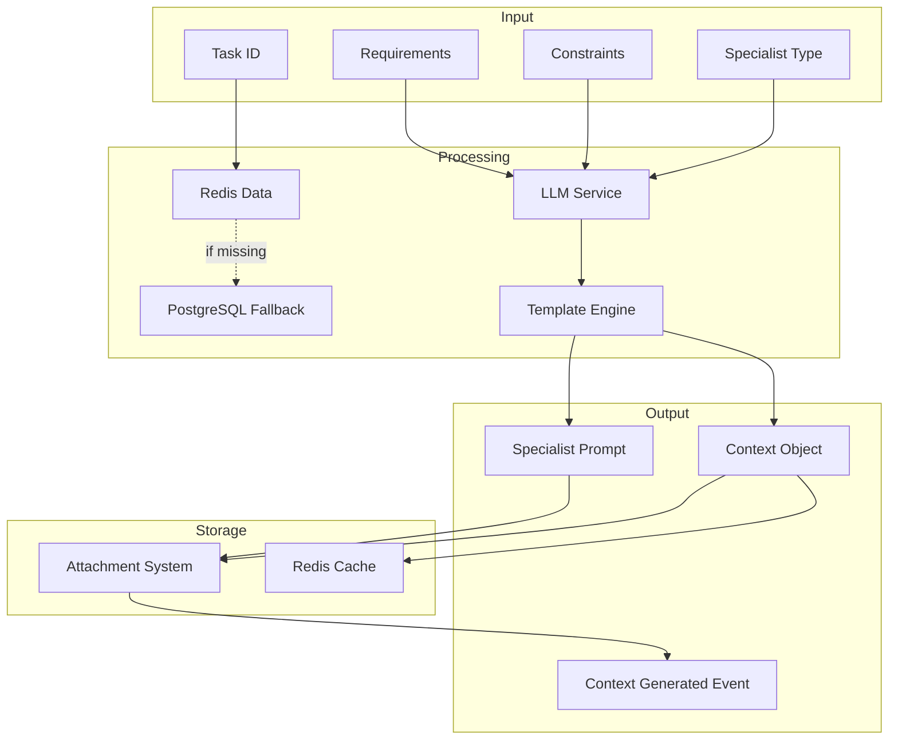

# Task Context Architecture

## Overview

The `task.context` handler represents a key architectural pattern in ClaudeBench: **LLM-enhanced task execution through contextual intelligence**. It bridges the gap between high-level task descriptions and concrete implementation details by generating specialized execution contexts for different types of workers.

## Architectural Principles

### 1. Attachment-First Storage

Unlike traditional systems that use separate tables for context data, `task.context` leverages the attachment system as its primary storage mechanism:

```
Task
  └── Attachments
        ├── context_frontend_1234567890
        ├── context_backend_1234567891
        └── context_testing_1234567892
```

**Benefits:**
- **Unified Storage**: All task-related data lives with the task
- **Temporal History**: Multiple contexts can be generated and stored over time
- **No Schema Migration**: Adding new context types requires no database changes
- **Audit Trail**: Every context generation is timestamped and attributed

### 2. Specialist-Aware Context Generation

The handler understands that different specialists need different types of information:

```typescript
interface SpecialistContext {
  frontend: {
    focus: "UI components, state management, user interactions",
    readings: ["Component files", "Style systems", "State stores"],
    patterns: ["React hooks", "CSS-in-JS", "Component composition"]
  },
  backend: {
    focus: "APIs, data models, business logic",
    readings: ["Route handlers", "Database schemas", "Service layers"],
    patterns: ["REST patterns", "Database transactions", "Error handling"]
  },
  testing: {
    focus: "Test coverage, edge cases, quality assurance",
    readings: ["Existing tests", "API contracts", "UI components"],
    patterns: ["Test patterns", "Mocking strategies", "E2E flows"]
  }
}
```

### 3. Session-Aware Processing

Context generation is tied to sessions, enabling workflow continuity:

```typescript
// Session hierarchy for context
sessionId (from input)
  ↓ fallback
metadata.sessionId
  ↓ fallback
metadata.clientId (MCP)
  ↓ fallback
instanceId (worker)
```

This hierarchy ensures context can be generated in various execution environments while maintaining traceability.

## Data Flow Architecture



## Template Architecture

The handler uses Nunjucks templates to generate consistent, specialist-specific prompts:

```
handlers/
  └── task/
      └── templates/
          └── task/
              └── task-context-prompt.njk
```

**Template Variables:**
- `description`: Task description
- `scope`: Implementation scope
- `mandatoryReadings`: Required files to review
- `architectureConstraints`: Technical constraints
- `relatedWork`: Other relevant tasks
- `successCriteria`: Definition of done

## Caching Strategy

```typescript
@Instrumented(300) // 5-minute cache
```

Context is cached for 5 minutes to balance:
- **Freshness**: Recent changes are reflected
- **Performance**: Repeated requests are fast
- **Cost**: LLM calls are minimized

## Event Integration

### Published Events

```typescript
{
  type: "task.context.generated",
  payload: {
    taskId: string,
    specialist: string,
    contextSize: number
  },
  metadata: {
    generatedBy: string,
    sessionId: string,
    timestamp: number
  }
}
```

### Event Consumers

- **Monitoring Systems**: Track context generation metrics
- **Workflow Orchestrators**: Trigger next steps after context ready
- **Audit Systems**: Log all context generation activities

## Resilience Patterns

### Circuit Breaker

```typescript
circuitBreaker: {
  threshold: 5,        // Open after 5 failures
  timeout: 30000,      // Reset after 30 seconds
  fallback: () => ({   // Graceful degradation
    context: {
      description: "Service unavailable",
      // Minimal valid context
    }
  })
}
```

### Rate Limiting

```typescript
rateLimit: {
  limit: 50,           // 50 contexts
  windowMs: 60000      // per minute
}
```

Prevents:
- LLM service overload
- Cost explosion
- Denial of service

## Integration Points

### 1. LLM Sampling Service

```typescript
const samplingService = getSamplingService();
const response = await samplingService.generateContext(
  sessionId,
  taskId,
  specialist,
  taskInfo
);
```

The sampling service abstracts:
- Model selection
- Prompt formatting
- Response parsing
- Error handling

### 2. Attachment System

```typescript
await registry.executeHandler("task.create_attachment", {
  taskId: input.taskId,
  key: `context_${specialist}_${timestamp}`,
  type: "json",
  value: contextData
});
```

Leverages the attachment handler for:
- Atomic storage
- PostgreSQL persistence
- Redis caching
- Event emission

### 3. Related Task Discovery

```typescript
const relatedTasks = await ctx.prisma.task.findMany({
  where: {
    id: { not: taskId },
    status: { in: ["in_progress", "completed"] }
  },
  orderBy: { updatedAt: "desc" },
  take: 5
});
```

Provides context about:
- Ongoing work
- Recent completions
- Potential conflicts

## Performance Characteristics

| Operation | Typical Duration | Cache Hit Duration |
|-----------|-----------------|-------------------|
| Context Generation | 2-10 seconds | <50ms |
| Attachment Storage | 50-100ms | N/A |
| Event Publishing | 5-10ms | N/A |
| Total (uncached) | 2-10 seconds | N/A |
| Total (cached) | <100ms | <100ms |

## Scalability Considerations

### Horizontal Scaling

Multiple instances can generate contexts concurrently:
- **Session affinity**: Not required
- **Cache sharing**: Redis enables cross-instance caching
- **Load distribution**: Rate limiting per instance

### Vertical Scaling

Resource requirements:
- **Memory**: Minimal (templates + context data)
- **CPU**: Low (mostly I/O bound)
- **Network**: Moderate (LLM API calls)

## Security Model

### Input Validation

```typescript
inputSchema: taskContextInput  // Zod validation
```

Prevents:
- Injection attacks
- Resource exhaustion
- Invalid data propagation

### Session Authentication

```typescript
const sessionId = ctx.metadata?.sessionId || 
                 ctx.metadata?.clientId || 
                 ctx.instanceId;
```

Ensures:
- Request attribution
- Audit trail
- Rate limit enforcement

## Evolution Path

### Current State (v1)
- Single context per specialist
- Template-based prompts
- Attachment storage

### Future Enhancements (v2)
- **Multi-model contexts**: Different LLMs for different specialists
- **Context versioning**: Track context evolution over time
- **Context feedback**: Learn from successful implementations
- **Context sharing**: Reuse contexts across similar tasks

### Long-term Vision (v3)
- **Adaptive contexts**: Adjust based on task success rates
- **Context libraries**: Pre-built contexts for common patterns
- **Context composition**: Combine multiple contexts
- **Real-time updates**: Stream context updates as task progresses

## Anti-Patterns to Avoid

### ❌ Direct Database Storage
```typescript
// Don't do this
await ctx.prisma.taskContext.create({
  data: contextData
});
```

### ✅ Use Attachments
```typescript
// Do this instead
await registry.executeHandler("task.create_attachment", {
  key: `context_${specialist}_${timestamp}`,
  value: contextData
});
```

### ❌ Synchronous LLM Calls in Request Path
```typescript
// Don't block the request
const context = await llm.generateSync(prompt);
```

### ✅ Use Sampling Service
```typescript
// Use the async sampling service
const context = await samplingService.generateContext(...);
```

### ❌ Hardcoded Prompts
```typescript
// Don't embed prompts in code
const prompt = `You are a ${specialist}...`;
```

### ✅ Use Templates
```typescript
// Use template system
const prompt = nunjucksEnv.render("task-context-prompt.njk", data);
```

## Monitoring & Observability

### Key Metrics

```typescript
// Track in Prometheus
task_context_generation_total
task_context_generation_duration_seconds
task_context_cache_hits_total
task_context_errors_total
```

### Health Indicators

- **Generation success rate**: >95%
- **Cache hit rate**: >30%
- **P95 latency**: <15 seconds
- **Error rate**: <1%

## Testing Strategy

### Unit Tests
- Template rendering
- Input validation
- Cache key generation

### Integration Tests
- Redis interaction
- Attachment creation
- Event publishing

### Contract Tests
- API schema compliance
- Event format validation
- Error response structure

## Conclusion

The `task.context` architecture demonstrates ClaudeBench's core principles:

1. **Event-driven**: Publishes events for observability
2. **Attachment-based**: Leverages unified storage
3. **Session-aware**: Maintains workflow continuity
4. **Resilient**: Handles failures gracefully
5. **Scalable**: Supports concurrent execution

This pattern serves as a blueprint for other LLM-enhanced handlers in the system, establishing conventions for context generation, storage, and retrieval that maintain consistency across the platform.