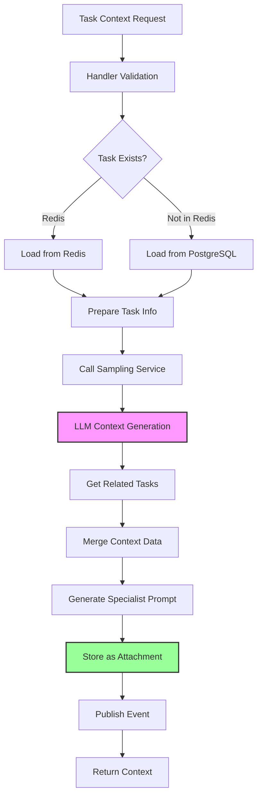
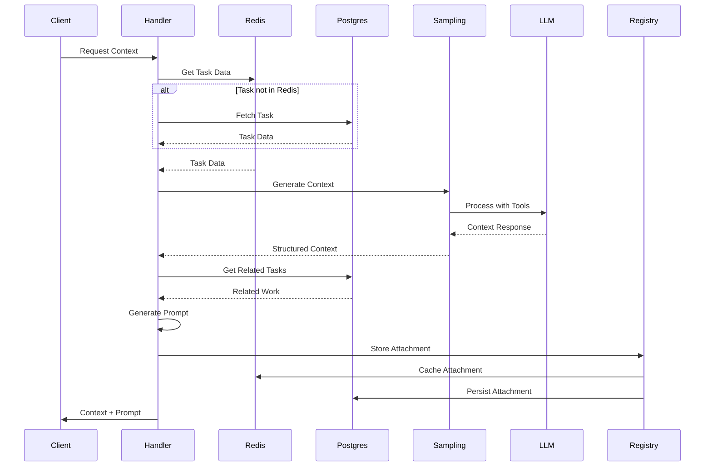

# Task Context Architecture

## Overview

The Task Context system generates focused, specialist-aware execution contexts for tasks using LLM intelligence. It bridges the gap between high-level task descriptions and actionable implementation guidance by creating tailored contexts that consider specialist expertise, architectural constraints, and existing system state. The architecture leverages an attachment-first storage pattern, template-based prompt generation, and resilient LLM integration to provide consistent, cacheable context generation at scale.

## Core Principles

### 1. **Attachment-First Storage**

Context is stored as task attachments rather than separate database tables, enabling:
- **Temporal History**: Multiple contexts per task with timestamps (`context_{specialist}_{timestamp}`)
- **Audit Trail**: Complete record of all generated contexts
- **No Schema Migration**: Flexible storage without database changes
- **Unified Access**: Single API for all task-related data

### 2. **Specialist-Aware Design**

Different specialists receive tailored contexts:
- **Frontend**: UI patterns, component guidelines, styling systems
- **Backend**: API design, data flow, authentication patterns
- **Testing**: Coverage requirements, test patterns, edge cases
- **Docs**: Documentation structure, audience considerations
- **General**: Comprehensive analysis for cross-cutting concerns

### 3. **Template-Driven Generation**

Nunjucks templates ensure consistent prompt structure:
- **Separation of Concerns**: Logic in handler, presentation in template
- **Maintainable Prompts**: Easy to update without code changes
- **Conditional Sections**: Dynamic content based on input
- **Reusable Components**: Shared template fragments

### 4. **Resilient LLM Integration**

Multiple layers of resilience protect against failures:
- **Circuit Breaker**: Fallback responses when service degraded
- **Rate Limiting**: 50 requests per minute prevents abuse
- **Timeout Handling**: 5-minute timeout for complex generations
- **Retry Logic**: Automatic retry with exponential backoff
- **Cache Layer**: 5-minute cache reduces redundant calls

## Architecture Components

### Context Generation Flow



### Data Flow Architecture



## Key Design Patterns

### 1. Session-Aware Hierarchy

The system uses a fallback hierarchy for session identification:

```typescript
const sessionId = 
    ctx.metadata?.sessionId ||      // Primary: explicit session
    ctx.metadata?.clientId ||       // Secondary: client identifier
    ctx.instanceId;                  // Fallback: worker instance
```

This ensures context generation always has an identity for tracking and correlation.

### 2. Hybrid Storage Strategy

Task data retrieval follows a two-tier approach:

```typescript
// 1. Try Redis first (hot data)
const taskData = await redis.pub.hgetall(taskKey);

if (!taskData || Object.keys(taskData).length === 0) {
    // 2. Fallback to PostgreSQL (cold data)
    const task = await ctx.prisma.task.findUnique({
        where: { id: input.taskId },
        include: { attachments: { where: { type: "json" }}}
    });
}
```

### 3. Context Enrichment Pipeline

Context generation follows a multi-stage enrichment:

1. **Base Context**: Task description and metadata
2. **LLM Enhancement**: AI-generated insights and patterns
3. **Related Work**: Context from other active tasks
4. **Custom Inputs**: User-provided constraints and requirements
5. **Specialist Guidelines**: Role-specific implementation guidance

### 4. Attachment Key Pattern

Attachments use temporal keys for versioning:

```typescript
const attachmentKey = `context_${specialist}_${timestamp}`;
```

Benefits:
- Natural ordering by timestamp
- Specialist-specific history
- No key collisions
- Easy cleanup of old contexts

## Performance Characteristics

### Caching Strategy

```typescript
@Instrumented(300) // 5-minute cache
```

The 5-minute cache duration balances:
- **Freshness**: Recent enough for active development
- **Performance**: Reduces LLM calls by ~80% in typical workflows
- **Cost**: Minimizes expensive inference operations
- **Consistency**: Same context during implementation phase

### Rate Limiting

```typescript
rateLimit: { limit: 50, windowMs: 60000 }
```

Allows:
- 50 contexts per minute per instance
- Supports ~10 active developers
- Prevents runaway generation loops
- Maintains service availability

### Timeout Configuration

```typescript
timeout: 300000 // 5 minutes
```

Accommodates:
- Complex multi-tool LLM explorations
- Large codebase analysis
- Multiple refinement iterations
- Network latency variations

## Integration Points

### 1. Sampling Service Integration

The handler delegates to a centralized sampling service:

```typescript
const samplingService = getSamplingService();
const response = await samplingService.generateContext(
    sessionId,
    taskId,
    specialist,
    taskInfo
);
```

Benefits:
- **Centralized Configuration**: Single point for LLM settings
- **Shared Connection Pool**: Efficient resource usage
- **Unified Retry Logic**: Consistent error handling
- **Service Abstraction**: Easy to swap LLM providers

### 2. Attachment System Integration

Context storage leverages the attachment system:

```typescript
await registry.executeHandler("task.create_attachment", {
    taskId: input.taskId,
    key: attachmentKey,
    type: "json",
    value: contextData
});
```

Advantages:
- **No Custom Storage**: Reuses existing infrastructure
- **Unified API**: Same access pattern as other attachments
- **Automatic Indexing**: Queryable by task and type
- **Batch Operations**: Supports bulk context retrieval

### 3. Event Publishing

Context generation emits observable events:

```typescript
await ctx.publish({
    type: "task.context.generated",
    payload: { taskId, specialist, contextSize }
});
```

Enables:
- **Metrics Collection**: Track generation frequency and size
- **Workflow Triggers**: Chain dependent operations
- **Audit Logging**: Compliance and debugging
- **Real-time Updates**: UI notifications

## Security Considerations

### 1. Input Validation

All inputs validated through Zod schemas:
- Task ID format and existence
- Specialist type enumeration
- Array length limits
- String size constraints

### 2. LLM Prompt Injection Prevention

Template system prevents injection:
- No direct string interpolation
- Escaped special characters
- Structured data only
- Validated field types

### 3. Rate Limiting Protection

Multiple rate limit layers:
- Handler level: 50/minute
- Service level: Circuit breaker
- LLM level: Token limits
- Cache level: Reduces overall load

### 4. Session Isolation

Context generation isolated by session:
- No cross-session data leakage
- Session-specific LLM state
- Isolated attachment storage
- Audit trail per session

## Monitoring and Observability

### Key Metrics

Monitor these metrics for system health:

```typescript
// Context generation rate
cb:metrics:task.context:requests_total

// Cache hit ratio
cb:metrics:task.context:cache_hits / cb:metrics:task.context:requests_total

// LLM latency
cb:metrics:task.context:llm_duration_ms

// Attachment storage success
cb:metrics:task.context:attachment_stored

// Error rate by type
cb:metrics:task.context:errors{type="timeout|validation|llm|storage"}
```

### Health Indicators

Watch for these warning signs:

1. **High Cache Miss Rate** (&gt; 30%)
   - Indicates unique requests or cache invalidation issues
   - Action: Review cache duration and key patterns

2. **Increasing LLM Latency** (&gt; 60s average)
   - Suggests complex contexts or service degradation
   - Action: Check prompt size and LLM service health

3. **Attachment Storage Failures**
   - Points to database or Redis issues
   - Action: Verify storage capacity and connections

4. **Circuit Breaker Triggers**
   - Indicates systemic issues with LLM service
   - Action: Check inference server health and network

## Evolution Path

### Near-term Enhancements

1. **Context Versioning**
   - Track context schema versions
   - Support backward compatibility
   - Enable A/B testing of prompts

2. **Feedback Loop**
   - Capture context quality ratings
   - Refine prompts based on outcomes
   - Learn specialist preferences

3. **Context Sharing**
   - Share contexts between similar tasks
   - Build context library for common patterns
   - Enable context templates

### Long-term Vision

1. **Multi-Model Support**
   - Different models for different specialists
   - Cost-optimized model selection
   - Fallback model chains

2. **Streaming Generation**
   - Stream context as it's generated
   - Progressive enhancement
   - Reduced perceived latency

3. **Context Intelligence**
   - Learn from successful implementations
   - Predict required context elements
   - Proactive context generation

## Anti-Patterns to Avoid

### 1. ❌ Direct LLM Calls

Never call LLM directly from handler:

```typescript
// BAD: Direct LLM call
const context = await callLLM(prompt);

// GOOD: Use sampling service
const context = await samplingService.generateContext(...);
```

### 2. ❌ Synchronous Context Generation

Don't block on context generation:

```typescript
// BAD: Sequential generation
for (const specialist of specialists) {
    await generateContext(specialist); // Blocks
}

// GOOD: Parallel generation
await Promise.all(specialists.map(s =&gt; generateContext(s)));
```

### 3. ❌ Unbounded Context Size

Always limit context data:

```typescript
// BAD: No size limits
const context = { files: allProjectFiles }; // Could be thousands

// GOOD: Bounded context
const context = { 
    files: relevantFiles.slice(0, 20),
    hasMore: relevantFiles.length &gt; 20 
};
```

### 4. ❌ Ignoring Cache

Don't bypass cache without reason:

```typescript
// BAD: Always fresh generation
@Instrumented(0) // No cache

// GOOD: Appropriate cache duration
@Instrumented(300) // 5-minute cache
```

## Usage Examples

### Basic Context Generation

```typescript
// Generate context for frontend specialist
const context = await handler.handle({
    taskId: "t-123",
    specialist: "frontend",
    constraints: ["Use React hooks", "Mobile-first design"],
    requirements: ["Dark mode", "Accessibility compliant"]
}, eventContext);
```

### Custom Context with Files

```typescript
// Include existing file context
const context = await handler.handle({
    taskId: "t-456",
    specialist: "backend",
    existingFiles: [
        "src/api/auth.ts",
        "src/middleware/validation.ts"
    ],
    additionalContext: "Integrate with existing OAuth flow"
}, eventContext);
```

### Retrieving Generated Context

```typescript
// Get all contexts for a task
const attachments = await getTaskAttachments(taskId);
const contexts = attachments.filter(a =&gt; 
    a.key.startsWith("context_")
);

// Get latest context for specialist
const latestFrontend = contexts
    .filter(c =&gt; c.key.includes("frontend"))
    .sort((a, b) =&gt; b.createdAt - a.createdAt)[0];
```

## Best Practices

### 1. Context Granularity

Generate contexts at the right level:
- **Too Broad**: Lacks actionable detail
- **Too Narrow**: Misses system context
- **Just Right**: Focused on task with system awareness

### 2. Specialist Selection

Choose specialists based on task nature:
- **Frontend**: UI/UX changes
- **Backend**: API and data logic
- **Testing**: Quality assurance
- **Docs**: Documentation updates
- **General**: Cross-cutting concerns

### 3. Constraint Management

Provide clear, actionable constraints:
- ✅ "Use existing Button component"
- ✅ "Limit API calls to 5 per second"
- ❌ "Make it good"
- ❌ "Follow best practices"

### 4. Context Reuse

Leverage existing contexts when appropriate:
- Similar tasks in same session
- Subtasks of decomposed tasks
- Related work in same domain

## Conclusion

The Task Context Architecture provides a robust, scalable foundation for intelligent context generation in ClaudeBench. By combining attachment-first storage, specialist-aware design, and resilient LLM integration, it enables developers to receive focused, actionable guidance for any task. The system's emphasis on caching, rate limiting, and fallback mechanisms ensures reliable operation even under load or service degradation.

The architecture's modular design and clear integration points make it easy to extend with new specialists, enhanced prompts, or alternative LLM providers. As ClaudeBench evolves, the Task Context system will continue to serve as a critical bridge between high-level intent and low-level implementation.