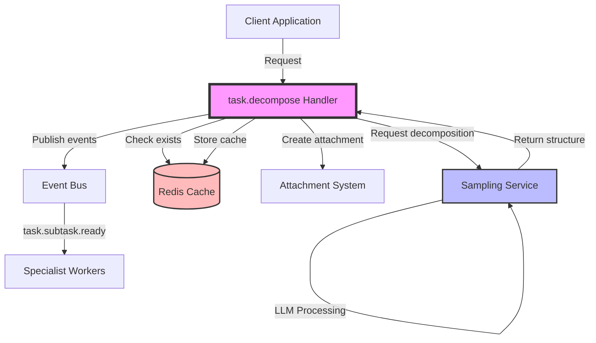
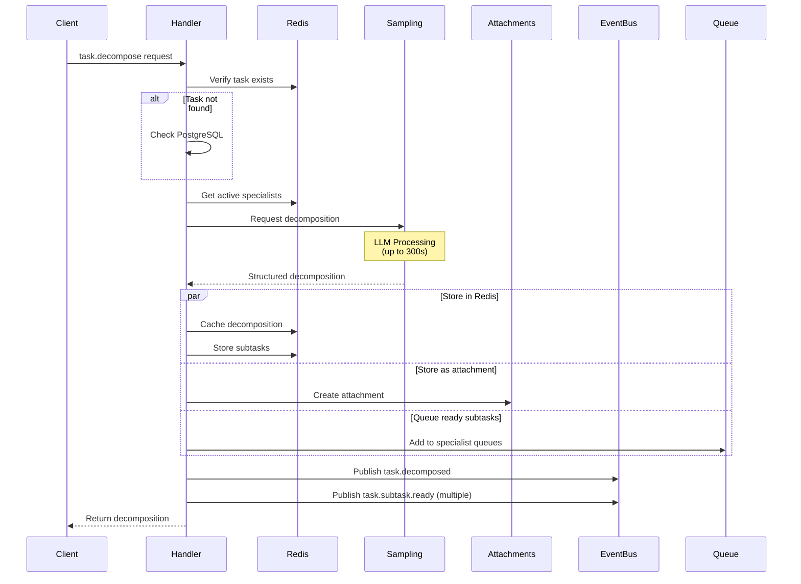
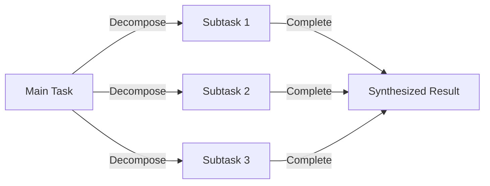
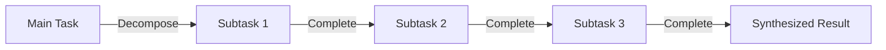
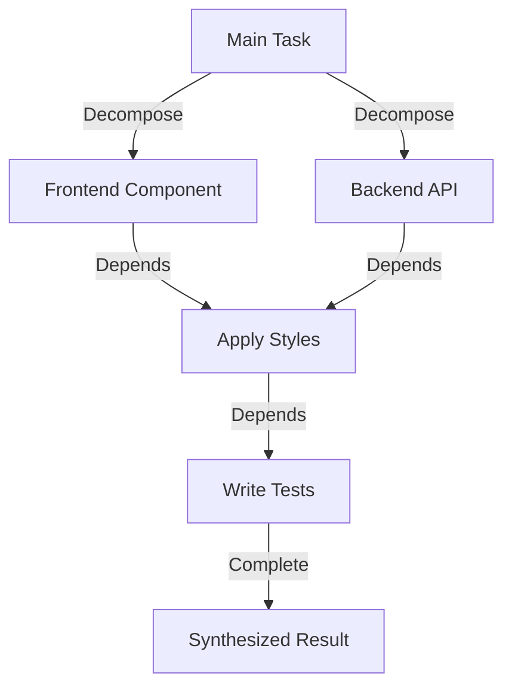
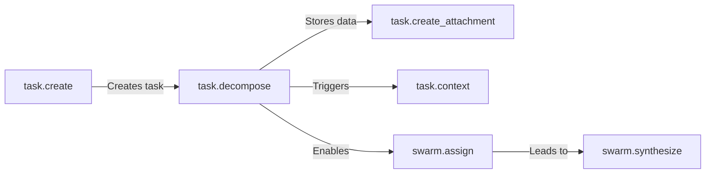

# Task Decomposition Architecture

## Overview

The task decomposition system enables intelligent breakdown of complex tasks into manageable subtasks using LLM intelligence. This document covers the architectural design, data flow, and integration patterns of the task decomposition feature.

## System Architecture



## Core Components

### 1. task.decompose Handler

The central handler responsible for orchestrating the decomposition process:

- **Location**: `/apps/server/src/handlers/task/task.decompose.handler.ts`
- **Event**: `task.decompose`
- **Rate Limit**: 10 requests per minute
- **Timeout**: 300 seconds (LLM processing)

### 2. Sampling Service Integration

The handler leverages MCP sampling service for intelligent decomposition:

```typescript
interface DecompositionRequest {
  sessionId: string;
  task: string;
  context: {
    specialists: Specialist[];
    priority: number;
    constraints: string[];
  };
}
```

### 3. Storage Architecture

#### Attachment-Based Storage

Decompositions are stored as task attachments:

```typescript
interface DecompositionAttachment {
  taskId: string;
  taskText: string;
  strategy: ExecutionStrategy;
  subtasks: Subtask[];
  architecturalConsiderations: string[];
  decomposedAt: string;
  decomposedBy: string;
  sessionId: string;
}
```

**Key Pattern**: `decomposition_{timestamp}`

#### Redis Caching Layer

Fast access cache with automatic expiration:

```
cb:decomposition:{taskId}
├── taskId: string
├── taskText: string  
├── strategy: string
├── totalComplexity: string
├── subtaskCount: string
├── timestamp: string
└── sessionId: string
```

**TTL**: 7 days (604800 seconds)

#### Subtask Storage

Individual subtask tracking in Redis:

```
cb:subtask:{subtaskId}
├── id: string
├── parentTaskId: string
├── description: string
├── specialist: string
├── complexity: string
├── estimatedMinutes: string
├── dependencies: JSON string
├── status: string
└── createdAt: string
```

### 4. Queue Management

Subtasks without dependencies are automatically queued:

```
cb:queue:specialist:{type}
├── Score: timestamp + complexity
└── Member: subtaskId
```

This enables pull-based work distribution where specialists can claim tasks from their queues.

## Data Flow

### Decomposition Process



### Event Flow

The decomposition triggers a cascade of events:

1. **task.decomposed**: Main decomposition complete
2. **task.subtask.ready**: For each subtask without dependencies
3. **task.subtask.assigned**: When specialists claim subtasks
4. **task.subtask.completed**: As subtasks finish
5. **task.synthesized**: When all subtasks complete

## Execution Strategies

### Parallel Execution



All subtasks can execute simultaneously. Best for independent work.

### Sequential Execution



Subtasks execute in order. Used when outputs depend on previous steps.

### Mixed Execution



Combination of parallel and sequential. Most common in real scenarios.

## Specialist System

### Specialist Types

| Type | Focus Area | Common Tasks |
|------|------------|--------------|
| `frontend` | UI/UX, React, CSS | Components, styling, interactions |
| `backend` | APIs, databases, auth | Services, data models, security |
| `testing` | Quality assurance | Unit, integration, E2E tests |
| `docs` | Documentation | API docs, guides, README files |
| `general` | Cross-cutting | Config, setup, deployment |

### Load Balancing

Specialists are assigned based on:

1. **Availability**: Active specialists only
2. **Load**: Current task count
3. **Capability Match**: Required skills vs specialist type
4. **Priority**: Higher priority tasks assigned first

## Session Management

### Session-Aware Processing

Sessions provide context continuity:

```typescript
interface SessionContext {
  sessionId: string;
  instanceId: string;
  metadata: {
    project?: string;
    workflow?: string;
    user?: string;
  };
}
```

### Session Priority Order

1. Explicit `sessionId` from input
2. Context metadata `sessionId`
3. Context metadata `clientId`
4. Instance ID fallback

## Performance Considerations

### Optimization Strategies

1. **Redis Caching**: 7-day TTL balances memory vs availability
2. **Attachment Compression**: Large decompositions are compressed
3. **Queue Scoring**: `timestamp + complexity` ensures fair ordering
4. **Parallel Processing**: Independent subtasks execute concurrently

### Bottlenecks & Mitigations

| Bottleneck | Impact | Mitigation |
|------------|--------|------------|
| LLM Processing | 300s max wait | Circuit breaker with fallback |
| Redis Memory | Cache growth | 7-day expiration policy |
| Queue Depth | Specialist overload | Dynamic specialist scaling |
| Attachment Size | Storage usage | Compression for large data |

## Error Handling

### Failure Scenarios

1. **Task Not Found**
   - Fallback to PostgreSQL
   - Error if not in either store

2. **LLM Timeout**
   - Circuit breaker activates
   - Returns minimal decomposition

3. **Storage Failure**
   - Rollback decomposition
   - Emit failure event

4. **No Session**
   - Attempt fallback resolution
   - Fail if no context available

### Circuit Breaker Configuration

```typescript
{
  threshold: 3,        // Failures before opening
  timeout: 60000,      // Reset after 60 seconds
  fallback: {          // Minimal response
    subtaskCount: 0,
    decomposition: {
      subtasks: [],
      executionStrategy: "sequential",
      totalComplexity: 0,
      reasoning: "Service temporarily unavailable"
    }
  }
}
```

## Integration Points

### With Other Handlers



### Event Integration

The handler integrates with the event bus for:

- Publishing decomposition events
- Triggering downstream processing
- Enabling workflow automation

## Monitoring & Observability

### Key Metrics

```typescript
// Handler metrics
cb:metrics:task.decompose
├── success_count
├── failure_count  
├── avg_duration
└── subtask_count_avg

// Queue metrics
cb:metrics:queue:specialist:{type}
├── depth
├── processing_rate
└── claim_rate
```

### Event Tracking

Monitor these events for system health:

- `task.decomposed`: Successful decompositions
- `task.decompose.failed`: Failed attempts
- `task.subtask.ready`: Work distribution
- `task.subtask.stalled`: Blocked subtasks

## Best Practices

### When to Decompose

✅ **Good Candidates**:
- Multi-faceted features
- Cross-functional requirements
- Tasks > 2 hours estimated
- Parallelizable work

❌ **Poor Candidates**:
- Simple CRUD operations
- Single-file changes
- Linear sequences only
- Tasks < 30 minutes

### Decomposition Guidelines

1. **Granularity**: Subtasks should be 30-120 minutes
2. **Independence**: Minimize dependencies between subtasks
3. **Clarity**: Each subtask should have clear success criteria
4. **Balance**: Distribute complexity evenly

### Session Hygiene

```typescript
class DecompositionManager {
  private sessionId: string;
  
  async initialize() {
    this.sessionId = await this.getOrCreateSession();
  }
  
  async decompose(taskId: string, description: string) {
    return await handler.execute('task.decompose', {
      taskId,
      task: description,
      sessionId: this.sessionId  // Always include
    });
  }
  
  private async getOrCreateSession(): Promise<string> {
    // Session management logic
  }
}
```

## Migration Path

### From swarm.decompose

The system has migrated from `swarm.decompose` to `task.decompose`:

1. **Domain Alignment**: Tasks naturally decompose into subtasks
2. **Storage Unification**: Leverages attachment system
3. **Better Caching**: Redis with automatic expiration
4. **Enhanced Events**: More granular event model

See [Migration Guide](../guides/task-decompose-migration.md) for details.

## Future Enhancements

### Planned Improvements

1. **Adaptive Decomposition**: Learn from past decompositions
2. **Dynamic Rebalancing**: Adjust assignments based on progress
3. **Dependency Resolution**: Automatic dependency detection
4. **Cost Estimation**: Predict resource requirements

### Research Areas

- Machine learning for optimal decomposition patterns
- Automatic specialist capability detection
- Progressive decomposition for large tasks
- Cross-task dependency management

## Summary

The task decomposition architecture provides:

- **Intelligent Breakdown**: LLM-powered task analysis
- **Flexible Storage**: Attachments + Redis caching
- **Event-Driven Processing**: Reactive workflow automation
- **Specialist Coordination**: Efficient work distribution
- **Session Continuity**: Context-aware operations
- **Robust Error Handling**: Circuit breakers and fallbacks

This architecture enables efficient handling of complex tasks while maintaining system reliability and performance.