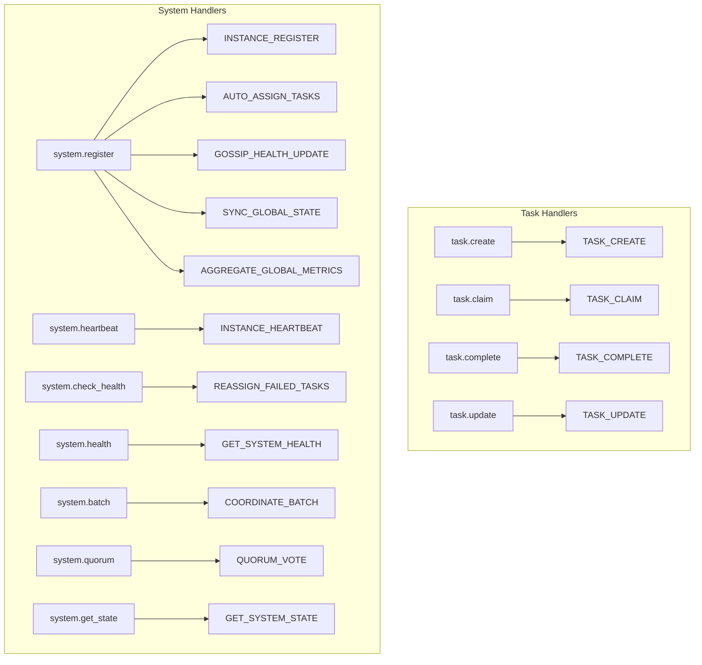

# LUA Scripts Migration Guide for ClaudeBench Handlers

## Executive Summary

This guide outlines the strategy for migrating ClaudeBench handlers to leverage Redis LUA scripts for atomic operations. The system currently uses 17 LUA scripts providing atomic guarantees for distributed coordination, state management, and event processing.

## Current State Analysis

### LUA Script Usage Distribution

| Domain | Handlers Using LUA | Total Scripts Used |
|--------|-------------------|-------------------|
| **Task** | 4 handlers | 5 scripts |
| **System** | 8 handlers | 12 scripts |
| **Hook** | 0 handlers | 0 scripts |
| **Test** | 0 handlers | 0 scripts |

### Handler-to-Script Mapping



## Migration Strategy

### Phase 1: Pattern Standardization

#### 1.1 Script Executor Pattern
Every handler that performs multi-step Redis operations should use the `redisScripts` executor:

```typescript
// GOOD: Using LUA script for atomic operations
import { redisScripts } from "@/core/redis-scripts";

async handle(input: Input, ctx: EventContext): Promise<Output> {
    const result = await redisScripts.scriptName(
        param1,
        param2
    );
    
    if (!result.success) {
        throw new Error(result.error || "Operation failed");
    }
    
    return transformResult(result);
}
```

```typescript
// BAD: Multiple Redis calls without atomicity
async handle(input: Input, ctx: EventContext): Promise<Output> {
    const exists = await ctx.redis.exists(key);
    if (exists) {
        await ctx.redis.hset(key, field, value);
        await ctx.redis.expire(key, ttl);
    }
    // Race condition: another instance could modify between calls
}
```

#### 1.2 Error Handling Pattern
All LUA script calls should follow consistent error handling:

```typescript
const result = await redisScripts.operation(params);

// Pattern A: Throw on error (for critical operations)
if (!result.success) {
    throw new Error(result.error || `Failed to ${operation}`);
}

// Pattern B: Return error state (for graceful degradation)
if (!result.success) {
    return {
        status: "failed",
        error: result.error,
        fallback: getFallbackValue()
    };
}
```

### Phase 2: Handler Migration Priority

#### High Priority (Already using LUA)
These handlers already use LUA scripts effectively:
- ✅ task.create
- ✅ task.claim  
- ✅ task.complete
- ✅ task.update
- ✅ system.register
- ✅ system.heartbeat
- ✅ system.health
- ✅ system.check_health
- ✅ system.batch
- ✅ system.quorum
- ✅ system.get_state

#### Medium Priority (Need LUA migration)
These handlers could benefit from LUA scripts:

**task.assign.handler.ts**
- Current: Multiple Redis operations for assignment
- Target: Create `TASK_ASSIGN` LUA script for atomic assignment with load balancing

**hook.pre_tool.handler.ts**
- Current: Sequential validation checks
- Target: Create `HOOK_VALIDATE` LUA script for atomic validation with rate limiting

**hook.post_tool.handler.ts**
- Current: Multiple Redis operations for result processing
- Target: Create `HOOK_PROCESS_RESULT` LUA script

#### Low Priority (Simple operations)
These handlers have simple Redis operations that don't require LUA:
- test.* handlers (testing purposes)
- Simple read-only operations

### Phase 3: New LUA Scripts to Create

#### 3.1 HOOK_VALIDATE Script
```lua
-- Validate hook execution with rate limiting and circuit breaker
local hook_key = KEYS[1]
local rate_key = KEYS[2]
local circuit_key = KEYS[3]
local tool_name = ARGV[1]
local instance_id = ARGV[2]
local timestamp = ARGV[3]

-- Check circuit breaker
local circuit_state = redis.call('get', circuit_key)
if circuit_state == 'open' then
    return {0, 'Circuit breaker open'}
end

-- Check rate limit
local current_count = redis.call('incr', rate_key)
if current_count == 1 then
    redis.call('expire', rate_key, 60)
end

if current_count > 100 then
    return {0, 'Rate limit exceeded'}
end

-- Validate hook configuration
local hook_config = redis.call('hget', hook_key, tool_name)
if not hook_config then
    return {1, 'No hook configured'}
end

-- Record validation
redis.call('hincrby', hook_key .. ':stats', 'validated', 1)
redis.call('hset', hook_key .. ':last', tool_name, timestamp)

return {1, hook_config}
```

#### 3.2 TASK_ASSIGN Script
```lua
-- Assign task to specific instance with load checking
local task_key = KEYS[1]
local instance_key = KEYS[2]
local queue_key = KEYS[3]
local task_id = ARGV[1]
local instance_id = ARGV[2]
local timestamp = ARGV[3]

-- Check task exists and is pending
local status = redis.call('hget', task_key, 'status')
if status ~= 'pending' then
    return {0, 'Task not pending'}
end

-- Check instance capacity
local current_load = redis.call('llen', queue_key)
local max_capacity = redis.call('hget', instance_key, 'maxTasks') or '10'
if current_load >= tonumber(max_capacity) then
    return {0, 'Instance at capacity'}
end

-- Assign task atomically
redis.call('hset', task_key, 
    'assignedTo', instance_id,
    'status', 'in_progress',
    'assignedAt', timestamp
)
redis.call('rpush', queue_key, task_id)

return {1, instance_id}
```

### Phase 4: Testing Strategy

#### 4.1 Contract Tests for LUA Scripts
Each LUA script needs contract tests:

```typescript
describe("LUA Script: TASK_CREATE", () => {
    it("should atomically create task and add to queue", async () => {
        const result = await redisScripts.createTask(
            "t-123",
            "Test task",
            50,
            "pending",
            new Date().toISOString(),
            {}
        );
        
        expect(result.success).toBe(true);
        expect(result.taskId).toBe("t-123");
        
        // Verify both operations happened
        const taskExists = await redis.exists("cb:task:t-123");
        const inQueue = await redis.zscore("cb:queue:tasks:pending", "t-123");
        
        expect(taskExists).toBe(1);
        expect(inQueue).toBeDefined();
    });
    
    it("should prevent duplicate task creation", async () => {
        // First creation
        await redisScripts.createTask("t-123", "Task 1", 50, "pending", now, {});
        
        // Duplicate attempt
        const result = await redisScripts.createTask("t-123", "Task 2", 50, "pending", now, {});
        
        expect(result.success).toBe(false);
        expect(result.error).toBe("Task already exists");
    });
});
```

#### 4.2 Integration Tests for Handlers
Test handlers with LUA script integration:

```typescript
describe("TaskCreateHandler with LUA", () => {
    it("should handle concurrent task creation", async () => {
        const handlers = Array(10).fill(null).map(() => new TaskCreateHandler());
        
        const results = await Promise.all(
            handlers.map((h, i) => 
                h.handle({ text: `Task ${i}` }, mockContext)
            )
        );
        
        // All should succeed with unique IDs
        const ids = results.map(r => r.id);
        expect(new Set(ids).size).toBe(10);
    });
});
```

### Phase 5: Performance Monitoring

#### 5.1 Script Execution Metrics
Add monitoring for LUA script performance:

```typescript
class RedisScriptExecutor {
    private async executeScript(
        script: string,
        keys: string[],
        args: string[],
        scriptName: string
    ) {
        const start = Date.now();
        try {
            const result = await this.redis.eval(script, keys.length, ...keys, ...args);
            
            // Record metrics
            await this.redis.hincrby("cb:metrics:lua", `${scriptName}:calls`, 1);
            await this.redis.hincrby("cb:metrics:lua", `${scriptName}:totalMs`, Date.now() - start);
            
            return result;
        } catch (error) {
            await this.redis.hincrby("cb:metrics:lua", `${scriptName}:errors`, 1);
            throw error;
        }
    }
}
```

#### 5.2 Performance Targets

| Script | Target Latency | Max Latency | Operations |
|--------|---------------|-------------|------------|
| TASK_CREATE | <5ms | 20ms | 2-4 Redis ops |
| TASK_CLAIM | <10ms | 30ms | 4-6 Redis ops |
| INSTANCE_REGISTER | <15ms | 50ms | 6-10 Redis ops |
| AGGREGATE_GLOBAL_METRICS | <50ms | 200ms | 10+ Redis ops |

## Best Practices

### 1. Script Design Principles

- **Single Responsibility**: Each script should do one atomic operation
- **Idempotency**: Scripts should be safe to retry
- **Bounded Complexity**: O(1) or O(n) with small n
- **Error Clarity**: Return specific error messages
- **TTL Management**: Always set TTL on temporary keys

### 2. TypeScript Integration

- **Type Safety**: Define interfaces for all script returns
- **Error Types**: Use discriminated unions for results
- **Validation**: Validate inputs before script execution
- **Logging**: Log script execution for debugging

### 3. Redis Key Patterns

Always follow the ClaudeBench key pattern:
```
cb:{type}:{identifier}
cb:task:t-123
cb:instance:worker-1
cb:queue:tasks:pending
cb:metrics:lua
```

### 4. Migration Checklist

For each handler migration:
- [ ] Identify multi-step Redis operations
- [ ] Design LUA script for atomicity
- [ ] Create TypeScript wrapper in redis-scripts.ts
- [ ] Update handler to use script
- [ ] Write contract tests for script
- [ ] Write integration tests for handler
- [ ] Monitor performance metrics
- [ ] Document script in lua-scripts.ts

## Implementation Timeline

### Week 1: Foundation
- [x] Document current LUA script usage
- [x] Create migration guide (this document)
- [ ] Set up LUA script testing framework
- [ ] Add performance monitoring

### Week 2: High-Value Migrations
- [ ] Create HOOK_VALIDATE script
- [ ] Create TASK_ASSIGN script
- [ ] Migrate hook.pre_tool handler
- [ ] Migrate hook.post_tool handler

### Week 3: Optimization
- [ ] Performance tune existing scripts
- [ ] Add script caching strategies
- [ ] Implement script versioning
- [ ] Create script deployment process

### Week 4: Documentation & Training
- [ ] Complete script documentation
- [ ] Create debugging guide
- [ ] Performance baseline report
- [ ] Team knowledge transfer

## Success Metrics

| Metric | Current | Target | Measurement |
|--------|---------|--------|-------------|
| Atomic Operations Coverage | 60% | 95% | Handlers using LUA scripts |
| Race Condition Bugs | Unknown | 0 | Bug reports |
| Average Operation Latency | 50ms | <10ms | P50 latency |
| Script Error Rate | Unknown | <0.1% | Errors/executions |
| Test Coverage | 70% | 95% | Script test coverage |

## Conclusion

The LUA script migration provides ClaudeBench with:
1. **Atomicity**: Eliminate race conditions in distributed operations
2. **Performance**: Reduce network round trips and latency
3. **Consistency**: Ensure data integrity across instances
4. **Simplicity**: Replace complex TypeScript logic with tested scripts

By following this migration guide, ClaudeBench will achieve its goal of a robust, efficient Redis-first architecture with strong consistency guarantees.