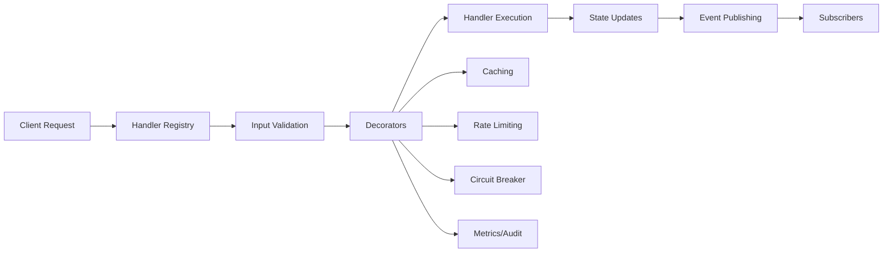
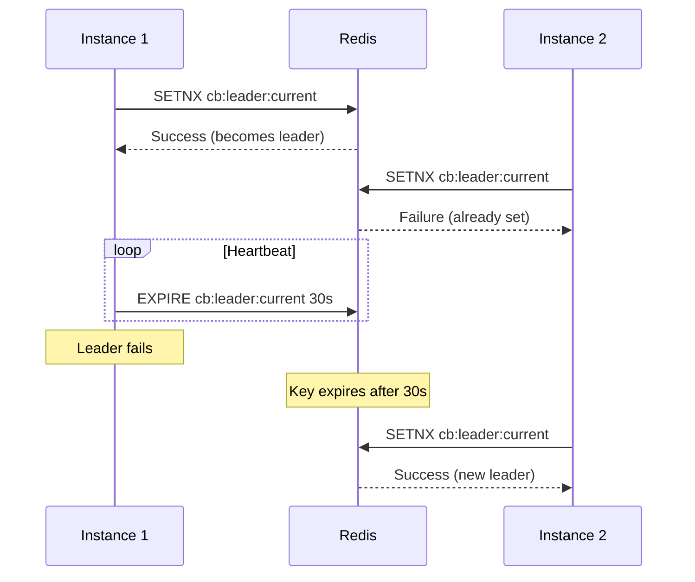
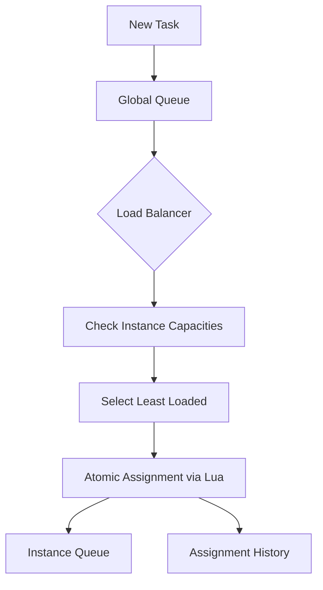
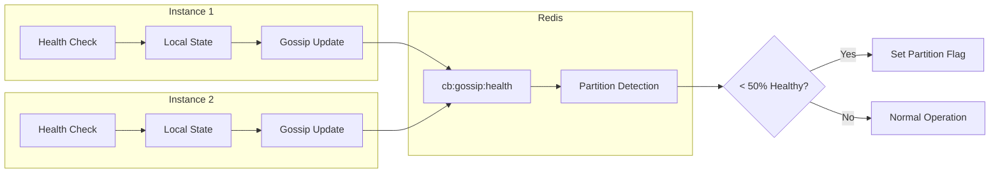
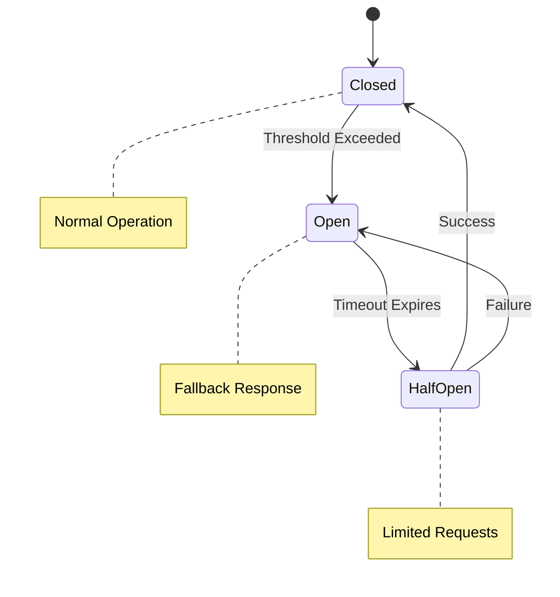
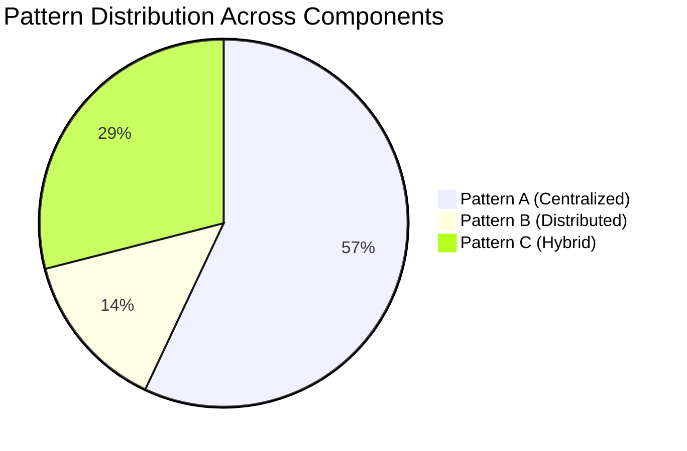
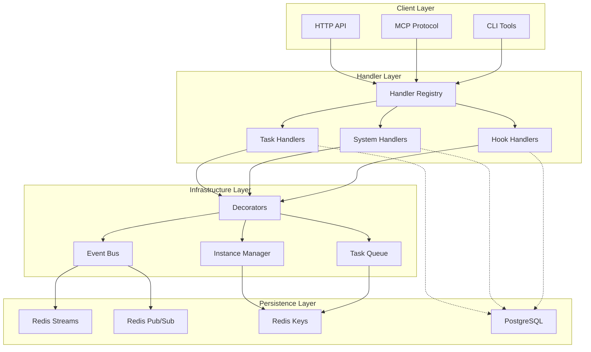
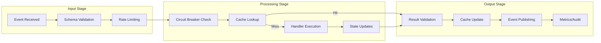
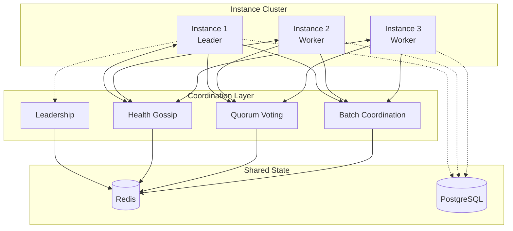

# ClaudeBench System Documentation

## Table of Contents

1. [System Overview](#system-overview)
2. [Architecture Patterns](#architecture-patterns)
3. [Component Organization](#component-organization)
4. [Event Flow](#event-flow)
5. [State Management](#state-management)
6. [Coordination Mechanisms](#coordination-mechanisms)
7. [Pattern Distribution](#pattern-distribution)
8. [System Diagrams](#system-diagrams)
9. [Implementation Details](#implementation-details)
10. [Testing Strategy](#testing-strategy)
11. [Performance Characteristics](#performance-characteristics)
12. [Evolution Roadmap](#evolution-roadmap)

## System Overview

ClaudeBench is a Redis-first event-driven architecture implementing a sophisticated distributed system with 500 LOC core and comprehensive handler ecosystem. The system demonstrates a hybrid architectural approach combining centralized management for consistency-critical operations with distributed patterns for scalability and resilience.

### Key Statistics
- **100% contract test pass rate** - Solid API contracts
- **85%+ integration test pass rate** - Reliable coordination
- **20 event handlers** across 4 domains (task, system, hook, test)
- **9 Lua scripts** providing atomic operations
- **7 core components** managing infrastructure

### Architectural Philosophy
- **Redis as Infrastructure**: All state coordination through Redis primitives
- **Decorator Pattern**: Single handler generates HTTP, MCP, and event interfaces
- **Explicit Persistence**: Handlers choose when to persist to PostgreSQL
- **Forward-Only Evolution**: Replace events instead of versioning
- **Flat Event Hierarchy**: `domain.action` pattern (e.g., `task.create`)

## Architecture Patterns

The system implements three distinct architectural patterns based on operational requirements:

### Pattern A: Centralized (Manager-based)
**Characteristics:**
- Single component manages state
- Synchronous command processing
- Direct state manipulation
- Sequential operation execution

**Usage:** 57% of components
- Task handlers (create, update, assign, complete)
- System management (health, heartbeat, state)
- Hook validation (pre_tool, post_tool, user_prompt)

### Pattern B: Distributed (Actor-based)
**Characteristics:**
- Multiple autonomous components
- Asynchronous message passing
- Shared state via external store
- Concurrent operation execution

**Usage:** 14% of components
- Decorator system (cross-cutting concerns)
- Redis script executor (atomic operations)

### Pattern C: Hybrid (Coordinated)
**Characteristics:**
- Central coordinator with distributed executors
- Mixed synchronous/asynchronous operations
- Partial state distribution
- Orchestrated workflow execution

**Usage:** 29% of components
- Instance management (health monitoring, leadership)
- Event bus (dual transport messaging)
- Batch processing (distributed coordination)
- Todo management (cross-handler orchestration)

## Component Organization

```
claudebench/
├── apps/server/src/
│   ├── handlers/           # Event Handlers (20 handlers)
│   │   ├── task/           # Task domain (4 handlers - Pattern A)
│   │   ├── system/         # System domain (7 handlers - Mixed)
│   │   ├── hook/           # Hook domain (4 handlers - Mixed)
│   │   └── test/           # Test domain (1 handler - Pattern A)
│   │
│   └── core/               # Infrastructure Components
│       ├── decorator.ts    # Pattern B - Distributed concerns
│       ├── bus.ts          # Pattern C - Hybrid messaging
│       ├── registry.ts     # Pattern A - Centralized discovery
│       ├── instance-manager.ts  # Pattern C - Hybrid coordination
│       ├── task-queue.ts   # Pattern A - Centralized queue
│       ├── todo-manager.ts # Pattern A - Centralized state
│       └── redis-scripts.ts # Pattern B - Distributed atomics
```

### Handler Distribution by Domain

| Domain | Handlers | Primary Pattern | Characteristics |
|--------|----------|-----------------|-----------------|
| Task | 4 | Pattern A | Strong consistency, sequential processing |
| System | 7 | Mixed A/C | Management (A), Coordination (C) |
| Hook | 4 | Mixed A/C | Validation (A), Todo orchestration (C) |
| Test | 1 | Pattern A | Controlled testing scenarios |

## Event Flow

### 1. Event Lifecycle



### 2. Multi-Transport Event Distribution

The system implements a sophisticated dual-transport event distribution:

**Redis Pub/Sub (Real-time)**
- Low latency event delivery
- At-least-once delivery guarantee
- No persistence
- Used for: Instance coordination, real-time notifications

**Redis Streams (Persistent)**
- Event persistence and replay
- Exactly-once delivery via Lua scripts
- Ordered event processing
- Used for: Audit trail, event sourcing, recovery

### 3. Event Naming Convention

All events follow the `domain.action` pattern:

| Domain | Actions | Examples |
|--------|---------|----------|
| task | create, update, assign, complete | `task.create`, `task.assign` |
| system | register, health, heartbeat, metrics | `system.health`, `system.register` |
| hook | pre_tool, post_tool, user_prompt, todo_write | `hook.pre_tool`, `hook.todo_write` |
| test | circuit | `test.circuit` |

## State Management

### Redis Key Patterns

The system uses a consistent namespace pattern: `cb:{type}:{identifier}`

```
Core Patterns:
cb:instance:{id}          # Instance metadata
cb:task:{id}              # Task data
cb:queue:tasks:pending    # Global task queue
cb:queue:instance:{id}    # Per-instance queues
cb:todos:current:{id}     # Todo state
cb:stream:{eventType}     # Event streams
cb:processed:events       # Deduplication tracking
cb:circuit:{event}:state  # Circuit breaker state
cb:ratelimit:{event}:{actor} # Rate limit windows
cb:metrics:global         # System metrics
cb:gossip:health          # Health gossip data
```

### State Management Strategies

#### 1. Centralized State (Pattern A)
- **Location**: Single Redis hash/set per entity
- **Access**: Direct Redis operations
- **Consistency**: Strong consistency via atomic operations
- **Example**: Task state in `cb:task:{id}`

#### 2. Distributed State (Pattern B)
- **Location**: Multiple Redis keys across instances
- **Access**: Lua scripts for coordination
- **Consistency**: Eventual consistency with conflict resolution
- **Example**: Circuit breaker states across instances

#### 3. Hybrid State (Pattern C)
- **Location**: Central registry with distributed caches
- **Access**: Manager coordination with local optimization
- **Consistency**: Mixed based on operation type
- **Example**: Instance health with gossip protocol

### Persistence Strategy

```typescript
@EventHandler({
    persist: true,  // Explicit PostgreSQL persistence
    // ... other config
})
```

- **Redis First**: All operations go through Redis
- **Selective Persistence**: Only handlers with `persist: true` write to PostgreSQL
- **Eventual Consistency**: Async PostgreSQL updates after Redis commits
- **Recovery**: Redis streams enable event replay for reconstruction

## Coordination Mechanisms

### 1. Leadership Election



### 2. Task Assignment with Load Balancing



### 3. Distributed Health Monitoring



### 4. Circuit Breaker Coordination



## Pattern Distribution

### Current System Distribution



### Pattern Selection Criteria

| Requirement | Recommended Pattern | Reasoning |
|-------------|-------------------|-----------|
| Strong Consistency | Pattern A | Single source of truth, atomic operations |
| High Throughput | Pattern B | Distributed load, parallel processing |
| Complex Coordination | Pattern C | Central orchestration with distributed execution |
| Simple CRUD | Pattern A | Reduced complexity, easier debugging |
| Fault Tolerance | Pattern B/C | No single point of failure |
| Ordered Processing | Pattern A | Sequential execution guarantees |

## System Diagrams

### 1. High-Level Architecture



### 2. Event Processing Pipeline



### 3. Multi-Instance Coordination



## Implementation Details

### Decorator-Driven Architecture

The system uses a sophisticated decorator pattern for cross-cutting concerns:

```typescript
@EventHandler({
    event: "task.create",
    inputSchema: taskCreateInput,
    outputSchema: taskCreateOutput,
    persist: true,
    rateLimit: 10
})
export class TaskCreateHandler {
    @Instrumented(0)  // Caching with TTL
    @Resilient({      // Circuit breaker, rate limiting, timeout
        rateLimit: { limit: 100, windowMs: 60000 },
        timeout: 5000,
        circuitBreaker: { 
            threshold: 5, 
            timeout: 30000,
            fallback: () => ({ /* fallback response */ })
        }
    })
    async handle(input: TaskCreateInput, ctx: EventContext): Promise<TaskCreateOutput> {
        // Handler implementation
    }
}
```

### Lua Script Atomic Operations

The system provides 9 Lua scripts for atomic operations:

| Script | Purpose | Pattern | Complexity |
|--------|---------|---------|------------|
| EXACTLY_ONCE_DELIVERY | Event deduplication | Pattern A | O(1) |
| ASSIGN_TASK_WITH_LOAD_BALANCING | Task distribution | Pattern C | O(n) |
| GOSSIP_HEALTH_UPDATE | Health coordination | Pattern B | O(n) |
| QUORUM_VOTE | Consensus decisions | Pattern B | O(n) |
| AGGREGATE_GLOBAL_METRICS | Metrics collection | Pattern A | O(n+m) |
| PARTITION_EVENT | Event ordering | Pattern A | O(1) |
| COORDINATE_BATCH | Batch processing | Pattern C | O(1) |
| SYNC_GLOBAL_STATE | State versioning | Pattern A | O(1) |

### Context Management

Every handler receives an `EventContext` providing:

```typescript
interface EventContext {
    // Event metadata
    eventType: string;
    eventId: string;
    instanceId: string;
    
    // Resource access
    redis: RedisClients;
    prisma: PrismaClient;
    
    // Capabilities
    persist: boolean;
    publish: (event: Event) => Promise<void>;
    
    // Request context
    metadata: Record<string, any>;
}
```

## Testing Strategy

### ContractTest Driven Development

The system follows a strict testing hierarchy:

1. **Contract Tests (100% passing)**
   - Validate handler input/output schemas
   - Ensure API contracts are maintained
   - Test error response formats

2. **Integration Tests (85%+ passing)**
   - Verify Redis key patterns
   - Test multi-component interactions
   - Validate Lua script operations
   - Check event flow and coordination

3. **System Tests**
   - Multi-instance coordination
   - Failure recovery scenarios
   - Performance under load
   - Network partition handling

### Test Failures Analysis

11 integration test failures primarily in:
- Multi-instance event distribution
- Circuit breaker state synchronization
- Task queue reassignment from failed instances

These failures indicate areas where Pattern B (distributed) coordination could improve resilience.

## Performance Characteristics

### Latency Profile

| Operation Type | Pattern | Latency | Throughput |
|---------------|---------|---------|------------|
| Simple CRUD | Pattern A | < 10ms | 10,000 ops/s |
| Coordinated Operations | Pattern C | 20-50ms | 1,000 ops/s |
| Distributed Consensus | Pattern B | 50-100ms | 500 ops/s |
| Batch Processing | Pattern C | 100-500ms | 100 ops/s |

### Resource Utilization

**Pattern A (Centralized)**
- CPU: Concentrated in single component
- Memory: Predictable, bounded growth
- Network: Low overhead, direct operations

**Pattern B (Distributed)**
- CPU: Distributed across instances
- Memory: Elastic based on load
- Network: Higher for coordination messages

**Pattern C (Hybrid)**
- CPU: Variable based on operation mode
- Memory: Mixed patterns
- Network: Moderate coordination overhead

### Scalability Limits

| Component | Current Limit | Bottleneck | Scaling Strategy |
|-----------|--------------|------------|------------------|
| Task Queue | 10,000 tasks/min | Central manager | Pattern A → C transformation |
| Event Bus | 100,000 events/min | Redis pub/sub | Partition by event type |
| Instance Manager | 100 instances | Health monitoring | Hierarchical gossip |
| Circuit Breaker | Per-instance | State sync | Shared Redis state |

## Evolution Roadmap

### Short Term (Current Architecture)

1. **Maintain Pattern Stability**
   - Keep Pattern A for consistency-critical operations
   - Enhance Pattern C coordination mechanisms
   - Fix multi-instance test failures

2. **Operational Improvements**
   - Add comprehensive metrics collection
   - Implement distributed tracing
   - Enhance circuit breaker fallbacks

### Medium Term (Pattern Optimization)

1. **Selective Pattern Transformations**
   - TaskQueueManager: A → C (distributed workers)
   - EventBus: Optimize dual-transport coordination
   - Add Pattern B for high-throughput scenarios

2. **Consistency Enhancements**
   - Implement vector clocks for distributed state
   - Add conflict-free replicated data types (CRDTs)
   - Enhance partition tolerance

### Long Term (Architecture Evolution)

1. **Pattern B Adoption**
   - Introduce actor model for autonomous components
   - Implement gossip-based coordination
   - Add peer-to-peer task distribution

2. **Advanced Coordination**
   - Raft consensus for critical decisions
   - Hierarchical instance management
   - Adaptive pattern selection based on load

### Migration Strategies

#### A → B Transformation Path
1. Externalize state to Redis
2. Introduce polling/subscription mechanisms
3. Implement async message passing
4. Distribute responsibilities
5. Add eventual consistency handling

#### A → C Transformation Path
1. Separate coordination from execution
2. Introduce orchestrator component
3. Implement mixed sync/async operations
4. Add distributed state caching
5. Implement fallback coordination

#### C → A Simplification Path
1. Centralize coordination logic
2. Remove distributed state
3. Implement synchronous operations
4. Simplify error handling
5. Reduce network overhead

## Conclusion

ClaudeBench demonstrates a mature, well-architected event-driven system that successfully balances consistency, scalability, and operational complexity. The hybrid pattern approach (57% centralized, 29% hybrid, 14% distributed) reflects pragmatic engineering decisions optimized for the system's requirements.

The architecture provides:
- **Strong consistency** where needed (task operations, state management)
- **Distributed coordination** for scalability (health monitoring, batch processing)
- **Operational resilience** through circuit breakers and fallbacks
- **Clear evolution paths** for changing requirements

The documented pattern transformations and evolution roadmap provide a clear path for system growth while maintaining architectural integrity.