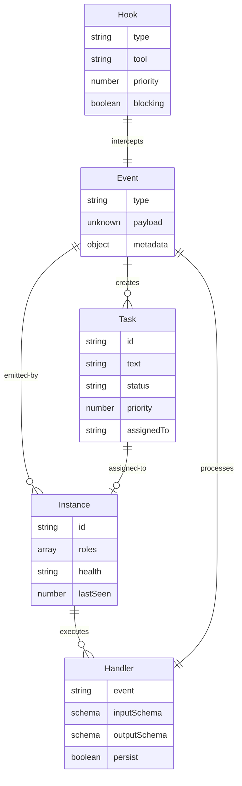

# ClaudeBench Data Model

## Core Entities

### Event
The fundamental unit of communication in ClaudeBench. All interactions are events.

```typescript
interface Event {
  type: string;           // domain.action format (e.g., "task.create")
  payload: unknown;       // Event-specific data, validated by schema
  metadata: {
    id: string;          // Unique event ID
    timestamp: number;    // Unix timestamp
    source?: string;     // Origin identifier
    sessionId?: string;  // Optional session context
    correlationId?: string; // For request-response patterns
    [key: string]: unknown; // Extensible metadata
  };
}
```

**Storage**: Redis Streams (`cb:stream:{type}`)
**TTL**: 24 hours for event history
**Validation**: Zod schema per event type

### Task
A unit of work managed by the system.

```typescript
interface Task {
  id: string;             // Format: t-{timestamp}
  text: string;           // Task description
  status: 'pending' | 'in_progress' | 'completed' | 'failed';
  priority: number;       // 0-100, higher = more important
  assignedTo?: string;    // Instance ID
  createdAt: Date;
  updatedAt: Date;
  result?: unknown;       // Task completion result
  error?: string;        // Error message if failed
}
```

**Storage**: 
- Hot: Redis Hash (`cb:task:{id}`)
- Cold: PostgreSQL via Prisma (optional persistence)
**Queue**: Redis Sorted Set (`cb:queue:tasks`) scored by priority

### Instance
A registered worker or service in the system.

```typescript
interface Instance {
  id: string;             // Unique instance identifier
  roles: string[];        // Capabilities (e.g., ["worker", "master"])
  health: 'healthy' | 'degraded' | 'unhealthy';
  lastSeen: number;       // Unix timestamp of last heartbeat
  metadata: {
    version: string;
    capabilities: string[];
    resources?: {
      cpu?: number;
      memory?: number;
    };
  };
}
```

**Storage**: Redis Hash (`cb:instance:{id}`)
**TTL**: 30 seconds (heartbeat timeout)
**Health**: Updated via `system.heartbeat` events

### Handler
Runtime representation of an event handler (not persisted, derived from decorators).

```typescript
interface HandlerConfig {
  event: string;          // Event type to handle
  inputSchema: ZodSchema; // Input validation
  outputSchema: ZodSchema; // Output validation
  persist?: boolean;      // Explicit persistence flag
  roles?: string[];       // Required instance roles
  rateLimit?: number;     // Events per second (default 100)
  timeout?: number;       // Handler timeout in ms
}

interface Handler {
  config: HandlerConfig;
  handle: (input: unknown, context: EventContext) => Promise<unknown>;
}
```

**Registration**: Via `@EventHandler` decorator
**Discovery**: Runtime reflection during startup
**Transports**: Auto-generates HTTP, MCP, WebSocket interfaces

### Hook
Interception points for tool execution (special handler type).

```typescript
interface Hook {
  type: 'pre_tool' | 'post_tool' | 'user_prompt' | 'todo_write';
  tool?: string;          // Specific tool or wildcard
  priority: number;       // Execution order
  blocking: boolean;      // Can prevent execution
  handler: (context: HookContext) => Promise<HookResult>;
}

interface HookContext {
  tool: string;
  params: unknown;
  metadata: EventMetadata;
}

interface HookResult {
  allow: boolean;
  reason?: string;
  modified?: unknown;     // Modified params/result
}
```

**Storage**: Redis Set (`cb:hooks:{type}`)
**Execution**: Priority order, blocking hooks can halt

## State Management

### Session (Transport-Specific)
Optional metadata passed through JSONRPC, not a core entity.

```typescript
interface SessionMetadata {
  sessionId?: string;     // Transport session ID
  userId?: string;       // Optional user context
  tokens?: string[];     // Auth tokens if needed
  ttl?: number;         // Session TTL hint
}
```

**Handling**: Graceful checking in handlers via `context.metadata`
**Storage**: Transport-managed (HTTP cookies, MCP session)

### Circuit Breaker State

```typescript
interface CircuitState {
  failures: number;       // Current failure count
  state: 'closed' | 'open' | 'half-open';
  lastFailure?: number;  // Unix timestamp
  resetAt?: number;      // When to attempt reset
}
```

**Storage**: Redis keys (`cb:circuit:{type}`)
**TTL**: 60 seconds
**Threshold**: Configurable per handler

### Rate Limit State

```typescript
interface RateLimitState {
  window: number[];      // Timestamps in current window
  blocked: boolean;      // Currently rate limited
}
```

**Storage**: Redis Sorted Set (`cb:rate:{id}:{window}`)
**TTL**: 60 seconds sliding window
**Default**: 100 requests/second

## Relationships



## Redis Key Patterns

All Redis keys follow the pattern `cb:{type}:{id}`:

- `cb:stream:{eventType}` - Event streams
- `cb:task:{taskId}` - Task data
- `cb:instance:{instanceId}` - Instance registry
- `cb:queue:tasks` - Task queue (sorted set)
- `cb:hooks:{hookType}` - Hook registry
- `cb:circuit:{handlerName}` - Circuit breaker state
- `cb:rate:{id}:{window}` - Rate limit windows
- `cb:health:{instanceId}` - Health status
- `cb:response:{correlationId}` - RPC responses

## Validation Schemas

All entities are validated using Zod schemas:

```typescript
// Example: Task creation schema
const TaskCreateInput = z.object({
  text: z.string().min(1).max(500),
  priority: z.number().int().min(0).max(100).default(50),
  metadata: z.record(z.unknown()).optional()
});

const TaskCreateOutput = z.object({
  id: z.string(),
  text: z.string(),
  status: z.enum(['pending', 'in_progress', 'completed', 'failed']),
  priority: z.number(),
  createdAt: z.string().datetime()
});
```

## Event Lifecycle

1. **Creation**: Event created with type and payload
2. **Validation**: Zod schema validates at boundary
3. **Publishing**: Redis XADD to stream
4. **Distribution**: Subscribers receive via XREAD
5. **Processing**: Handler executes with context
6. **Persistence**: Optional write to PostgreSQL
7. **Response**: Result published if correlationId present
8. **Observation**: All events observable via stream

## Data Consistency

- **Eventually Consistent**: Redis is source of truth for hot data
- **Explicit Persistence**: Handlers choose what goes to PostgreSQL
- **No Transactions**: Single-user localhost doesn't need them
- **Forward-Only**: No versioning, replace events for changes
- **Idempotent**: Handlers should be safe to retry